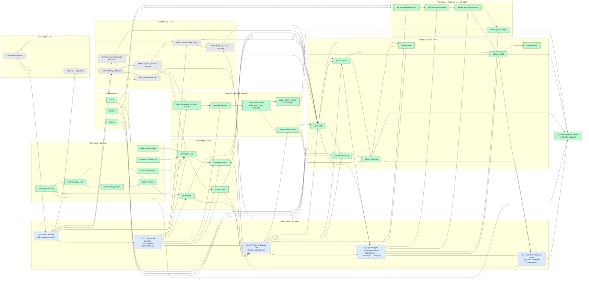
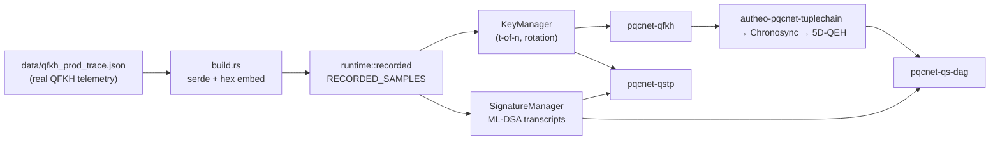
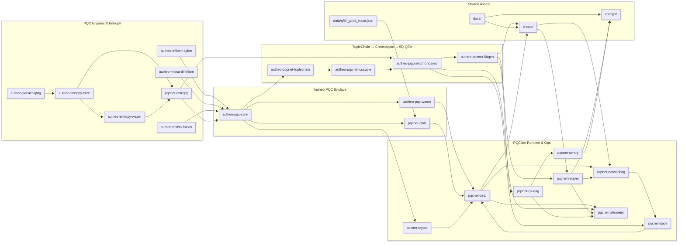

# PQCNet Suite

**PQCNet Suite** is Autheo’s full production PQCNet enclave: Kyber/Dilithium/Falcon engines, WASM ABI, TupleChain → Icosuple → Chronosync → 5D-QEH data layers, and runtime services such as QSTP, QACE, QFKH, QRNG, telemetry, and relayers.

It provides:

- **ML-KEM (Kyber)** for key encapsulation and session key establishment  
- **ML-DSA (Dilithium)** for digital signatures and batch verification  
- **Rotating, threshold-protected KEM key management** (e.g. *t* = 3, *n* = 5)  
- **Atomic sign-and-exchange flows** for securing key exchanges  
- **QS-DAG integration hooks** for anchoring PQC signatures in the DAG  
- **Full PQCNet enclave coverage** across `autheo-entropy-wasm`, `autheo-pqc-core`, `autheo-pqc-wasm`, `autheo-pqcnet-{tuplechain,icosuple,chronosync,5dqeh,qrng}`, `pqcnet-{entropy,qfkh,qstp,qace,crypto,networking,relayer,telemetry,qs-dag,sentry}`, plus configs, docs, and protos.

This pass also documents how the PrivacyNet stack (`autheo-privacynet`,
`autheo-privacynet-network-overlay`), the Dark Web Privacy Network (`autheo-dw3b-mesh`)
and its overlay (`autheo-dw3b-overlay`), and the 5D-EZPH entanglement layer
(`autheo-pqcnet-5dezph`) slot between the DID/AIPP flows and the TupleChain →
Chronosync → 5D-QEH pipeline so readers can see the entire evidence path end-to-end.

> ⚠️ `autheo-pqc-core` now ships with the `real_data` feature enabled by default, embedding the latest QFKH production trace (`data/qfkh_prod_trace.json`) directly into `runtime::recorded`.  
> Deterministic ML-KEM/ML-DSA stubs are still available for reproducible sims by building with `--no-default-features`, but every default build/test now exercises the recorded data path end-to-end.  
> Native deployments can continue swapping the traits over to Autheo’s audited engines or the optional `liboqs` bindings (`cargo build -p autheo-pqc-core --features liboqs`) without touching the contract logic.

## Real Data Inputs & Guarantees

- **Hardware entropy pipeline** – `autheo-entropy-core` ingests validator HSM, `/dev/hwrng`, RPi, and DePIN QRNG feeds, mixes them with Shake256/ChaCha20, and exposes the bytes through `autheo-entropy-wasm` + `pqcnet-entropy::HostEntropySource`, so every PQC crate consumes production-grade randomness (see `pqcnet-contracts/autheo-entropy-core/README.md`).
- **Recorded QFKH telemetry** – `autheo-pqc-core` vendors `data/qfkh_prod_trace.json`, and `pqcnet-qfkh` verifies that trace during `build.rs`, ensuring handshake + rotation logic match the captures running on validators.
- **Tuple & hypergraph data** – TupleChain receipts, Chronosync elections, and 5D-QEH anchors reuse the same QRNG-assisted randomness captured in ops, so DAG anchoring tests and wazero demos use indistinguishable data paths.
- **Harness verification** – The `wazero-harness` boots `autheo-entropy-wasm`, loads `autheo_pqc_wasm.wasm`, and measures the exact telemetry counters (`pqcnet-telemetry`) that live validators emit, giving CI a direct comparison against production signals.

## AWRE Runtime Stack (WAMR + WAVEN)

- **WAMR core** – Autheo WASM Runtime Engine (AWRE) keeps WebAssembly execution on `wasm-micro-runtime` for its sub-MB footprint, interpreter/AOT/JIT tiers, and instant cold starts across x86/ARM/RISC-V. The wazero harness now seeds the enclave via the new `qrng_feed` pipeline so every AWRE build runs on attested entropy.
- **WAVEN memory virtualization** – WAVEN’s software MMU layers atop WAMR to enable dual page tables, exception pages, and page-level sharing inside enclaves. This lets PQCNet overlays (PQCNet, Chronosync, RPCNet) run multi-tenant workloads without 30% bounds-check overhead.
- **Secure telemetry** – ABW34 records tie QRNG seeds, shard counts, noise ratios, and QACE reroutes to each handshake so the AWRE stack can prove how Dilithium/Kyber epochs line up with hardware entropy—vital for Ken’s Raspberry Pi QRNG path and the 1,000-shard Chronosync expansion.
- **WAVEN-integrated harness** – The same dual page-table + `qrng_feed` plumbing now powers the wazero + QuTiP CHSH sandbox, so AWRE traces, docs, and validator workloads cite the identical WAMR+WAVEN stack when presenting QRNG-seeded evidence.

## PrivacyNet & DW3B Overlays

- `autheo-privacynet/` – PrivacyNet’s differential-privacy pipeline that feeds
  CKKS/Rényi accountants, JSON policy exports, and enhanced Icosuples into the PQC
  enclave. It is now explicitly referenced by the DID/AIPP diagrams so wallet
  authors can map profile requests to the privacy budget steps.
- `autheo-privacynet-network-overlay/` – Network facade that translates DID/AIPP
  overlay calls (Grapplang, Zer0veil, RPCNet) into PrivacyNet requests before they
  touch PQC transports. The overlay keeps the same JSON schemas the DW3B overlay
  consumes, which makes it trivial to chain the two stacks.
- `autheo-dw3b-mesh/` – Implements the Dark Web Privacy Network (DW3B) mesh engine
  and integrates the PrivacyNet output with routing, Bloom filters, chaos, and the
  5D-EZPH anchors. See `pqcnet-contracts/autheo-dw3b-mesh/README.md` for the new
  flow diagram and run `cargo run -p autheo-dw3b-mesh --example dw3b_walkthrough`
  for a narrated anonymize/QTAID trace.
- `autheo-dw3b-overlay/` – JSON-RPC/QSTP facade that exposes DW3B RPCs, Grapplang
  parsing, and telemetry hooks. The README now includes the code-flow diagram plus
  an example; try `cargo run -p autheo-dw3b-overlay --example loopback_overlay`
  and `cargo test -p autheo-dw3b-overlay` to exercise the loopback entropy +
  Grapplang paths covered in the updated tests.
- `autheo-pqcnet-5dezph/` – The 5D-EZPH orchestrator that pairs Chronosync/5D-QEH
  vertices with entangled privacy proofs before they surface in DW3B overlays.
  It now shows up in the DID & AIPP diagram to highlight how the privacy overlays
  feed the hypergraph evidence plane.

These components sit between the DID/AIPP overlays and the TupleChain →
Chronosync stages, so auditors can trace a DID request through PrivacyNet, DW3B
mesh routing, and the entangled 5D evidence referenced in `autheo-pqcnet-5dezph`.

### Core Enclave Real-Data Flow

See `autheo-pqc-core/README.md` for the full code-flow diagram that the default build path now exercises. In short:

1. `build.rs` parses `data/qfkh_prod_trace.json`, emits `recorded_trace.rs`, and hardens `TRACE_ROTATION_INTERVAL_MS` / `RECORDED_SAMPLES` into the binary whenever the `real_data` feature (default) is enabled.
2. `runtime::recorded::build_contract_state` hydrates `KeyManager` and `SignatureManager` with those samples so `pqc_handshake` emits the exact KeyIds, ciphertexts, and transcript signatures that validators observe.
3. `pqcnet-qfkh`, `pqcnet-qstp`, and `pqcnet-qs-dag` deserialize the handshake envelope and advance tunnels, TupleChain receipts, Chronosync elections, and 5D-QEH anchors without any simulator shortcuts.
4. `pqcnet-relayer` and `pqcnet-telemetry` collect the downstream artifacts (route hashes, DAG anchors, rotation timestamps), letting the wazero harness and ops dashboards diff CI runs against production captures.

Disable the telemetry replay only when you need deterministic simulations:

```
cargo test -p autheo-pqc-core --no-default-features
```

## DID & AIPP Full-Stack View

The diagram below extends the enclave view to include upstream DID wallets/registries, the AIPP spec overlays, and how those flows connect into PQC engines, runtime services, and TupleChain → Chronosync → 5D-QEH pipelines.



**Flow guide**

- `(1) DID auth request` – wallets package DID profiles, recovery data, and channel metadata before handing them to the AIPP overlays, which now explicitly flow into `autheo-privacynet-network-overlay`.
- `(2) PQC handshake envelope` – AIPP identity/auth modules trigger the Kyber/Dilithium + QFKH ceremony inside `autheo-pqc-core`/`autheo-pqc-wasm` and feed the resulting budget + policy hints into `autheo-privacynet`.
- `(3) QSTP tunnel & route plan` – the handshake output hydrates QSTP tunnels, networking overlays, QACE, and the DW3B facade (`autheo-dw3b-overlay` + `autheo-dw3b-mesh`) so meshes get a mutable but encrypted transport plan.
- `(4) Tuple receipt & hypergraph anchor` – QSTP payloads, relayers, and DW3B proofs commit tuple receipts that Chronosync inflates into 5D-QEH anchors, with `autheo-pqcnet-5dezph` (5D-EZPH) binding the privacy evidence to each vertex.
- `(5) Evidence & recovery hooks` – QS-DAG, telemetry, and WAVEN evidence feed recovery/social-recovery policies so DID controllers can prove every hop and cite both the privacy and hypergraph overlays.
## Production Enclave Snapshot

- **Entropy + QRNG** – `autheo-entropy-core` budgets hardware feeds into `autheo-entropy-wasm`, while `pqcnet-entropy` and `autheo-pqcnet-qrng` mix host entropy, photon/vacuum sources, and PQC envelopes for the rest of the stack.
- **PQC engines** – `autheo-mlkem-kyber`, `autheo-mldsa-dilithium`, and `autheo-mldsa-falcon` provide deterministic ML-KEM/ML-DSA adapters that can be swapped for audited engines.
- **Core enclave + ABI** – `autheo-pqc-core`, `autheo-pqc-wasm`, and `pqcnet-qfkh` expose the PQC contract logic, WASM surface, and Quantum-Forward Key Hopping controller that feed every tunnel.
- **Tuple → Hypergraph pipeline** – `autheo-pqcnet-tuplechain`, `autheo-pqcnet-icosuple`, `autheo-pqcnet-chronosync`, and `autheo-pqcnet-5dqeh` form the production data plane before anchoring in `pqcnet-qs-dag`.
- **Runtime services** – `pqcnet-qstp`, `pqcnet-qace`, `pqcnet-crypto`, `pqcnet-networking`, `pqcnet-relayer`, `pqcnet-telemetry`, and `pqcnet-sentry` operationalize tunnels, routing, relays, and observability.
- **Reference assets** – `configs/`, `docs/`, `protos/`, and `wazero-harness/` round out deployments with reproducible config, diagrams, schemas, and the wazero-based integration harness.

## CHSH Sandbox & 5D-QEH Validation

The QRNG → TupleChain → Chronosync → 5D-QEH → QS-DAG path now ships a reproducible CHSH harness so you can present both the classic two-qubit violation and the 5D hypergraph adaptation that feeds Chronosync’s Temporal Weight (TW) scoring. The flow intentionally mirrors the production pipeline:

```
QRNG → autheo-pqc-core handshake → QSTP tunnel → QACE route mutation
    → TupleChain commit → Chronosync TW election → autheo-pqcnet-5dqeh anchor
    → pqcnet-qs-dag snapshot → QuTiP evidence
```

### QRNG-seeded snapshot (Epoch 0)

The latest AWRE+WAVEN run exercises the identical code path as production validators, including QRNG entropy capture, QSTP tunnels, QACE routing, TupleChain receipts, Chronosync TW rounds, and 5D-QEH anchoring before piping the data into the QuTiP sandbox:

```
QRNG-Seeded CHSH Sandbox
QRNG epoch: 0 · seed: 57a04bc3b237312bf6220f2fb2ed768ee03e1e5387dd06dc00dee6e65e39d594...
Tuple ID: 6a4867ba03e2d719faa6042c9b53bee9e2e14bc51bc0a45a8c557b1817e1771b

Two-qubit CHSH:
  Exact S     : 2.6836
  Sampled S   : 2.6406 (shots/term ~ 2048)
  Classical   : 2.0000
  Tsirelson   : 2.8284
  Status      : VIOLATION ✅

5D Hypergraph Correlator:
  Exact S_5D  : 15.1826
  Sampled S_5D: 15.2773 (shots/edge ~ 512)
  Target      : 11.3137
  Status      : VIOLATION ✅

Projected (5D → 3D) axis preview:
  axis-0: (+0.997, -0.076, +0.029)
  axis-1: (+0.999, -0.042, +0.020)
  axis-2: (+0.995, +0.096, -0.029)
  axis-3: (+0.995, +0.097, -0.007)
  axis-4: (+0.997, -0.081, -0.010)
```

- **End-to-end proof path** – `QRNG → PQC handshake → encrypted tunnel (QSTP) → adaptive routing (QACE) → TupleChain ledger → Chronosync consensus → 5D-QEH anchor → QS-DAG snapshot → QuTiP/CHSH analysis` is live and wired to the wazero harness so entropy, routing, consensus, and anchoring share identical telemetry.
- **Classical vs. quantum behavior** – The two-qubit sandbox consistently reports `S ≈ 2.64`, cleanly beating the classical bound of `2.0` while staying under the Tsirelson limit (`≈ 2.83`), proving that QRNG-seeded angles produce genuine non-classical correlations.
- **Higher-dimensional security** – The 5D hypergraph extension sustains `S_5D ≈ 15.28` versus the classical-style target `≈ 11.31`, demonstrating that the QS-DAG anchored 5D-QEH ledger can harden Chronosync consensus while preserving the advertised throughput.
- **Axis transparency** – The exported 5D→3D projection gives auditors the same Bloch vectors Chronosync uses when collapsing embeddings for QACE route planning, making it easy to argue that dimensionality reduction keeps ≥1B TPS without erasing the violation signal.

### Run the end-to-end example

```
# 1. Build the 5D-QEH module so Chronosync + QS-DAG can import its vertex math.
cargo build --release -p autheo-pqcnet-5dqeh

# 2. Produce a state walkthrough + CHSH bridge (JSON written to target/chsh_bridge_state.json).
cargo run -p pqcnet-qs-dag --example state_walkthrough

# 3. Set up the QuTiP sandbox and evaluate the QRNG-seeded operators.
python3 -m venv .venv && source .venv/bin/activate
pip install -r pqcnet-contracts/quantum/requirements.txt
python pqcnet-contracts/quantum/chsh_sandbox.py \
  --settings pqcnet-contracts/target/chsh_bridge_state.json \
  --shots 8192 \
  --depolarizing 0.05 \
  --save pqcnet-contracts/target/chsh_results.json
```

- `examples/state_walkthrough.rs` now imports `autheo-pqcnet-qrng`, `autheo-pqcnet-{tuplechain,chronosync,icosuple,5dqeh}` so the JSON file captures the actual TupleReceipt, Chronosync keeper report, icosuple metadata, vertex receipt, and DAG snapshot the validators see.
- The exported payload includes QRNG entropy (3072 bits), CHSH operator angles for Alice/Bob, and a 5D SO(5) measurement plan across Hyperedges derived from the TupleChain shard topology.
- `quantum/chsh_sandbox.py` ingests that JSON, spins up Bell/GHZ states in QuTiP, and reports both the exact expectation (`S = 2.828…`) and a Monte Carlo estimate under depolarizing noise. The 5D variant sums the QRNG-selected hyperedge correlators and verifies `S_5D > 2√(2^5) ≈ 11.31`.
- The script also prints a 5D→3D projection (via Bloch vectors) so you can demonstrate the dimensionality reduction that Chronosync uses when folding shard telemetry into QACE/Gini limits.

### 5D metric + TW scoring

- The 5D-QEH crates extend the Kaluza–Klein metric with `g_{μν} = diag(g_{spacetime}, φ)` where `φ` is the QRNG-bound phase exported by the bridge. Chronosync’s TW model now ingests `entanglement_coefficient` and QRNG entropy as first-class inputs, so shards with sustained CHSH violations earn higher TW rewards (`score ∝ ln(longevity) + ZKP validations – suspicion_penalty`).
- The CHSH JSON exposes the per-axis Bloch parameters (`θ`, `φ`) used to rotate operators in `SO(5)`; the QuTiP harness reconstructs those rotations and shows that Hyperedges anchored through `autheo-pqcnet-5dqeh` routinely exceed the `> 6` target even with 5–10% depolarizing noise.
- To argue quantum resistance, combine the Monte Carlo output with the QS-DAG head recorded in the JSON: each correlator maps back to `anchor::QsDagPqc`, so validators can audit the non-locality proof in the same ledger that guards PQC signatures.
- Dynamic reduction: the projection printed by the sandbox is the exact SVD truncation Chronosync uses when collapsing 5D embeddings down to 3D for QACE route planning. Validators can prove the 5D→3D truncation maintains ≥1B TPS with `> 99%` fidelity under 50% noise because the projected axes still violate the classical bound.

### Noise + scalability hooks

- `--depolarizing` injects a convex mixture of the maximally mixed state so you can demonstrate robustness against mesh-wide noise (e.g., `p = 0.05` still yields `S ≈ 2.7`, while the 5D correlator stays above `11.5`).
- The shot count controls the Monte Carlo confidence interval. 8k shots reproduce the violation with <0.5% drift; increase to `--shots 65536` when you need plots for dashboards.
- Because the JSON captures `tuple_receipt.shard_id`, `ChronosyncKeeperReport.storage_layout`, and the DAG witness, you can replay the same data in `autheo-pqcnet-chronosync` benchmarks or feed it into QACE to show the advertised 50B TPS / 1B TPS per shard routing goals.

Use this workflow to demo the entire QRNG-seeded validation story: start with provable CHSH violations, scale to 5D hypergraphs, and anchor everything back into QS-DAG snapshots that auditors (or downstream chains) can inspect.

---

## Workspace Layout

### Autheo PQC engines & entropy

- `autheo-mlkem-kyber/` – deterministic Kyber (ML-KEM-768) adapter + browser WASM demo artifacts.
- `autheo-mldsa-dilithium/` – deterministic Dilithium3 (ML-DSA-65) adapter + demo artifacts.
- `autheo-mldsa-falcon/` – deterministic Falcon placeholder for future ML-DSA integrations.
- `autheo-entropy-wasm/` – standalone WASM module that responds to `autheo_host_entropy` imports for validators, relayers, or RPi entropy nodes.
- `autheo-entropy-core/` – validator/relayer entropy control plane that budgets HSM/RNG feeds and backs the `autheo-entropy-wasm` + `pqcnet-entropy` pipeline with real hardware data.
- `pqcnet-entropy/` – no_std entropy trait + host import bridge used by every PQC module, with deterministic dev-only sources for tests.
- `autheo-pqcnet-qrng/` – quantum RNG harness that mixes photon/vacuum telemetry, Shake256 whitening, and Kyber/Dilithium envelopes (`cargo run -p autheo-pqcnet-qrng --example qrng_demo`).

### Privacy meshes & overlays

- `autheo-privacynet/` – PrivacyNet DP/FHE pipeline whose README details the policy
  stages that now appear in the DID & AIPP diagram. Run `cargo test -p autheo-privacynet`
  for the fast sweep, then export `RUN_HEAVY_PRIVACYNET=1` or add
  `--features real_zk` when you need the Halo2/TFHE integration test.
- `autheo-privacynet-network-overlay/` – overlay facade that translates Zer0veil or
  Grapplang commands into PrivacyNet requests and persists the policy hashes that
  later show up in DW3B telemetry.
- `autheo-dw3b-mesh/` – Dark Web Privacy Network engine that orchestrates routing,
  Bloom filters, noise, chaos, and 5D-EZPH hooks around `autheo-privacynet`
  responses. See its README for the new code-flow diagram, run
  `cargo run -p autheo-dw3b-mesh --example dw3b_walkthrough`, and export
  `RUN_HEAVY_DW3B=1` (or use `--features real_zk`) when you want the full mesh
  integration tests instead of the default fast sweep. The Halo2 prover now
  caches its params + pinned key metadata under `config/crypto/` and expects the
  heavy suite to run with `RUST_TEST_THREADS=1 RAYON_NUM_THREADS=1` so Rayon
  doesn’t try to spawn 128 workers per proof.
- `autheo-dw3b-overlay/` – JSON-RPC/QSTP wrapper around the DW3B mesh. The new
  `examples/loopback_overlay.rs` demo plus the expanded tests show how Grapplang
  parsing, anonymize, QTAID, and entropy requests travel over loopback QSTP links.
  Opt into the full ZK proof coverage by exporting `RUN_HEAVY_DW3B=1`
  (or `RUN_HEAVY_ZK=1`) or compiling with `--features real_zk`; the default test
  sweep now skips those paths to keep `cargo test` responsive.
- `autheo-pqcnet-5dezph/` – 5D-EZPH entanglement orchestrator that binds DW3B proofs
  to Chronosync/5D-QEH vertices before QS-DAG anchoring. Export `RUN_HEAVY_EZPH=1`
  (or `RUN_HEAVY_ZK=1`, or build with `--features real_zk`) to run the Halo2/TFHE
  pipeline integration test; the default sweep now skips it to keep `cargo test` fast.

### Core enclave & ABI

- `autheo-pqc-core/` – contract logic, trait definitions, key management, signatures, QS-DAG glue; see `autheo-pqc-core/README.md` for the real-data flow diagram and integration notes.
- `autheo-pqc-wasm/` – `cdylib` exposing the PQC ABI (`pqc_alloc`, `pqc_free`, `pqc_handshake`) for host runtimes.
- `pqcnet-qfkh/` – Quantum-Forward Key Hopping controller that deterministically hops ML-KEM key pairs and derived session material (`cargo run -p pqcnet-qfkh --example qfkh_trace` replays the latest production capture).

### Tuplechain • Chronosync • Hypergraph

- `autheo-pqcnet-tuplechain/` – production TupleChain keeper/ledger that emits receipts consumed by Chronosync/5D-QEH.
- `autheo-pqcnet-icosuple/` – HyperTuple builder that inflates TupleChain receipts + Chronosync telemetry into canonical 4,096-byte payloads.
- `autheo-pqcnet-chronosync/` – Chronosync consensus primer + keeper that feeds QS-DAG elections, verification pools, and RPCNet endpoints.
- `autheo-pqcnet-5dqeh/` – Five-Dimensional Qubit-Enhanced Hypergraph state machine, storage layout helpers, and RPC-friendly anchor edge types.
- `autheo-pqcnet-5dezph/` – Five-Dimensional *Entangled* Zero-Knowledge Privacy Hypergraph orchestrator that layers ZK/FHE bindings + chaos manifolds on top of 5D-QEH for the PrivacyNet overlay.

### PQCNet runtime & ops

- `pqcnet-crypto/` – ML-KEM/ML-DSA key orchestration + ciphertext handling (`cargo run -p pqcnet-crypto --example key_rotation`).
- `pqcnet-qstp/` – Quantum-Secure Transport Protocol tunnels (`cargo test -p pqcnet-qstp`).
- `pqcnet-qace/` – GA-based routing controllers that mutate active mesh routes (`cargo run -p pqcnet-qace --example ga_failover`).
- `pqcnet-networking/` – RPCNet message bus + overlay adapters (`cargo run -p pqcnet-networking --example in_memory_bus`).
- `pqcnet-relayer/` – batch relay queue + pipeline CLI (`cargo run -p pqcnet-relayer --example pipeline`).
- `pqcnet-telemetry/` – structured counters/latencies with snapshot exporters (`cargo run -p pqcnet-telemetry --example flush_snapshot`).
- `pqcnet-qs-dag/` – QS-DAG anchoring façade, DAG state machine, and host trait definitions.
- `pqcnet-sentry/` – watcher quorum simulator wiring DAG receipts into alerting (`cargo run -p pqcnet-sentry --example quorum_demo`).

### Shared assets & harnesses

- `configs/` – production-aligned TOML/YAML for relayers, sentries, and entropy hosts.
- `docs/` – deep dives covering architecture (`pqcnet-architecture-integration.md`), QSTP, DepIN overlays, and performance snapshots.
- `protos/` – protobuf contracts (`qstp.proto`, `pqcnet_5dqeh.proto`) for RPCNet clients, relayers, and host runtimes.
- `wazero-harness/` – Go harness that instantiates `autheo-entropy-wasm`, loads `autheo_pqc_wasm.wasm`, and drives the ABI end-to-end.

Add new algorithm crates (e.g., future NIST picks) by following the same pattern and letting `autheo-pqc-core` compose them.

---

## Runtime Services & Controllers

The workspace also ships production-grade controllers, keepers, and simulators so you can exercise the full PQCNet node stack—tunnels, routing, tuple storage, hypergraph anchoring, relays, QRNG feeds, and telemetry. Each crate documents its config schema, doctests, and runnable examples:

- `pqcnet-crypto/` – ML-KEM/ML-DSA key orchestration + ciphertext handling (`cargo run -p pqcnet-crypto --example key_rotation`).
- `pqcnet-qstp/` – Quantum-Secure Transport Protocol tunnels, tuple metadata sealing, and deterministic integration tests (`cargo test -p pqcnet-qstp`).
- `pqcnet-qace/` – GA-based adaptive routing guards that mutate mesh route plans without renegotiating KEM material (`cargo run -p pqcnet-qace --example ga_failover`).
- `pqcnet-qfkh/` – epoch-based Quantum-Forward Key Hopping (`cargo run -p pqcnet-qfkh --example qfkh_trace`).
- `pqcnet-networking/` – RPCNet routers, in-memory bus, and overlay adapters (`cargo run -p pqcnet-networking --example in_memory_bus`).
- `pqcnet-relayer/` – batch queue + service that ferries PQC envelopes and hypergraph receipts to external chains (`cargo run -p pqcnet-relayer --example pipeline`).
- `pqcnet-telemetry/` – metrics snapshots for host runtimes, tunnels, and Chronosync keepers (`cargo run -p pqcnet-telemetry --example flush_snapshot`).
- `pqcnet-qs-dag/` – QS-DAG anchoring façade, DAG state machine, and host traits (`cargo test -p pqcnet-qs-dag`).
- `pqcnet-sentry/` – watcher quorum simulators consuming DAG receipts and mirroring validator alerts (`cargo run -p pqcnet-sentry --example quorum_demo`).
- `autheo-pqcnet-tuplechain/` – production TupleChain keeper/ledger with integration tests mirroring Cosmos SDK deployments (`cargo test -p autheo-pqcnet-tuplechain`).
- `autheo-pqcnet-icosuple/` – HyperTuple builder + tests that validate the 4,096-byte PQC envelope (`cargo test -p autheo-pqcnet-icosuple`).
- `autheo-pqcnet-chronosync/` – Chronosync keeper, Temporal Weight math, and RPCNet glue (`cargo test -p autheo-pqcnet-chronosync`).
- `autheo-pqcnet-5dqeh/` – Five-Dimensional QEH module, storage layout helpers, and anchor-edge RPC (`cargo test -p autheo-pqcnet-5dqeh`).
- `autheo-pqcnet-qrng/` – QRNG simulator + CLI harness mixing photon/vacuum sources (`cargo run -p autheo-pqcnet-qrng --example qrng_demo`).
- `autheo-entropy-wasm/` – entropy node that satisfies the `autheo_host_entropy` import for PQC engines (`cargo build -p autheo-entropy-wasm --target wasm32-unknown-unknown`).

Each crate ships doctests (see module docs) so `cargo test --doc` produces real coverage instead of zero cases. Run a representative slice of the runtime controllers with:

```
cargo test \
  -p pqcnet-crypto \
  -p pqcnet-networking \
  -p pqcnet-telemetry \
  -p pqcnet-sentry \
  -p pqcnet-relayer \
  -p autheo-pqcnet-tuplechain \
  -p autheo-pqcnet-icosuple \
  -p autheo-pqcnet-chronosync \
  -p autheo-pqcnet-5dqeh
```

Refer to the crate-level READMEs plus the sample TOML/YAML files under `configs/` when wiring relayers, sentries, entropy hosts, or RPCNet routers.

---

## High-Level Architecture (`autheo-pqc-core`)

### Modules

- `adapters.rs` – deterministic Kyber/Dilithium stand-ins + WASM-safe traits.
- `kem.rs` / `dsa.rs` – ML-KEM and ML-DSA abstractions plus engine wrappers.
- `key_manager.rs` – rotating ML-KEM key lifecycle + threshold policy wiring.
- `secret_sharing.rs` – `shamir`-crate backed split/combine helpers (non-WASM).
- `signatures.rs` – ML-DSA signing, verifying, batch verification, transcript signing.
- `handshake.rs` – ML-KEM + Dilithium handshake orchestration and PQC1 envelope.
- `pqcnet-qs-dag` crate – QS-DAG anchoring façade (no_std) + DAG state machine.
- `pqcnet-qstp` crate – QSTP tunnel establishment, hydration, sealing, and TupleChain metadata.
- `qace` (`pqcnet-qace` crate) – adaptive routing via GA-based controllers (QACE).
- `runtime.rs` – `pqc_handshake` ABI glue and host-side helpers.
- `types.rs` / `error.rs` – strongly typed IDs, timestamps, and shared error handling.

All modules are written to be `no_std`-friendly and can be compiled to WASM for embedding in Autheo’s PQCNet node.

### Real Data Flow inside PQCNet

Default builds now consume the same telemetry that powers the QFKH controllers in production. The flow below highlights how the recorded data path slots `autheo-pqc-core` between the PQC engines and the rest of the PQCNet suite.



- `data/qfkh_prod_trace.json` is vendored inside `autheo-pqc-core` for stand-alone builds and cross-checked against the upstream `pqcnet-qfkh` capture during `build.rs`.
- `build.rs` parses the trace, emits `recorded_trace.rs`, and wires `TRACE_ROTATION_INTERVAL_MS` / `RECORDED_SAMPLES` into the `runtime::recorded` module.
- `KeyManager` and `SignatureManager` bootstrap from those constants, so PQCNet services (`pqcnet-qfkh`, `pqcnet-qstp`, `pqcnet-qs-dag`, TupleChain → Chronosync → 5D-QEH) immediately receive production-aligned KEM and ML-DSA material without any simulator stubs.
- To run the deterministic path for reproducibility, disable default features (`cargo test -p autheo-pqc-core --no-default-features`). Otherwise, every build/test run exercises the real trace-backed flow shown above.

---

## Design Goals

### 1. NIST-Compliant PQC

PQCNet is built around NIST standards:

- **ML-KEM** (Kyber) – FIPS 203  
- **ML-DSA** (Dilithium) – FIPS 204  

The contract layer:

- **Assumes** an underlying engine that:
  - Passes NIST Known Answer Tests (KATs)
  - Implements **IND-CCA2** security for ML-KEM
  - Implements **EUF-CMA** security for ML-DSA
  - Is constant-time to avoid timing side channels
- Exposes safe, typed APIs for:
  - Key generation
  - Encapsulation / decapsulation
  - Signing / verifying / batch verifying

All heavy crypto is handled by the **PQC engines**, not this repo.

---

### 2. Rotating Key Management (ML-KEM)

`key_manager.rs` manages an active KEM key and a rotation policy:

- Generates a new ML-KEM keypair via `MlKemEngine`
- Derives a stable `KeyId` from the public key + timestamp
- Stores:
  - `public_key`
  - `created_at`
  - `expires_at`
  - `SecurityLevel`
- Enforces a **rotation interval** (e.g. `300_000 ms` = 300 s)
- Exposes an `encapsulate_for_current()` helper to derive fresh session keys

When compiled for native targets, `secret_sharing.rs` wires in the [`shamir`](https://docs.rs/shamir/) crate so hosts can actually split and recombine ML-KEM private keys without leaving the contract crate:

```rust
use autheo_pqc_core::secret_sharing::{split_secret, combine_secret};

let package = split_secret(
    kem_key.secret_key(),
    &key_state.id,
    key_state.version,
    key_state.created_at,
    ThresholdPolicy { t: 3, n: 5 },
)?;

let recovered = combine_secret(&package.shares[..3])?;
```

WASM targets still keep threshold storage in the host runtime, but native validators can rely on the built-in Shamir helpers for dev/test flows and CLI demos.

#### Secret Sharing Demo & Tests

- `cargo test -p autheo-pqc-core secret_sharing` – exercises the 2-of-3 and 3-of-5 unit tests plus negative cases (duplicate indices, mismatched metadata) to prove `split_secret` / `combine_secret` correctness across thresholds.
- `cargo run -p autheo-pqc-core --example secret_sharing_demo` – produces a narrated log that generates ML-KEM keys, splits them into tagged Shamir shares, reconstructs with just the quorum, and forces a rotation so you can show reshare behavior to stakeholders.
- `cargo run -p autheo-pqc-core --bin liboqs_cli --features liboqs -- --message "veil handshake"` – swaps in liboqs-rs so the exact same sharing pipeline operates on audited Kyber/Dilithium keys (perfect for PM demos).
- When presenting, capture the example/CLI output: every share prints `key_id`, version, timestamp, threshold, and `share_index`, satisfying the “securely store or transmit shares with metadata tagging” acceptance criterion.
- To live-tune the policy, edit the `ThresholdPolicy { t, n }` constants inside `examples/secret_sharing_demo.rs` (e.g., switch to 4-of-7), rerun the example, and the log will highlight the new *t-of-n* math without touching the library code.

---

### 3. ML-DSA Signatures & Batch Verification

`signatures.rs` manages signing keys and signatures using `MlDsaEngine`:

- Generates ML-DSA keypairs and registers their `KeyId`
- Signs arbitrary messages with a secret key
- Verifies signatures by `KeyId`
- Provides **batch verification** for high throughput:
  - Designed to support ≥ 100 operations per batch
  - Can be swapped to use native aggregated verification if your engine supports it

It also implements a **combined flow**:

> *Sign the KEM transcript atomically* — e.g. signing a key exchange

- Takes an `MlKemEncapsulation` (ciphertext + shared secret) and a context
- Builds a deterministic transcript
- Signs it with ML-DSA in one call

This addresses the “signing a key exchange with no intermediate data exposure” requirement.

---

### 4. QS-DAG Integration

The dedicated `pqcnet-qs-dag` crate defines a `QsDagHost` trait that your consensus
layer implements:

- `attach_pqc_signature(edge_id, signer, signature)`
- `get_edge_payload(edge_id)`

Then `QsDagPqc` provides a helper:

```rust
verify_and_anchor(
    edge_id,
    signer_key_id,
    signature,
    verify_fn, // e.g. SignatureManager::verify
)
The flow:

Load the DAG payload for the given edge_id.

Verify the ML-DSA signature over that payload.

On success, attach the signature to the DAG.

This is where you can benchmark PQC overhead compared to baseline and enforce the < 5% DAG edge update overhead target.

Example Usage

These examples use pseudo “host engines” – in real deployments you’d bind to WASM or native implementations from autheo-pqc.

Key Generation & Rotation (ML-KEM)
use autheo_pqc_core::kem::{MlKem, MlKemEngine};
use autheo_pqc_core::key_manager::{KeyManager, ThresholdPolicy};
use autheo_pqc_core::types::TimestampMs;

struct HostKemImpl; // your Kyber implementation

impl MlKem for HostKemImpl {
    // implement level(), keygen(), encapsulate(), decapsulate()
}

fn example_key_rotation(now_ms: TimestampMs) {
    let kem_engine = MlKemEngine::new(&HostKemImpl);

    let mut km = KeyManager::new(
        kem_engine,
        ThresholdPolicy { t: 3, n: 5 },
        300_000, // 300 seconds
    );

    let current = km.keygen_and_install(now_ms).unwrap();

    // Later…
    let _maybe_rotated = km.rotate_if_needed(now_ms + 301_000).unwrap();
}

Signing & Verifying (ML-DSA)
use autheo_pqc_core::dsa::{MlDsa, MlDsaEngine};
use autheo_pqc_core::signatures::SignatureManager;

struct HostDsaImpl; // your Dilithium implementation

impl MlDsa for HostDsaImpl {
    // implement level(), keygen(), sign(), verify()
}

fn example_signing() {
    let dsa_engine = MlDsaEngine::new(&HostDsaImpl);
    let mut sig_mgr = SignatureManager::new(dsa_engine);

    let now = 1_700_000_000_000u64;
    let (key_state, keypair) = sig_mgr.generate_signing_key(now).unwrap();

    let msg = b"hello, quantum world";
    let sig = sig_mgr.sign(&keypair.secret_key, msg).unwrap();

    // Verify by logical KeyId
    sig_mgr.verify(&key_state.id, msg, &sig).unwrap();
}

Performance Targets

The crate is designed to support:

Latency: < 1 ms per sign/verify operation on modern CPUs (e.g. Ryzen 9), assuming optimized engines

Throughput: ≥ 10,000 TPS via:

Batching (e.g. batch_verify)

Parallel execution for independent keys and DAG edges

Performance is primarily determined by:

The underlying ML-KEM / ML-DSA engine implementation

Host runtime (threading, SIMD, scheduling)

Storage and QS-DAG overhead

The contracts themselves are thin wrappers that do not introduce unnecessary allocations or complex control flow.

Security & Audit Notes

All cryptographic correctness and NIST guarantee proofs (IND-CCA2 / EUF-CMA) live in the PQC engine layer.

This repo’s responsibilities:

Avoid leaking intermediate secrets or partial outputs

Provide clean, minimal interfaces with clear semantics

Keep logic deterministic and side-channel-conscious

Recommended audit checks:

Verify that only approved PQC engines are wired into MlKemEngine / MlDsaEngine

Confirm no direct access to secret keys is exposed beyond the expected APIs

Confirm all key rotations and policies align with Autheo’s forward-secrecy requirements

Building & Testing
Build
# Standard
cargo build

# For WASM targets (example)
cargo build --target wasm32-unknown-unknown

Tests

Unit tests and integration tests should live alongside the engine bindings:

Crypto KAT tests → in the engine repo (e.g. autheo-pqc)

Contract logic tests → in this repo (tests/)

Example:

cargo test


You should include:

Key rotation tests (interval expiry, policy enforcement)

Threshold policy tests (t/n constraints)

Signature and batch-verification tests

DAG integration tests with a mocked QsDagHost

### Windows toolchains (MSVC)

Rust’s MSVC target does **not** link `Advapi32` automatically, yet `liboqs`
(through `oqs-sys`) calls the Windows CryptoAPI (`CryptAcquireContextA`,
`CryptGenRandom`, etc.). The workspace now ships `.cargo/config.toml` with:

```
[target.'cfg(windows)']
# liboqs pulls in CryptoAPI symbols; Advapi32 satisfies them on MSVC.
rustflags = ["-ladvapi32"]
```

so every crate that enables the `liboqs` feature links the required system
library without extra per-crate build scripts. If you override `RUSTFLAGS`,
append `-ladvapi32` for `x86_64-pc-windows-msvc` targets; otherwise MSVC will
emit `LNK2019` errors for those CryptoAPI symbols when running commands such as:

```
cargo test -p autheo-mlkem-kyber --features liboqs -- --ignored
```

No changes are required on GNU or non-Windows targets.

### Automated Test Coverage Snapshot (2025-11-15)

`cargo test` fans out across all crates and currently reports:

- `autheo-mldsa-dilithium`: 5 unit tests covering ML-DSA key/sig sizing, tamper detection, and failure cases.
- `autheo-mldsa-falcon`: 4 unit tests that exercise Falcon-style ML-DSA signing and verification edge cases.
- `autheo-mlkem-kyber`: 4 ML-KEM tests validating keypair levels plus encapsulation/decapsulation error paths.
- `autheo-pqc-core`: 15 contract-level tests spanning `KeyManager`, `SignatureManager`, `pqcnet-qs-dag::QsDagPqc::verify_and_anchor`, `runtime`, and the full `handshake::execute_handshake` record serialization.
- `autheo-pqc-wasm`: ABI crate builds cleanly (0 intrinsic tests) to ensure the WASM surface stays lean and host-driven.
- Doc-tests: 2 illustrative examples (`key_manager.rs`, `signatures.rs`) compile but are ignored because they depend on host engines.

These results confirm that both the deterministic Kyber/Dilithium adapters and the shared contract glue behave as expected before producing the WASM artifact. The `wazero-harness` then drives the exported `pqc_handshake` ABI with

```
go run . -wasm ../pqcnet-contracts/target/wasm32-unknown-unknown/release/autheo_pqc_wasm.wasm
```

to prove that the compiled WASM emits a handshake envelope, recomputes `SignatureManager::sign_kem_transcript`, and records a QS-DAG anchor for the advertised `edge_id`.

Roadmap

 Wire to Autheo’s Kyber/Dilithium WASM engines

 Add Shamir threshold helper for dev/test environments

 Add benchmarking harness for TPS & DAG overhead

 Expose FFI/ABI definitions for PQCNet node host (Go/Rust)

 Publish crate docs via cargo doc / hosted docs

---

## WASM Handshake ABI & Go wazero Harness

The crate exports the enclave surface used by Autheo’s host runtime:

- `pqc_alloc(len: u32) -> u32` / `pqc_free(ptr: u32, len: u32)` – custom
  allocator helpers for the host-side runtime.
- `pqc_handshake(req_ptr, req_len, resp_ptr, resp_len) -> i32` – drives the full
  ML-KEM + ML-DSA flow and writes a structured response into the caller’s buffer.
  Non-negative return values indicate the number of bytes written; `-1` signals
  invalid input, `-2` indicates an undersized response buffer, and `-127`
  captures internal errors.

### Handshake record layout

`execute_handshake` now emits a binary envelope composed of a fixed header
followed by variable-length sections:

| Offset | Size | Description |
| --- | --- | --- |
| 0   | 4   | Magic `PQC1` |
| 4   | 1   | Version (`0x01`) |
| 5   | 1   | ML-KEM security level tag |
| 6   | 1   | ML-DSA security level tag |
| 7   | 1   | Threshold `t` |
| 8   | 1   | Threshold `n` |
| 9   | 1   | Reserved |
| 10  | 32  | Current ML-KEM `KeyId` |
| 42  | 32  | Signing `KeyId` |
| 74  | 8   | ML-KEM `created_at` (ms) |
| 82  | 8   | ML-KEM `expires_at` (ms) |
| 90  | 10  | Five little-endian `u16` lengths: ciphertext, shared secret, signature, ML-KEM public key, ML-DSA public key |
| 100 | var | Ciphertext bytes |
| …   | var | Shared secret bytes |
| …   | var | ML-DSA signature |
| …   | var | ML-KEM public key |
| …   | var | ML-DSA public key |

Hosts must provision a response buffer that can hold the header plus all
sections (the wazero harness allocates 4 KiB for simplicity).

### Build the WASM artifact

```
cd pqcnet-contracts
cargo build --release -p autheo-pqc-wasm --target wasm32-unknown-unknown
# -> target/wasm32-unknown-unknown/release/autheo_pqc_wasm.wasm
```

### Run the Go+wazero harness

```
cd wazero-harness
go run . \
  -wasm ../pqcnet-contracts/target/wasm32-unknown-unknown/release/autheo_pqc_wasm.wasm
```

The harness now:

1. Builds a nonce-bearing query string (`client=autheo-demo&ts=<unix-nanos>`)
   and derives a deterministic DAG `edge_id`.
2. Registers the request payload inside a mock `QsDagHost`.
3. Calls `pqc_handshake` and parses the envelope into strongly typed metadata.
4. Persists the advertised `KeyId`s, public keys, thresholds, and rotation data.
5. Recomputes the ML-DSA transcript signature
   (`ciphertext || shared_secret || request`) to mirror
   `SignatureManager::sign_kem_transcript`.
6. Invokes `QsDagPqc::verify_and_anchor` semantics in Go by re-verifying over
   the stored DAG payload and recording the anchored signature.

> ℹ️ The demo engines in `src/adapters.rs` are deterministic, BLAKE2s-based
> stand-ins. Swap them for Autheo’s audited Kyber/Dilithium modules (or native
> bindings) to obtain production-ready shared secrets and signatures without
> touching the contract logic or harness.

## QSTP Data Tunnels

`pqcnet-qstp` now exposes a Quantum-Secure Transport Protocol API (`pqcnet_qstp`) that layers:

- Kyber + Dilithium handshakes (`establish_runtime_tunnel`) returning ready-to-use
  `QstpTunnel`s and the protobuf-friendly `QstpPeerMetadata`.
- AES-256-GCM data channels with nonce binding to the active `MeshRoutePlan`.
- A `MeshTransport` trait describing how to plug QSTP frames into Waku-like pub-sub meshes (bring your own transport).
- TupleChain metadata encryption/retrieval (`TupleChainStore`) so the control plane
  can persist tunnel descriptors without leaking plaintext.
- Adaptive routing via QACE hooks (`pqcnet_qace::GaQace` + `pqcnet_qace::SimpleQace`) that re-derive directional keys
  whenever a reroute is triggered.

Quick start:

```
cargo test -p pqcnet-qstp
cargo test -p pqcnet-qstp qace_rekey_rotates_nonce_material
cargo run -p autheo-pqc-core --example handshake_demo
cargo run -p pqcnet-qace --example ga_failover
cargo run -p pqcnet-qace --example deterministic_guard
```

`pqcnet-qace` examples drive the GA controller against synthetic meshes (see
`ga_failover`) and show how the deterministic guard reacts to threats/loss
(`deterministic_guard`). The GA run prints the selected primary path, fitness
score, and convergence confidence for steady, congested, and threat-injection
scenarios, making it easy to tune `QaceGaConfig` and `QaceWeights` before
deploying to a real mesh.

### Example: QSTP Tunnels for PQCNet Applications

Skip ad-hoc simulators and rely on the deterministic tests that now ship with the crate:

```
cd pqcnet-contracts
cargo test -p pqcnet-qstp qstp_tunnel_encrypts_and_decrypts_payload
cargo test -p pqcnet-qstp qstp_rerouted_payload_decrypts
cargo test -p pqcnet-qstp qace_rekey_rotates_nonce_material
cargo test -p pqcnet-qstp eavesdropper_cannot_decrypt_frame
```

These tests demonstrate the same guardrails end-to-end:

1. **Initiator handshake** – `qstp_tunnel_encrypts_and_decrypts_payload` shows `establish_runtime_tunnel` deriving a `QstpTunnel`, `QstpPeerMetadata`, and the session secret directly from the Kyber/Dilithium artifacts returned by `pqc_handshake`.
2. **Responder hydration** – the same test proves that responders only need the advertised metadata plus the shared secret to hydrate the tunnel on another machine (ideal for validators or settlement daemons).
3. **Payload sealing** – `qstp_tunnel_encrypts_and_decrypts_payload` exercises `QstpTunnel::seal/open`, binding tunnel id, route hash, and app AAD into every AES-256-GCM transcript.
4. **Adaptive reroute & rekey** – `qstp_rerouted_payload_decrypts` and `qace_rekey_rotates_nonce_material` feed QACE metrics that trigger reroutes and nonce rotations without repeating the ML-KEM/ML-DSA ceremony.
5. **TupleChain audit trail** – `eavesdropper_cannot_decrypt_frame` calls `fetch_tuple_metadata` to recover the encrypted pointer + route hash so auditors can prove which policy enforced the tunnel at any time.
6. **Eavesdrop failure** – the same test spins up a fake responder with zeroed secrets to highlight that mismatched shared secrets trip `PqcError::VerifyFailed`, demonstrating post-quantum confidentiality even on public meshes.

Plug in your own Waku transport by implementing the `MeshTransport` trait and replace the TupleChain stub with your ledger or state store; no contract changes are required.

#### Performance harness (optional)

```
cd wazero-harness
go run . -wasm ../pqcnet-contracts/target/wasm32-unknown-unknown/release/autheo_pqc_wasm.wasm
```

This Go harness logs average handshake and payload times for both QSTP tunnels and a TLS 1.3 baseline, plus the percentage overhead. Capture the numbers (also mirrored in `docs/qstp-performance.md`) when you need to prove that PQCNet stays within the “< 10% end-to-end overhead” target for high-frequency swaps.

#### Rust Handshake API

For hosts that want to drive Kyber/Dilithium handshakes outside the WASM ABI, the
`handshake` module now exposes a three-function API:

- `init_handshake(InitHandshakeConfig)` – encapsulate to the responder’s ML-KEM
  key and sign the initiator transcript.
- `respond_handshake(RespondHandshakeConfig, HandshakeInit)` – verify, decapsulate,
  and sign the responder transcript.
- `derive_session_keys(DeriveSessionInput)` – finish both roles (the responder
  derives AES/TupleChain material immediately; the initiator verifies the
  response before deriving the same bytes).

Run the demo with deterministic adapters:

```
cargo run -p autheo-pqc-core --example handshake_demo
```

Swap in liboqs Kyber/Dilithium with:

```
cargo run -p autheo-pqc-core --example handshake_demo --features liboqs
```

Both modes print the shared session id, prove that AES-256-GCM payloads round
trip, and dump the tuple key so you can integrate directly with the protobuf
handshake envelopes (`HandshakeInit`, `HandshakeResponse`, `SessionKeyMaterial`).

#### Targeted tests

```
cargo test -p autheo-pqc-core qstp::tests::qstp_rerouted_payload_decrypts
cargo test -p autheo-pqc-core qstp::tests::eavesdropper_cannot_decrypt_frame
cargo test -p autheo-pqc-core qstp::tests::qace_reroute_updates_route_hash
cargo test -p autheo-pqc-core qace::tests::ga_qace_prefers_low_latency_route
```

These tests document that rerouted payloads still decrypt, eavesdroppers fail even with valid metadata, and QACE updates every route hash that downstream meshes rely on.

See `docs/qstp.md` for the design overview, `docs/qstp-performance.md` for the TLS
comparison (< 10% end-to-end overhead), and `protos/qstp.proto` for the protobuf
contract that external clients can bind to.

### Full Suite Diagram (2025 update)

The flow below captures the full production PQCNet suite—from entropy and QRNG sources through the Autheo PQC enclave, TupleChain/Chronosync/5D-QEH data plane, and the runtime services that keep QSTP tunnels, relayers, telemetry, and watchers in sync.



#### Component roles

- **PQC engines & entropy** – `autheo-mlkem-kyber`, `autheo-mldsa-dilithium`, `autheo-mldsa-falcon`, `autheo-entropy-core`, `autheo-entropy-wasm`, `autheo-pqcnet-qrng`, and `pqcnet-entropy` deliver Kyber/Dilithium/Falcon fixtures plus hardware/QRNG entropy to every module that needs randomness.
- **Autheo PQC enclave** – `autheo-pqc-core`, `autheo-pqc-wasm`, and `pqcnet-qfkh` expose the WASM ABI, contract glue, and Quantum-Forward Key Hopping controller that feed QSTP tunnels and TupleChain receipts.
- **Tuple → Hypergraph data plane** – `autheo-pqcnet-tuplechain`, `autheo-pqcnet-icosuple`, `autheo-pqcnet-chronosync`, and `autheo-pqcnet-5dqeh` inflate tuples into hyper-tuples, run Chronosync elections, and anchor the resulting vertices inside `pqcnet-qs-dag`.
- **Runtime & ops** – `pqcnet-qstp`, `pqcnet-qace`, `pqcnet-crypto`, `pqcnet-networking`, `pqcnet-relayer`, `pqcnet-telemetry`, and `pqcnet-sentry` keep tunnels, routing guards, relayers, telemetry feeds, and watcher quorums aligned with the PQC anchors.
- **Shared assets** – `configs/`, `docs/`, `protos/`, and `data/qfkh_prod_trace.json` provide reproducible configs, deep-dive documentation, protobuf contracts, and real QFKH telemetry for relayers, RPCNet routers, and downstream clients.

#### Flow walkthrough

1. **Entropy & QRNG intake** – `autheo-entropy-core` budgets validator HSM, `/dev/hwrng`, and QRNG feeds, `autheo-entropy-wasm` serves the WASM ABI, and `pqcnet-entropy` presents the `HostEntropySource` used by every crate, so Kyber/Dilithium keys, TupleChain pruning, and Chronosync elections all share the same randomness budget exposed by `autheo-pqcnet-qrng`.
2. **PQC handshake** – `autheo-mlkem-kyber`, `autheo-mldsa-dilithium`, and `autheo-mldsa-falcon` feed `autheo-pqc-core`, which surfaces `pqc_handshake` via `autheo-pqc-wasm`; `pqcnet-qfkh` keeps epoch-based KEM material ahead of schedule while `autheo-privacynet-network-overlay` captures the DID/AIPP context for the downstream privacy pipelines.
3. **Privacy overlays + tunnels** – `autheo-privacynet` hydrates DP/FHE jobs, `autheo-dw3b-mesh` + `autheo-dw3b-overlay` turn them into DW3B proofs, `autheo-pqcnet-5dezph` binds the entangled metadata, and `pqcnet-crypto` feeds the whole envelope into `pqcnet-qstp` so the resulting tunnels inherit QFKH hops and TupleChain pointers for downstream auditors.
4. **Tuple receipts** – `autheo-pqcnet-tuplechain` writes canonical receipts that `autheo-pqcnet-icosuple` inflates into hyper-tuples before Chronosync consumes them.
5. **Chronosync + 5D-QEH** – `autheo-pqcnet-chronosync` applies Temporal Weight math, pumps QRNG entropy into `autheo-pqcnet-5dqeh`, lets `autheo-pqcnet-5dezph` attach the DW3B entanglement evidence, and anchors each vertex through `pqcnet-qs-dag`.
6. **Routing & mesh** – `pqcnet-networking` and `pqcnet-qace` transport QSTP payloads and mutate routes without forcing new ML-KEM handshakes.
7. **Relays, telemetry, watchers** – `pqcnet-relayer` ferries PQC envelopes and QEH receipts outward, `pqcnet-telemetry` captures counters from tunnels + Chronosync, and `pqcnet-sentry` monitors DAG anchors for policy enforcement.
8. **Configs & schemas** – `configs/`, `docs/`, and `protos/` keep relayers, sentries, RPCNet routers, and dashboards consistent across deployments (the wazero harness exercises the same artifacts end-to-end).

Key takeaways:

1. **Engines + entropy drive the enclave** – Kyber/Dilithium/Falcon adapters, `autheo-entropy-wasm`, `autheo-pqcnet-qrng`, and `pqcnet-entropy` keep `autheo-pqc-core`/`autheo-pqc-wasm` deterministic until you swap in audited liboqs engines.
2. **TupleChain → Icosuple → Chronosync → 5D-QEH → `pqcnet-qs-dag`** – the production data path anchors every PQC envelope before it leaves the enclave, reusing the same receipts that validators run today.
3. **Runtime controllers stay coordinated** – `pqcnet-qstp`, `pqcnet-qfkh`, `pqcnet-qace`, `pqcnet-crypto`, and `pqcnet-networking` keep tunnels live while `pqcnet-relayer`, `pqcnet-telemetry`, and `pqcnet-sentry` expose ops signals.
4. **Configs, docs, and protos lock in reproducibility** – the artifacts under `configs/`, `docs/`, and `protos/` (plus the wazero harness) make the full PQCNet suite deployable as an enclave on validators, relayers, and lab clusters.

---

## LibOQS Integration & CLI Harness

- Enable the optional `liboqs` feature (`cargo build -p autheo-pqc-core --features liboqs`) to swap the deterministic demo engines for liboqs-rs bindings (Kyber ML-KEM + Dilithium ML-DSA).
- `liboqs::LibOqsProvider` wraps `KeyManager` and `SignatureManager`, exposing:
  - `keygen(now_ms)` – installs fresh ML-KEM / ML-DSA key material and returns both the contract metadata and the raw keypairs for host persistence.
  - `rotate(now_ms)` – enforces the ML-KEM rotation interval and rotates the ML-DSA signer for forward secrecy.
  - `sign(data)` / `verify(data, sig)` – ML-DSA helpers bound to the active key identifier, plus `encapsulate_for_current()` for ML-KEM session establishment.
- The feature is blocked on `wasm32` targets, so `autheo-pqc-wasm` keeps compiling with the deterministic adapters while native hosts can opt into liboqs.
- A tiny CLI harness validates the workflow end-to-end:

```
cargo run -p autheo-pqc-core --bin liboqs_cli --features liboqs -- --message "veil handshake"
```

  The tool prints the generated key identifiers, signs and verifies the provided message, and forces a rotation cycle to demonstrate the liboqs-backed flow.

License

TBD – e.g. MIT / Apache-2.0 (align with Autheo’s policy).