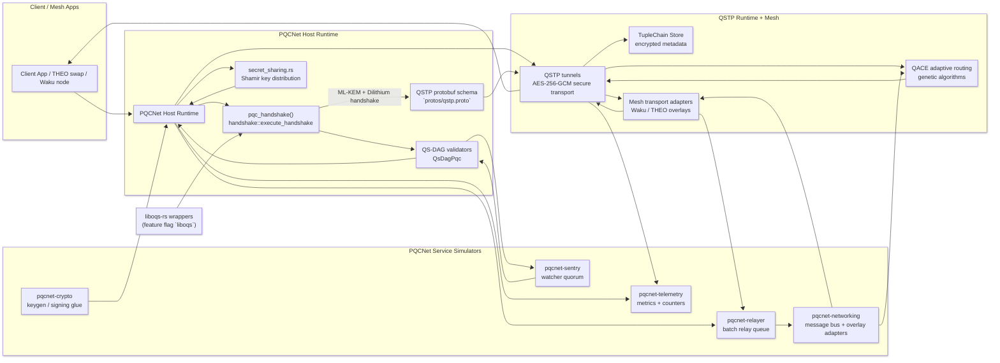

# PQCNet Contracts

**PQCNet** is a Rust contract library for NIST-compliant post-quantum cryptography, designed to plug into Autheo-One’s PQCNet node and QS-DAG consensus.

It provides:

- **ML-KEM (Kyber)** for key encapsulation and session key establishment  
- **ML-DSA (Dilithium)** for digital signatures and batch verification  
- **Rotating, threshold-protected KEM key management** (e.g. *t* = 3, *n* = 5)  
- **Atomic sign-and-exchange flows** for securing key exchanges  
- **QS-DAG integration hooks** for anchoring PQC signatures in the DAG

> ⚠️ This workspace doesn’t ship production ML-KEM / ML-DSA code.  
> `autheo-pqc-core` only defines traits and contract logic, and the sibling `autheo-mlkem-*` / `autheo-mldsa-*` crates are deterministic BLAKE2s-based stubs for demos/tests.  
> Real deployments point those traits at audited engines—Autheo’s Kyber/Dilithium WASM builds, PQClean, or the `liboqs` feature that wires in liboqs-rs’ primitives.

---

## Workspace Layout

- `autheo-mlkem-kyber/` – deterministic Kyber (ML-KEM-768) adapter + browser WASM demo artifacts.
- `autheo-mldsa-dilithium/` – deterministic Dilithium3 (ML-DSA-65) adapter + demo artifacts.
- `autheo-mldsa-falcon/` – deterministic Falcon placeholder for future ML-DSA integrations.
- `autheo-pqc-core/` – contract logic, trait definitions, key management, signatures, QS-DAG glue.
- `autheo-pqc-wasm/` – `cdylib` that exposes the PQC ABI (`pqc_alloc`, `pqc_free`, `pqc_handshake`) for hosts.
- `pqcnet-entropy/` – no_std entropy trait + host import bridge (`autheo_host_entropy`) plus deterministic dev-only sources.
- `autheo-entropy-wasm/` – standalone WASM module that runs on validators/RPi to service entropy requests from PQC modules.
- `wazero-harness/` – Go harness used to exercise the WASM ABI end-to-end (now instantiates the entropy node and bridges the `autheo_host_entropy` import automatically).

Add new algorithm crates (e.g., future NIST picks) by following the same pattern and letting `autheo-pqc-core` compose them.

---

## PQCNet Service Simulators

The workspace also ships lightweight binaries and libraries that mimic the PQCNet
node stack. Each crate now includes README instructions, config schemas, doc
tests, and runnable examples so you can demo behavior quickly:

- `pqcnet-crypto/` – deterministic key derivation + signing. Example:
  `cargo run -p pqcnet-crypto --example key_rotation`
- `pqcnet-networking/` – in-memory message bus. Example:
  `cargo run -p pqcnet-networking --example in_memory_bus`
- `pqcnet-telemetry/` – structured counters/latencies. Example:
  `cargo run -p pqcnet-telemetry --example flush_snapshot`
- `pqcnet-sentry/` – watcher quorum simulator. Example:
  `cargo run -p pqcnet-sentry --example quorum_demo`
- `pqcnet-relayer/` – batch relay queue. Example:
  `cargo run -p pqcnet-relayer --example pipeline`

Each crate has an embedded doctest (see the top-level module docs) so `cargo test
--doc` reports real coverage instead of zero cases. Run the full component test
suite with:

```
cargo test \
  -p pqcnet-crypto \
  -p pqcnet-networking \
  -p pqcnet-telemetry \
  -p pqcnet-sentry \
  -p pqcnet-relayer
```

Refer to the `pqcnet-*/README.md` files for config snippets that match the
sample TOML/YAML files under `configs/`.

---

## High-Level Architecture (`autheo-pqc-core`)

### Modules

- `adapters.rs` – deterministic Kyber/Dilithium stand-ins + WASM-safe traits.
- `kem.rs` / `dsa.rs` – ML-KEM and ML-DSA abstractions plus engine wrappers.
- `key_manager.rs` – rotating ML-KEM key lifecycle + threshold policy wiring.
- `secret_sharing.rs` – `shamir`-crate backed split/combine helpers (non-WASM).
- `signatures.rs` – ML-DSA signing, verifying, batch verification, transcript signing.
- `handshake.rs` – ML-KEM + Dilithium handshake orchestration and PQC1 envelope.
- `pqcnet-qs-dag` crate – QS-DAG anchoring façade (no_std) + DAG state machine.
- `pqcnet-qstp` crate – QSTP tunnel establishment, hydration, sealing, and TupleChain metadata.
- `qace` (`pqcnet-qace` crate) – adaptive routing via GA-based controllers (QACE).
- `runtime.rs` – `pqc_handshake` ABI glue and host-side helpers.
- `types.rs` / `error.rs` – strongly typed IDs, timestamps, and shared error handling.

All modules are written to be `no_std`-friendly and can be compiled to WASM for embedding in Autheo’s PQCNet node.

---

## Design Goals

### 1. NIST-Compliant PQC

PQCNet is built around NIST standards:

- **ML-KEM** (Kyber) – FIPS 203  
- **ML-DSA** (Dilithium) – FIPS 204  

The contract layer:

- **Assumes** an underlying engine that:
  - Passes NIST Known Answer Tests (KATs)
  - Implements **IND-CCA2** security for ML-KEM
  - Implements **EUF-CMA** security for ML-DSA
  - Is constant-time to avoid timing side channels
- Exposes safe, typed APIs for:
  - Key generation
  - Encapsulation / decapsulation
  - Signing / verifying / batch verifying

All heavy crypto is handled by the **PQC engines**, not this repo.

---

### 2. Rotating Key Management (ML-KEM)

`key_manager.rs` manages an active KEM key and a rotation policy:

- Generates a new ML-KEM keypair via `MlKemEngine`
- Derives a stable `KeyId` from the public key + timestamp
- Stores:
  - `public_key`
  - `created_at`
  - `expires_at`
  - `SecurityLevel`
- Enforces a **rotation interval** (e.g. `300_000 ms` = 300 s)
- Exposes an `encapsulate_for_current()` helper to derive fresh session keys

When compiled for native targets, `secret_sharing.rs` wires in the [`shamir`](https://docs.rs/shamir/) crate so hosts can actually split and recombine ML-KEM private keys without leaving the contract crate:

```rust
use autheo_pqc_core::secret_sharing::{split_secret, combine_secret};

let package = split_secret(
    kem_key.secret_key(),
    &key_state.id,
    key_state.version,
    key_state.created_at,
    ThresholdPolicy { t: 3, n: 5 },
)?;

let recovered = combine_secret(&package.shares[..3])?;
```

WASM targets still keep threshold storage in the host runtime, but native validators can rely on the built-in Shamir helpers for dev/test flows and CLI demos.

#### Secret Sharing Demo & Tests

- `cargo test -p autheo-pqc-core secret_sharing` – exercises the 2-of-3 and 3-of-5 unit tests plus negative cases (duplicate indices, mismatched metadata) to prove `split_secret` / `combine_secret` correctness across thresholds.
- `cargo run -p autheo-pqc-core --example secret_sharing_demo` – produces a narrated log that generates ML-KEM keys, splits them into tagged Shamir shares, reconstructs with just the quorum, and forces a rotation so you can show reshare behavior to stakeholders.
- `cargo run -p autheo-pqc-core --bin liboqs_cli --features liboqs -- --message "veil handshake"` – swaps in liboqs-rs so the exact same sharing pipeline operates on audited Kyber/Dilithium keys (perfect for PM demos).
- When presenting, capture the example/CLI output: every share prints `key_id`, version, timestamp, threshold, and `share_index`, satisfying the “securely store or transmit shares with metadata tagging” acceptance criterion.
- To live-tune the policy, edit the `ThresholdPolicy { t, n }` constants inside `examples/secret_sharing_demo.rs` (e.g., switch to 4-of-7), rerun the example, and the log will highlight the new *t-of-n* math without touching the library code.

---

### 3. ML-DSA Signatures & Batch Verification

`signatures.rs` manages signing keys and signatures using `MlDsaEngine`:

- Generates ML-DSA keypairs and registers their `KeyId`
- Signs arbitrary messages with a secret key
- Verifies signatures by `KeyId`
- Provides **batch verification** for high throughput:
  - Designed to support ≥ 100 operations per batch
  - Can be swapped to use native aggregated verification if your engine supports it

It also implements a **combined flow**:

> *Sign the KEM transcript atomically* — e.g. signing a key exchange

- Takes an `MlKemEncapsulation` (ciphertext + shared secret) and a context
- Builds a deterministic transcript
- Signs it with ML-DSA in one call

This addresses the “signing a key exchange with no intermediate data exposure” requirement.

---

### 4. QS-DAG Integration

The dedicated `pqcnet-qs-dag` crate defines a `QsDagHost` trait that your consensus
layer implements:

- `attach_pqc_signature(edge_id, signer, signature)`
- `get_edge_payload(edge_id)`

Then `QsDagPqc` provides a helper:

```rust
verify_and_anchor(
    edge_id,
    signer_key_id,
    signature,
    verify_fn, // e.g. SignatureManager::verify
)
The flow:

Load the DAG payload for the given edge_id.

Verify the ML-DSA signature over that payload.

On success, attach the signature to the DAG.

This is where you can benchmark PQC overhead compared to baseline and enforce the < 5% DAG edge update overhead target.

Example Usage

These examples use pseudo “host engines” – in real deployments you’d bind to WASM or native implementations from autheo-pqc.

Key Generation & Rotation (ML-KEM)
use autheo_pqc_core::kem::{MlKem, MlKemEngine};
use autheo_pqc_core::key_manager::{KeyManager, ThresholdPolicy};
use autheo_pqc_core::types::TimestampMs;

struct HostKemImpl; // your Kyber implementation

impl MlKem for HostKemImpl {
    // implement level(), keygen(), encapsulate(), decapsulate()
}

fn example_key_rotation(now_ms: TimestampMs) {
    let kem_engine = MlKemEngine::new(&HostKemImpl);

    let mut km = KeyManager::new(
        kem_engine,
        ThresholdPolicy { t: 3, n: 5 },
        300_000, // 300 seconds
    );

    let current = km.keygen_and_install(now_ms).unwrap();

    // Later…
    let _maybe_rotated = km.rotate_if_needed(now_ms + 301_000).unwrap();
}

Signing & Verifying (ML-DSA)
use autheo_pqc_core::dsa::{MlDsa, MlDsaEngine};
use autheo_pqc_core::signatures::SignatureManager;

struct HostDsaImpl; // your Dilithium implementation

impl MlDsa for HostDsaImpl {
    // implement level(), keygen(), sign(), verify()
}

fn example_signing() {
    let dsa_engine = MlDsaEngine::new(&HostDsaImpl);
    let mut sig_mgr = SignatureManager::new(dsa_engine);

    let now = 1_700_000_000_000u64;
    let (key_state, keypair) = sig_mgr.generate_signing_key(now).unwrap();

    let msg = b"hello, quantum world";
    let sig = sig_mgr.sign(&keypair.secret_key, msg).unwrap();

    // Verify by logical KeyId
    sig_mgr.verify(&key_state.id, msg, &sig).unwrap();
}

Performance Targets

The crate is designed to support:

Latency: < 1 ms per sign/verify operation on modern CPUs (e.g. Ryzen 9), assuming optimized engines

Throughput: ≥ 10,000 TPS via:

Batching (e.g. batch_verify)

Parallel execution for independent keys and DAG edges

Performance is primarily determined by:

The underlying ML-KEM / ML-DSA engine implementation

Host runtime (threading, SIMD, scheduling)

Storage and QS-DAG overhead

The contracts themselves are thin wrappers that do not introduce unnecessary allocations or complex control flow.

Security & Audit Notes

All cryptographic correctness and NIST guarantee proofs (IND-CCA2 / EUF-CMA) live in the PQC engine layer.

This repo’s responsibilities:

Avoid leaking intermediate secrets or partial outputs

Provide clean, minimal interfaces with clear semantics

Keep logic deterministic and side-channel-conscious

Recommended audit checks:

Verify that only approved PQC engines are wired into MlKemEngine / MlDsaEngine

Confirm no direct access to secret keys is exposed beyond the expected APIs

Confirm all key rotations and policies align with Autheo’s forward-secrecy requirements

Building & Testing
Build
# Standard
cargo build

# For WASM targets (example)
cargo build --target wasm32-unknown-unknown

Tests

Unit tests and integration tests should live alongside the engine bindings:

Crypto KAT tests → in the engine repo (e.g. autheo-pqc)

Contract logic tests → in this repo (tests/)

Example:

cargo test


You should include:

Key rotation tests (interval expiry, policy enforcement)

Threshold policy tests (t/n constraints)

Signature and batch-verification tests

DAG integration tests with a mocked QsDagHost

### Automated Test Coverage Snapshot (2025-11-15)

`cargo test` fans out across all crates and currently reports:

- `autheo-mldsa-dilithium`: 5 unit tests covering ML-DSA key/sig sizing, tamper detection, and failure cases.
- `autheo-mldsa-falcon`: 4 unit tests that exercise Falcon-style ML-DSA signing and verification edge cases.
- `autheo-mlkem-kyber`: 4 ML-KEM tests validating keypair levels plus encapsulation/decapsulation error paths.
- `autheo-pqc-core`: 15 contract-level tests spanning `KeyManager`, `SignatureManager`, `pqcnet-qs-dag::QsDagPqc::verify_and_anchor`, `runtime`, and the full `handshake::execute_handshake` record serialization.
- `autheo-pqc-wasm`: ABI crate builds cleanly (0 intrinsic tests) to ensure the WASM surface stays lean and host-driven.
- Doc-tests: 2 illustrative examples (`key_manager.rs`, `signatures.rs`) compile but are ignored because they depend on host engines.

These results confirm that both the deterministic Kyber/Dilithium adapters and the shared contract glue behave as expected before producing the WASM artifact. The `wazero-harness` then drives the exported `pqc_handshake` ABI with

```
go run . -wasm ../pqcnet-contracts/target/wasm32-unknown-unknown/release/autheo_pqc_wasm.wasm
```

to prove that the compiled WASM emits a handshake envelope, recomputes `SignatureManager::sign_kem_transcript`, and records a QS-DAG anchor for the advertised `edge_id`.

Roadmap

 Wire to Autheo’s Kyber/Dilithium WASM engines

 Add Shamir threshold helper for dev/test environments

 Add benchmarking harness for TPS & DAG overhead

 Expose FFI/ABI definitions for PQCNet node host (Go/Rust)

 Publish crate docs via cargo doc / hosted docs

---

## WASM Handshake ABI & Go wazero Harness

The crate exports the enclave surface used by Autheo’s host runtime:

- `pqc_alloc(len: u32) -> u32` / `pqc_free(ptr: u32, len: u32)` – custom
  allocator helpers for the host-side runtime.
- `pqc_handshake(req_ptr, req_len, resp_ptr, resp_len) -> i32` – drives the full
  ML-KEM + ML-DSA flow and writes a structured response into the caller’s buffer.
  Non-negative return values indicate the number of bytes written; `-1` signals
  invalid input, `-2` indicates an undersized response buffer, and `-127`
  captures internal errors.

### Handshake record layout

`execute_handshake` now emits a binary envelope composed of a fixed header
followed by variable-length sections:

| Offset | Size | Description |
| --- | --- | --- |
| 0   | 4   | Magic `PQC1` |
| 4   | 1   | Version (`0x01`) |
| 5   | 1   | ML-KEM security level tag |
| 6   | 1   | ML-DSA security level tag |
| 7   | 1   | Threshold `t` |
| 8   | 1   | Threshold `n` |
| 9   | 1   | Reserved |
| 10  | 32  | Current ML-KEM `KeyId` |
| 42  | 32  | Signing `KeyId` |
| 74  | 8   | ML-KEM `created_at` (ms) |
| 82  | 8   | ML-KEM `expires_at` (ms) |
| 90  | 10  | Five little-endian `u16` lengths: ciphertext, shared secret, signature, ML-KEM public key, ML-DSA public key |
| 100 | var | Ciphertext bytes |
| …   | var | Shared secret bytes |
| …   | var | ML-DSA signature |
| …   | var | ML-KEM public key |
| …   | var | ML-DSA public key |

Hosts must provision a response buffer that can hold the header plus all
sections (the wazero harness allocates 4 KiB for simplicity).

### Build the WASM artifact

```
cd pqcnet-contracts
cargo build --release -p autheo-pqc-wasm --target wasm32-unknown-unknown
# -> target/wasm32-unknown-unknown/release/autheo_pqc_wasm.wasm
```

### Run the Go+wazero harness

```
cd wazero-harness
go run . \
  -wasm ../pqcnet-contracts/target/wasm32-unknown-unknown/release/autheo_pqc_wasm.wasm
```

The harness now:

1. Builds a nonce-bearing query string (`client=autheo-demo&ts=<unix-nanos>`)
   and derives a deterministic DAG `edge_id`.
2. Registers the request payload inside a mock `QsDagHost`.
3. Calls `pqc_handshake` and parses the envelope into strongly typed metadata.
4. Persists the advertised `KeyId`s, public keys, thresholds, and rotation data.
5. Recomputes the ML-DSA transcript signature
   (`ciphertext || shared_secret || request`) to mirror
   `SignatureManager::sign_kem_transcript`.
6. Invokes `QsDagPqc::verify_and_anchor` semantics in Go by re-verifying over
   the stored DAG payload and recording the anchored signature.

> ℹ️ The demo engines in `src/adapters.rs` are deterministic, BLAKE2s-based
> stand-ins. Swap them for Autheo’s audited Kyber/Dilithium modules (or native
> bindings) to obtain production-ready shared secrets and signatures without
> touching the contract logic or harness.

## QSTP Data Tunnels

`pqcnet-qstp` now exposes a Quantum-Secure Transport Protocol API (`pqcnet_qstp`) that layers:

- Kyber + Dilithium handshakes (`establish_runtime_tunnel`) returning ready-to-use
  `QstpTunnel`s and the protobuf-friendly `QstpPeerMetadata`.
- AES-256-GCM data channels with nonce binding to the active `MeshRoutePlan`.
- A `MeshTransport` trait plus `InMemoryMesh` simulator for Waku-like pub-sub meshes.
- TupleChain metadata encryption/retrieval (`TupleChainStore`) so the control plane
  can persist tunnel descriptors without leaking plaintext.
- Adaptive routing via QACE hooks (`pqcnet_qace::GaQace` + `pqcnet_qace::SimpleQace`) that re-derive directional keys
  whenever a reroute is triggered.

Quick start:

```
cargo run -p pqcnet-qstp --example qstp_mesh_sim
cargo run -p pqcnet-qstp --example qstp_performance
cargo run -p autheo-pqc-core --example handshake_demo
cargo run -p pqcnet-qace --example ga_failover
cargo run -p pqcnet-qace --example deterministic_guard
```

`pqcnet-qace` examples drive the GA controller against synthetic meshes (see
`ga_failover`) and show how the deterministic guard reacts to threats/loss
(`deterministic_guard`). The GA run prints the selected primary path, fitness
score, and convergence confidence for steady, congested, and threat-injection
scenarios, making it easy to tune `QaceGaConfig` and `QaceWeights` before
deploying to a real mesh.

### Example: QSTP Tunnels for PQCNet Applications

Run the mesh simulator to watch PQCNet provision a QSTP tunnel that THEO swaps or Waku-derived pub-sub meshes can immediately reuse:

```
cd pqcnet-contracts
cargo run -p pqcnet-qstp --example qstp_mesh_sim
```

The example prints each of the following guardrails so you can demonstrate end-to-end confidentiality, integrity, and forward secrecy:

1. **Initiator handshake** – `establish_runtime_tunnel` derives a `QstpTunnel`, `QstpPeerMetadata`, and a session secret straight from the Kyber/Dilithium artifacts returned by `pqc_handshake`.
2. **Responder hydration** – `hydrate_remote_tunnel` proves that peers only need the advertised `peer_metadata` plus the shared secret to hydrate the tunnel on a different machine (ideal for validators or settlement daemons).
3. **Payload sealing** – `QstpTunnel::seal` wraps something like a THEO swap intent (`waku::order-intent`) into an AES-256-GCM `QstpFrame` whose AAD binds the tunnel id, route hash, and application context, then the in-memory Waku mesh delivers it to `node_b`.
4. **Reroute on threat** – feeding `GaQace` a high `threat_score` triggers a hop from `waku/mesh/primary` to `waku/mesh/failsafe` without repeating the ML-KEM/ML-DSA handshake, keeping the data plane live while still rotating directional nonces.
5. **TupleChain audit trail** – `fetch_tuple_metadata` dumps the encrypted pointer and route hash so that control planes can show auditors which policy enforced the tunnel at any point in time.
6. **Eavesdrop failure** – the simulator spins up a fake responder with zeroed secrets to highlight that any mismatched shared secret trips `PqcError::VerifyFailed`, demonstrating post-quantum confidentiality even on public meshes.

Plug in your own Waku transport by implementing the `MeshTransport` trait and replace the TupleChain stub with your ledger or state store; no contract changes are required.

#### Performance harness (optional)

```
cd pqcnet-contracts
cargo run -p pqcnet-qstp --example qstp_performance
```

This benchmark logs average handshake and payload times for both QSTP tunnels and a TLS 1.3 baseline, plus the percentage overhead. Capture the table when you need to prove that PQCNet stays within the “< 10% end-to-end overhead” target for high-frequency swaps.

#### Rust Handshake API

For hosts that want to drive Kyber/Dilithium handshakes outside the WASM ABI, the
`handshake` module now exposes a three-function API:

- `init_handshake(InitHandshakeConfig)` – encapsulate to the responder’s ML-KEM
  key and sign the initiator transcript.
- `respond_handshake(RespondHandshakeConfig, HandshakeInit)` – verify, decapsulate,
  and sign the responder transcript.
- `derive_session_keys(DeriveSessionInput)` – finish both roles (the responder
  derives AES/TupleChain material immediately; the initiator verifies the
  response before deriving the same bytes).

Run the demo with deterministic adapters:

```
cargo run -p autheo-pqc-core --example handshake_demo
```

Swap in liboqs Kyber/Dilithium with:

```
cargo run -p autheo-pqc-core --example handshake_demo --features liboqs
```

Both modes print the shared session id, prove that AES-256-GCM payloads round
trip, and dump the tuple key so you can integrate directly with the protobuf
handshake envelopes (`HandshakeInit`, `HandshakeResponse`, `SessionKeyMaterial`).

#### Targeted tests

```
cargo test -p autheo-pqc-core qstp::tests::qstp_rerouted_payload_decrypts
cargo test -p autheo-pqc-core qstp::tests::eavesdropper_cannot_decrypt_frame
cargo test -p autheo-pqc-core qstp::tests::qace_reroute_updates_route_hash
cargo test -p autheo-pqc-core qace::tests::ga_qace_prefers_low_latency_route
```

These tests document that rerouted payloads still decrypt, eavesdroppers fail even with valid metadata, and QACE updates every route hash that downstream meshes rely on.

See `docs/qstp.md` for the design overview, `docs/qstp-performance.md` for the TLS
comparison (< 10% end-to-end overhead), and `protos/qstp.proto` for the protobuf
contract that external clients can bind to.

### Code Flow Diagram (Handshake → QSTP Runtime)

The flow below replaces the previous sequence diagram and highlights every contract component the host touches—liboqs-rs wrappers for ML-KEM/ML-DSA, Shamir-based threshold sharing, protobuf-backed QSTP control messages, AES-256-GCM tunnels, and GA-powered QACE routing.



#### Component roles

- **ClientSurface** – Wallets, THEO swaps, and Waku relays that construct intents and call the WASM ABI exported by `autheo-pqc-wasm`.
- **PQCNet Host Runtime** – `autheo-pqc-core/src/runtime.rs` plus `autheo_pqc_wasm::pqc_handshake`. It owns the active ML-KEM/ML-DSA material, orchestrates rotations, and prepares the handshake envelope.
- **secret_sharing.rs** – Hosts that enforce threshold custody reconstruct ML-KEM secrets with `combine_secret`, run the handshake, and immediately re-split with `split_secret` so private keys only exist in-memory for a single call.
- **liboqs wrappers** – Optional providers in `src/liboqs.rs` that swap the deterministic demo engines for audited Kyber/Dilithium primitives when `--features liboqs` is set.
- **QS-DAG validators** – `pqcnet-qs-dag::QsDagPqc` verifies Dilithium signatures over DAG payloads and anchors them so tuple metadata inherits PQC guarantees.
- **QSTP Runtime + Mesh** – `pqcnet_qstp` (`QstpTunnel`, `MeshTransport`, `TupleChainStore`) and `qace.rs` (`GaQace`, `SimpleQace`) turn handshake outputs into AES-256-GCM tunnels, encrypted TupleChain metadata, and adaptive mesh routing.
- **pqcnet-crypto** – Supplies deterministic keygen/signing flows that bind directly to `autheo-pqc-core`, mirroring how the host runtime sources ML-KEM/ML-DSA material inside the diagram.
- **pqcnet-relayer** – Buffers handshake envelopes and QSTP payloads before they leave the host, modelling the batch queue that feeds the networking layer in the diagram.
- **pqcnet-networking** – Provides the simulated message bus / overlay adapters that plug into Waku or THEO meshes; its edges to `Mesh` and `QACE` show how it transports and routes QSTP traffic.
- **pqcnet-telemetry** – Streams counters/latencies from both the host runtime and active tunnels, capturing the dual arrows from `Host` and `Tunnel` into the telemetry sink.
- **pqcnet-sentry** – Represents the watcher quorum that consumes QS-DAG anchors and feeds status back to `pqcnet-qs-dag::QsDagPqc`, closing the DAG loop in the flow.

#### Flow walkthrough

1. **Handshake request** – The client calls `pqc_handshake` with a request buffer. `runtime.rs` deserializes it, fetches the active ML-KEM key from `KeyManager`, and checks whether a rotation or threshold rebuild is required.
2. **Threshold enforcement** – If the host stores Shamir shares, `secret_sharing::combine_secret` rehydrates the ML-KEM key just for the handshake, then `split_secret` writes fresh shares back out once the call completes.
3. **PQC engines** – `handshake::execute_handshake` invokes `MlKemEngine` + `MlDsaEngine` (deterministic adapters or liboqs-backed) to encapsulate, decapsulate, and sign the transcript (`SignatureManager::sign_kem_transcript`).
4. **Handshake envelope** – The function emits the PQC1 binary layout, which is mapped directly onto `QstpHandshake*` messages in `protos/qstp.proto`. The host returns this buffer to the caller or forwards it across the mesh.
5. **Tunnel hydration** – `pqcnet_qstp::establish_runtime_tunnel` ingests the handshake artifacts, derives AES-256-GCM keys, binds them to a `MeshRoutePlan`, and emits TupleChain metadata so auditors can trace the session.
6. **Transport + TupleChain** – `pqcnet_qstp::QstpTunnel::seal` wraps application payloads while `TupleChainStore` persists encrypted descriptors (key ids, route hashes, rotation window) for later verification.
7. **Mesh routing** – Each payload travels over Waku/THEO adapters implementing `MeshTransport`. Telemetry feeds `qace::GaQace`, which mutates the active route without re-running the ML-KEM/Dilithium handshake.
8. **DAG anchoring** – When required, `QsDagPqc::verify_and_anchor` reloads the stored payload, re-verifies the Dilithium signature, and anchors it on QS-DAG so TupleChain pointers inherit consensus-level integrity.

Key takeaways:

1. **Integrate liboqs-rs for ML-KEM/ML-DSA wrappers** – opt into the `liboqs` feature so `MlKemEngine`/`MlDsaEngine` pull from audited Kyber + Dilithium bindings before invoking `pqc_handshake`.
2. **Threshold sharing with the `shamir` crate** – use `secret_sharing::split_secret` / `combine_secret` to distribute ML-KEM secrets according to each `ThresholdPolicy`.
3. **QSTP protocol in protobuf + ML-KEM/Dilithium handshake** – `handshake.rs` emits PQC1 envelopes that map directly onto the messages in `protos/qstp.proto`.
4. **QSTP tunnels for secure transport** – `pqcnet_qstp::establish_runtime_tunnel` converts handshake outputs into AES-256-GCM channels and TupleChain metadata for auditors.
5. **Adaptive routing with QACE** – `pqcnet_qace::GaQace` ingests latency/threat metrics and mutates the active `MeshRoutePlan` without forcing another handshake.

---

## LibOQS Integration & CLI Harness

- Enable the optional `liboqs` feature (`cargo build -p autheo-pqc-core --features liboqs`) to swap the deterministic demo engines for liboqs-rs bindings (Kyber ML-KEM + Dilithium ML-DSA).
- `liboqs::LibOqsProvider` wraps `KeyManager` and `SignatureManager`, exposing:
  - `keygen(now_ms)` – installs fresh ML-KEM / ML-DSA key material and returns both the contract metadata and the raw keypairs for host persistence.
  - `rotate(now_ms)` – enforces the ML-KEM rotation interval and rotates the ML-DSA signer for forward secrecy.
  - `sign(data)` / `verify(data, sig)` – ML-DSA helpers bound to the active key identifier, plus `encapsulate_for_current()` for ML-KEM session establishment.
- The feature is blocked on `wasm32` targets, so `autheo-pqc-wasm` keeps compiling with the deterministic adapters while native hosts can opt into liboqs.
- A tiny CLI harness validates the workflow end-to-end:

```
cargo run -p autheo-pqc-core --bin liboqs_cli --features liboqs -- --message "veil handshake"
```

  The tool prints the generated key identifiers, signs and verifies the provided message, and forces a rotation cycle to demonstrate the liboqs-backed flow.

License

TBD – e.g. MIT / Apache-2.0 (align with Autheo’s policy).