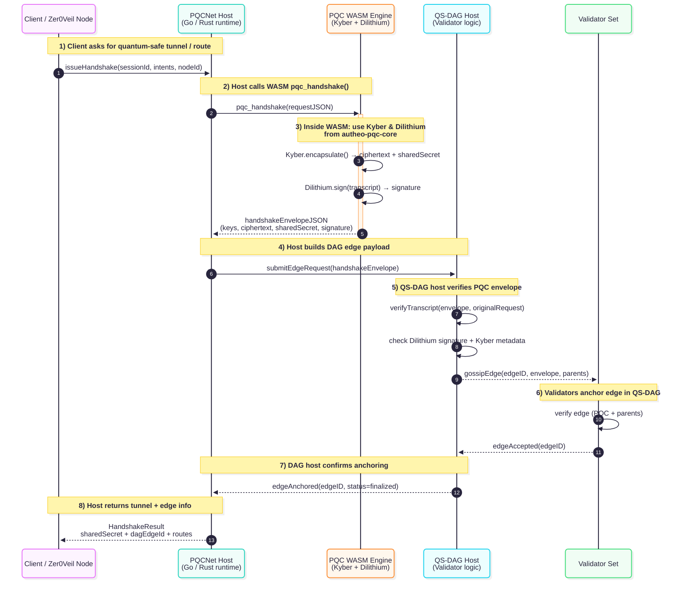

# PQCNet Contracts

**PQCNet** is a Rust contract library for NIST-compliant post-quantum cryptography, designed to plug into Autheo-One’s PQCNet node and QS-DAG consensus.

It provides:

- **ML-KEM (Kyber)** for key encapsulation and session key establishment  
- **ML-DSA (Dilithium)** for digital signatures and batch verification  
- **Rotating, threshold-protected KEM key management** (e.g. *t* = 3, *n* = 5)  
- **Atomic sign-and-exchange flows** for securing key exchanges  
- **QS-DAG integration hooks** for anchoring PQC signatures in the DAG

> ⚠️ This crate does **not** implement crypto primitives itself.  
> It defines **traits and contract logic** around *audited, NIST-compliant* PQC engines that you plug in from `autheo-pqc` (Kyber/Dilithium WASM, PQClean, etc.).

---

## Workspace Layout

- `autheo-mlkem-kyber/` – deterministic Kyber (ML-KEM-768) adapter + browser WASM demo artifacts.
- `autheo-mldsa-dilithium/` – deterministic Dilithium3 (ML-DSA-65) adapter + demo artifacts.
- `autheo-mldsa-falcon/` – deterministic Falcon placeholder for future ML-DSA integrations.
- `autheo-pqc-core/` – contract logic, trait definitions, key management, signatures, QS-DAG glue.
- `autheo-pqc-wasm/` – `cdylib` that exposes the PQC ABI (`pqc_alloc`, `pqc_free`, `pqc_handshake`) for hosts.
- `wazero-harness/` – Go harness used to exercise the WASM ABI end-to-end.

Add new algorithm crates (e.g., future NIST picks) by following the same pattern and letting `autheo-pqc-core` compose them.

---

## High-Level Architecture (`autheo-pqc-core`)

### Modules

- `kem.rs` – ML-KEM abstraction (`MlKem`, `MlKemEngine`, `MlKemKeyPair`)
- `dsa.rs` – ML-DSA abstraction (`MlDsa`, `MlDsaEngine`, `MlDsaKeyPair`)
- `key_manager.rs` – rotating KEM key management and policy
- `signatures.rs` – signing, verifying, batch verify, and “sign KEM transcript”
- `qs_dag.rs` – QS-DAG integration shim for anchoring PQC signatures
- `types.rs` – common types (`KeyId`, `EdgeId`, `SecurityLevel`, etc.)
- `error.rs` – standardized error type (`PqcError`) and `PqcResult<T>`

All modules are written to be `no_std`-friendly and can be compiled to WASM for embedding in Autheo’s PQCNet node.

---

## Design Goals

### 1. NIST-Compliant PQC

PQCNet is built around NIST standards:

- **ML-KEM** (Kyber) – FIPS 203  
- **ML-DSA** (Dilithium) – FIPS 204  

The contract layer:

- **Assumes** an underlying engine that:
  - Passes NIST Known Answer Tests (KATs)
  - Implements **IND-CCA2** security for ML-KEM
  - Implements **EUF-CMA** security for ML-DSA
  - Is constant-time to avoid timing side channels
- Exposes safe, typed APIs for:
  - Key generation
  - Encapsulation / decapsulation
  - Signing / verifying / batch verifying

All heavy crypto is handled by the **PQC engines**, not this repo.

---

### 2. Rotating Key Management (ML-KEM)

`key_manager.rs` manages an active KEM key and a rotation policy:

- Generates a new ML-KEM keypair via `MlKemEngine`
- Derives a stable `KeyId` from the public key + timestamp
- Stores:
  - `public_key`
  - `created_at`
  - `expires_at`
  - `SecurityLevel`
- Enforces a **rotation interval** (e.g. `300_000 ms` = 300 s)
- Exposes an `encapsulate_for_current()` helper to derive fresh session keys

Threshold-sharing (e.g. Shamir with *t = 3*, *n = 5*) is treated as a **host responsibility**:

- The contract defines the **policy** (`ThresholdPolicy { t, n }`)
- The PQCNet / validator infra actually:
  - Splits the secret key into shares
  - Distributes & stores them in secure enclaves / services
  - Recombines shares when needed

This separation keeps the contract simple and allows richer math libraries and HSMs off-chain.

---

### 3. ML-DSA Signatures & Batch Verification

`signatures.rs` manages signing keys and signatures using `MlDsaEngine`:

- Generates ML-DSA keypairs and registers their `KeyId`
- Signs arbitrary messages with a secret key
- Verifies signatures by `KeyId`
- Provides **batch verification** for high throughput:
  - Designed to support ≥ 100 operations per batch
  - Can be swapped to use native aggregated verification if your engine supports it

It also implements a **combined flow**:

> *Sign the KEM transcript atomically* — e.g. signing a key exchange

- Takes an `MlKemEncapsulation` (ciphertext + shared secret) and a context
- Builds a deterministic transcript
- Signs it with ML-DSA in one call

This addresses the “signing a key exchange with no intermediate data exposure” requirement.

---

### 4. QS-DAG Integration

`qs_dag.rs` defines a `QsDagHost` trait that your consensus layer implements:

- `attach_pqc_signature(edge_id, signer, signature)`
- `get_edge_payload(edge_id)`

Then `QsDagPqc` provides a helper:

```rust
verify_and_anchor(
    edge_id,
    signer_key_id,
    signature,
    verify_fn, // e.g. SignatureManager::verify
)
The flow:

Load the DAG payload for the given edge_id.

Verify the ML-DSA signature over that payload.

On success, attach the signature to the DAG.

This is where you can benchmark PQC overhead compared to baseline and enforce the < 5% DAG edge update overhead target.

Example Usage

These examples use pseudo “host engines” – in real deployments you’d bind to WASM or native implementations from autheo-pqc.

Key Generation & Rotation (ML-KEM)
use autheo_pqc_core::kem::{MlKem, MlKemEngine};
use autheo_pqc_core::key_manager::{KeyManager, ThresholdPolicy};
use autheo_pqc_core::types::TimestampMs;

struct HostKemImpl; // your Kyber implementation

impl MlKem for HostKemImpl {
    // implement level(), keygen(), encapsulate(), decapsulate()
}

fn example_key_rotation(now_ms: TimestampMs) {
    let kem_engine = MlKemEngine::new(&HostKemImpl);

    let mut km = KeyManager::new(
        kem_engine,
        ThresholdPolicy { t: 3, n: 5 },
        300_000, // 300 seconds
    );

    let current = km.keygen_and_install(now_ms).unwrap();

    // Later…
    let _maybe_rotated = km.rotate_if_needed(now_ms + 301_000).unwrap();
}

Signing & Verifying (ML-DSA)
use autheo_pqc_core::dsa::{MlDsa, MlDsaEngine};
use autheo_pqc_core::signatures::SignatureManager;

struct HostDsaImpl; // your Dilithium implementation

impl MlDsa for HostDsaImpl {
    // implement level(), keygen(), sign(), verify()
}

fn example_signing() {
    let dsa_engine = MlDsaEngine::new(&HostDsaImpl);
    let mut sig_mgr = SignatureManager::new(dsa_engine);

    let now = 1_700_000_000_000u64;
    let (key_state, keypair) = sig_mgr.generate_signing_key(now).unwrap();

    let msg = b"hello, quantum world";
    let sig = sig_mgr.sign(&keypair.secret_key, msg).unwrap();

    // Verify by logical KeyId
    sig_mgr.verify(&key_state.id, msg, &sig).unwrap();
}

Performance Targets

The crate is designed to support:

Latency: < 1 ms per sign/verify operation on modern CPUs (e.g. Ryzen 9), assuming optimized engines

Throughput: ≥ 10,000 TPS via:

Batching (e.g. batch_verify)

Parallel execution for independent keys and DAG edges

Performance is primarily determined by:

The underlying ML-KEM / ML-DSA engine implementation

Host runtime (threading, SIMD, scheduling)

Storage and QS-DAG overhead

The contracts themselves are thin wrappers that do not introduce unnecessary allocations or complex control flow.

Security & Audit Notes

All cryptographic correctness and NIST guarantee proofs (IND-CCA2 / EUF-CMA) live in the PQC engine layer.

This repo’s responsibilities:

Avoid leaking intermediate secrets or partial outputs

Provide clean, minimal interfaces with clear semantics

Keep logic deterministic and side-channel-conscious

Recommended audit checks:

Verify that only approved PQC engines are wired into MlKemEngine / MlDsaEngine

Confirm no direct access to secret keys is exposed beyond the expected APIs

Confirm all key rotations and policies align with Autheo’s forward-secrecy requirements

Building & Testing
Build
# Standard
cargo build

# For WASM targets (example)
cargo build --target wasm32-unknown-unknown

Tests

Unit tests and integration tests should live alongside the engine bindings:

Crypto KAT tests → in the engine repo (e.g. autheo-pqc)

Contract logic tests → in this repo (tests/)

Example:

cargo test


You should include:

Key rotation tests (interval expiry, policy enforcement)

Threshold policy tests (t/n constraints)

Signature and batch-verification tests

DAG integration tests with a mocked QsDagHost

### Automated Test Coverage Snapshot (2025-11-15)

`cargo test` fans out across all crates and currently reports:

- `autheo-mldsa-dilithium`: 5 unit tests covering ML-DSA key/sig sizing, tamper detection, and failure cases.
- `autheo-mldsa-falcon`: 4 unit tests that exercise Falcon-style ML-DSA signing and verification edge cases.
- `autheo-mlkem-kyber`: 4 ML-KEM tests validating keypair levels plus encapsulation/decapsulation error paths.
- `autheo-pqc-core`: 15 contract-level tests spanning `KeyManager`, `SignatureManager`, `qs_dag::verify_and_anchor`, `runtime`, and the full `handshake::execute_handshake` record serialization.
- `autheo-pqc-wasm`: ABI crate builds cleanly (0 intrinsic tests) to ensure the WASM surface stays lean and host-driven.
- Doc-tests: 2 illustrative examples (`key_manager.rs`, `signatures.rs`) compile but are ignored because they depend on host engines.

These results confirm that both the deterministic Kyber/Dilithium adapters and the shared contract glue behave as expected before producing the WASM artifact. The `wazero-harness` then drives the exported `pqc_handshake` ABI with

```
go run . -wasm ../pqcnet-contracts/target/wasm32-unknown-unknown/release/autheo_pqc_wasm.wasm
```

to prove that the compiled WASM emits a handshake envelope, recomputes `SignatureManager::sign_kem_transcript`, and records a QS-DAG anchor for the advertised `edge_id`.

Roadmap

 Wire to Autheo’s Kyber/Dilithium WASM engines

 Add Shamir threshold helper for dev/test environments

 Add benchmarking harness for TPS & DAG overhead

 Expose FFI/ABI definitions for PQCNet node host (Go/Rust)

 Publish crate docs via cargo doc / hosted docs

---

## WASM Handshake ABI & Go wazero Harness

The crate exports the enclave surface used by Autheo’s host runtime:

- `pqc_alloc(len: u32) -> u32` / `pqc_free(ptr: u32, len: u32)` – custom
  allocator helpers for the host-side runtime.
- `pqc_handshake(req_ptr, req_len, resp_ptr, resp_len) -> i32` – drives the full
  ML-KEM + ML-DSA flow and writes a structured response into the caller’s buffer.
  Non-negative return values indicate the number of bytes written; `-1` signals
  invalid input, `-2` indicates an undersized response buffer, and `-127`
  captures internal errors.

### Handshake record layout

`execute_handshake` now emits a binary envelope composed of a fixed header
followed by variable-length sections:

| Offset | Size | Description |
| --- | --- | --- |
| 0   | 4   | Magic `PQC1` |
| 4   | 1   | Version (`0x01`) |
| 5   | 1   | ML-KEM security level tag |
| 6   | 1   | ML-DSA security level tag |
| 7   | 1   | Threshold `t` |
| 8   | 1   | Threshold `n` |
| 9   | 1   | Reserved |
| 10  | 32  | Current ML-KEM `KeyId` |
| 42  | 32  | Signing `KeyId` |
| 74  | 8   | ML-KEM `created_at` (ms) |
| 82  | 8   | ML-KEM `expires_at` (ms) |
| 90  | 10  | Five little-endian `u16` lengths: ciphertext, shared secret, signature, ML-KEM public key, ML-DSA public key |
| 100 | var | Ciphertext bytes |
| …   | var | Shared secret bytes |
| …   | var | ML-DSA signature |
| …   | var | ML-KEM public key |
| …   | var | ML-DSA public key |

Hosts must provision a response buffer that can hold the header plus all
sections (the wazero harness allocates 4 KiB for simplicity).

### Build the WASM artifact

```
cd pqcnet-contracts
cargo build --release -p autheo-pqc-wasm --target wasm32-unknown-unknown
# -> target/wasm32-unknown-unknown/release/autheo_pqc_wasm.wasm
```

### Run the Go+wazero harness

```
cd wazero-harness
go run . \
  -wasm ../pqcnet-contracts/target/wasm32-unknown-unknown/release/autheo_pqc_wasm.wasm
```

The harness now:

1. Builds a nonce-bearing query string (`client=autheo-demo&ts=<unix-nanos>`)
   and derives a deterministic DAG `edge_id`.
2. Registers the request payload inside a mock `QsDagHost`.
3. Calls `pqc_handshake` and parses the envelope into strongly typed metadata.
4. Persists the advertised `KeyId`s, public keys, thresholds, and rotation data.
5. Recomputes the ML-DSA transcript signature
   (`ciphertext || shared_secret || request`) to mirror
   `SignatureManager::sign_kem_transcript`.
6. Invokes `QsDagPqc::verify_and_anchor` semantics in Go by re-verifying over
   the stored DAG payload and recording the anchored signature.

> ℹ️ The demo engines in `src/adapters.rs` are deterministic, BLAKE2s-based
> stand-ins. Swap them for Autheo’s audited Kyber/Dilithium modules (or native
> bindings) to obtain production-ready shared secrets and signatures without
> touching the contract logic or harness.

### QS-DAG Handshake Flow

The runtime path for `issueHandshake` requests is implemented jointly by `autheo-pqc-wasm` and `autheo-pqc-core`:

1. The host runtime forwards the client request JSON into the exported `pqc_handshake` function, which immediately calls `handshake::execute_handshake` after validating the buffer and pulling a monotonic timestamp via `runtime::with_contract_state`.
2. `KeyManager::encapsulate_for_current` rotates Kyber keys if needed, derives the ciphertext/shared secret pair, and exposes the active `ThresholdPolicy`.
3. `SignatureManager::sign_kem_transcript` binds the ciphertext, shared secret, and original request string with Dilithium before the handshake artifacts are serialized into the `PQC1` binary layout.
4. The host wraps this envelope into a QS-DAG `edge` payload and invokes its `QsDagHost` implementation; `QsDagPqc::verify_and_anchor` replays the Dilithium verification before gossiping to validators.
5. Validators attest to the edge, after which the host returns the finalized shared secret, DAG edge metadata, and routing hints to the client.



---

## LibOQS Integration & CLI Harness

- Enable the optional `liboqs` feature (`cargo build -p autheo-pqc-core --features liboqs`) to swap the deterministic demo engines for liboqs-rs bindings (Kyber ML-KEM + Dilithium ML-DSA).
- `liboqs::LibOqsProvider` wraps `KeyManager` and `SignatureManager`, exposing:
  - `keygen(now_ms)` – installs fresh ML-KEM / ML-DSA key material and returns both the contract metadata and the raw keypairs for host persistence.
  - `rotate(now_ms)` – enforces the ML-KEM rotation interval and rotates the ML-DSA signer for forward secrecy.
  - `sign(data)` / `verify(data, sig)` – ML-DSA helpers bound to the active key identifier, plus `encapsulate_for_current()` for ML-KEM session establishment.
- The feature is blocked on `wasm32` targets, so `autheo-pqc-wasm` keeps compiling with the deterministic adapters while native hosts can opt into liboqs.
- A tiny CLI harness validates the workflow end-to-end:

```
cargo run -p autheo-pqc-core --bin liboqs_cli --features liboqs -- --message "veil handshake"
```

  The tool prints the generated key identifiers, signs and verifies the provided message, and forces a rotation cycle to demonstrate the liboqs-backed flow.

License

TBD – e.g. MIT / Apache-2.0 (align with Autheo’s policy).