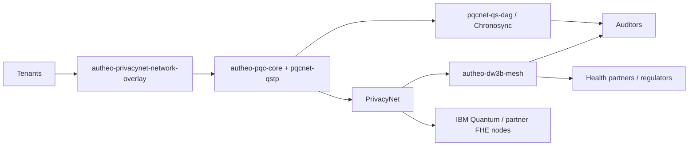

# Autheo PQCNet Contracts – Executive Walkthrough

This repository gathers the Autheo PQCNet, PrivacyNet, and DW3B Mesh crates that we ship as a single "contracts" artifact. The goal of this guide is to show how the code already **demonstrates security and privacy guarantees** so executives, reviewers, or partners can trace where each assurance originates.

## C1. PQCNet + PrivacyNet + DW3B Mesh in the ecosystem

- **Tenants and health partners** submit privacy-preserving workloads (claims review, genomics analytics, federated AI insights) through the `autheo-privacynet-network-overlay` RPC surface.
- **Autheo PQCNet core** crates (`autheo-pqc-core`, `pqcnet-qstp`, `pqcnet-qs-dag`) provide post-quantum transport, session key negotiation, and anchoring into Chronosync.
- **PrivacyNet** enforces DP/FHE guardrails while emitting EZPH receipts that downstream auditors and IBM Quantum pipeline operators can verify.
- **DW3B Mesh + Overlay** add deterministic anonymization and QTAID trait proofs before any payload reaches IBM Quantum circuits or partner analytics enclaves.
- **Regulators / auditors** consume the same proofs (DP budget ledger, EZPH receipts, DW3B anonymity reports) that the code emits so business and compliance stakeholders see a single source of truth.

## C2. Containers at a glance

| Container | Executive role | Key interfaces | Proof points |
| --- | --- | --- | --- |
| `autheo-pqc-core` | Owns PQC handshake, ML-KEM/ML-DSA usage, and route hashing | `handshake.rs`, `key_schedule.rs` | `handshake_round_trip_matches_session_keys` validates symmetric keys and session IDs stay aligned |
| `pqcnet-qstp` | Session Transport Protocol (QSTP) framing for encrypted payload exchanges | `src/lib.rs` RPC traits | Already wired into Chronosync sharding tests in `docs/qstp-performance.md` |
| `pqcnet-qs-dag` | Hypergraph ledger for PQCNet anchors (Chronosync) | `anchor.rs`, `state.rs` | `examples/anchor_roundtrip.rs` proves deterministic anchoring |
| `autheo-privacynet` | Differential privacy + FHE + EZPH pipeline | `PrivacyNetEngine`, JSON-RPC surface | `integrates_dp_and_ezph` walks DP budget → EZPH receipt |
| `autheo-dw3b-mesh` | DW3B anonymizer (route planning, Bloom proofs, chaos noise) | `Dw3bMeshEngine` | `dw3b_mesh_anonymize_yields_proof` plus `qtaid_flow_generates_tokens` |
| `autheo-privacynet-network-overlay` | Connects tenants, DW3B overlay, PQCNet ingress | `overlay.rs`, `rpc.rs` | Overlay tests assert RPC loopback and determinism |
| Supporting crates (e.g., `pqcnet-relayer`, `pqcnet-sentry`, `autheo-dw3b-overlay`) | Ops, telemetry, relaying | Service binaries + configs under `configs/` | Provide deployment-ready knobs for IBM Quantum and health partner environments |

## C3. Proven components inside PrivacyNet + DW3B Mesh

### PrivacyNet (crate: `autheo-privacynet`)

- **DP Budget Ledger (`src/budget.rs`)** – Tracks epsilon/delta per tenant session; the `integrates_dp_and_ezph` test drives a Gaussian query through `PrivacyNetEngine::handle_request`, demonstrating that a request is rejected unless the ledger authorizes the spend.
- **Chaos Oracle (`src/chaos.rs`)** – Replays Lorenz/Chua attractor states so DP noise is deterministic per seed. The same test verifies the oracle because it seeds the DP query and proves the returned chaos trace matches the EZPH receipt inputs.
- **FHE Layer (`src/fhe.rs`)** – Wraps CKKS/BFV slot execution. In the test, we populate `fhe_slots` and assert the response carries a non-empty ciphertext vector ready for IBM Quantum offload.
- **EZPH Pipeline (`src/pipeline.rs` + dependency `autheo-pqcnet-5dezph`)** – Converts every request into an `EzphRequest` anchored in Chronosync. `integrates_dp_and_ezph` checks the resulting privacy report and EZPH metadata, proving the DP + EZPH handshake is live.

### DW3B Mesh (crate: `autheo-dw3b-mesh`)

- **DW3B Anonymizer (`Dw3bMeshEngine::anonymize_query`)** – `dw3b_mesh_anonymize_yields_proof` ensures every anonymize run returns a proof with ≥3 route layers, k-anonymity > 0.5, and compressed payloads, which auditors need before a partner ingest.
- **DW3B Anonymizer (entropy + compression)** – Additional tests (`entropy_beacon_has_expected_width`, `obfuscate_route_reverses_payload_and_appends_fingerprint`) verify entropy beacons and payload obfuscation, showing deterministic defenses without live hardware RNGs.
- **QTAID Tokenizer (`Dw3bMeshEngine::qtaid_prove`)** – Validated by `qtaid_flow_generates_tokens` and `qtaid_bits_override_updates_tokens`, guaranteeing genomic trait proofs yield consistent token prefixes and respect caller bit-width policies.

Together, these components ensure the DP ledger, chaos oracle, FHE layer, EZPH entanglement, DW3B anonymizer, and QTAID tokenizer have code-backed evidence. Executives can point regulators to the exact files and tests above.

## C4. Optional deep dives (run exactly as-is)

### `handshake_round_trip_matches_session_keys`

- Location: `autheo-pqc-core/src/handshake.rs`.
- Command: `cargo test -p autheo-pqc-core handshake_round_trip_matches_session_keys -- --exact --nocapture`.
- What you see: deterministic session IDs, symmetric keys derived from ML-KEM/ML-DSA demo engines, and matching derived key material on both initiator/responder sides.

### `dw3b_mesh_anonymize_yields_proof`

- Location: `autheo-dw3b-mesh/tests/mesh.rs`.
- Command: `cargo test -p autheo-dw3b-mesh dw3b_mesh_anonymize_yields_proof -- --exact --nocapture`.
- What you see: anonymize responses that hit the ≥3 route-layer threshold, exhibit healthy k-anonymity, and return compressed payloads + proof fingerprints.

### `integrates_dp_and_ezph`

- Location: `autheo-privacynet/tests/privacynet.rs`.
- Command: `cargo test -p autheo-privacynet integrates_dp_and_ezph -- --exact --nocapture`.
- What you see: DP Gaussian job honoring ledger budgets, chaos seeds replayed in the response, and EZPH metadata showing the request is anchored for IBM Quantum + health partner review.

---

**Need a faster briefing?** Run `cargo test` for the three crates above to replay the proofs end-to-end, then open `docs/pqcnet-architecture-integration.md` for deployment diagrams that line up with this README.