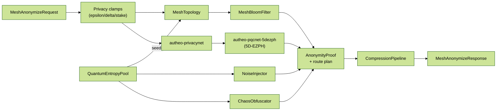

# Autheo DW3B Mesh

`autheo-dw3b-mesh` implements the DW3B privacy mesh engine that pairs the
Autheo PrivacyNet pipeline with the dark-web overlay guarantees defined in the
Autheo PrivacyNet + DW3B Mesh primer. The crate exposes a deterministic
`Dw3bMeshEngine` that orchestrates TFHE-backed homomorphic slots, Rényi/Gaussian differential
privacy, recursive Halo2 + RISC Zero proof stubs, Zstandard/fractal compression,
Chua/Rössler chaos perturbations, and Bloom-filter backed anonymity proofs.

## Highlights

- **Privacy primitives** – wraps the production `autheo-privacynet` engine and
  layers DW3B-specific components such as Rényi accountants, Laplace/Gaussian
  noise injectors, and the quantum one-way entropy pool used by the DW3B mesh.
- **Mesh routing** – synthesizes stake-aware route plans across Mixnet/Tor/I2P,
  Query Mesh, Stake Anonymity, CDN, Index, Governance, and Micro-Node roles while
  computing deterministic k-anonymity + Bloom false-positive bounds.
- **Anonymity proofs** – produces the `AnonymityProof` structure described in the
  spec (SNARK/STARK/FHE slices, Bloom membership hash, stake commitment, mixnet
  hops) so overlays can verify the provenance of entangled proofs.
- **Noise + chaos** – deterministic Chua/Rössler integrators seed privacy noise
  and chaos-based route jitter, giving auditors reproducible Lyapunov metrics
  (λ ≥ 4.5) and entropy amplification traces.
- **Compression pipeline** – applies Zstandard with DW3B markers plus a fractal
  projection stub to keep ciphertext expansion ≤ 4:1 before CDN/Index caching.

## Code flow



Requests enter through privacy budget clamps, are routed through the mesh
topology with entropy-derived seeds, and ultimately fuse PrivacyNet responses,
5D-EZPH entanglement metadata, Bloom summaries, noise, and chaos trajectories
into a deterministic DW3B `MeshAnonymizeResponse`.

## Using the engine

```rust
use autheo_dw3b_mesh::{
    config::Dw3bMeshConfig,
    engine::{Dw3bMeshEngine, MeshAnonymizeRequest},
};

let config: Dw3bMeshConfig = toml::from_str(&std::fs::read_to_string("config/dw3b.toml")?)?;
let request: MeshAnonymizeRequest = serde_yaml::from_str(
    &std::fs::read_to_string("config/examples/dw3b_request.yaml")?,
)?;
let mut engine = Dw3bMeshEngine::new(config);
let response = engine.anonymize_query(request)?;
println!(
    "proof_id={} route_layers={}",
    response.proof.proof_id,
    response.route_plan.hops.len()
);
```

`Dw3bMeshConfig::zk_prover` / `fhe_backend` thread directly into `PrivacyNetConfig::ezph`, so you
can switch between the Halo2+TFHE path and the mock pipeline without touching engine code.

Sample hardened configs live under `config/dw3b.{toml,yaml}` and the walkthrough example will
auto-load them (or honor `DW3B_CONFIG`). Provide a request manifest via
`config/examples/dw3b_request.{toml,yaml}` or override the `DW3B_REQUEST` env var.

See `examples/dw3b_walkthrough.rs` for a narrated run that prints:

- DP budget claims + Rényi accountant
- Chaos trajectory (Chua/Rössler coordinates and Lyapunov exponent)
- Route plan with DW3B node kinds and Poisson mixnet decoys
- Entangled proof metadata (Halo2 digest, STARK fallback, Bloom hash)

## Examples

```
cargo run -p autheo-dw3b-mesh --example dw3b_walkthrough
```

The walkthrough streams anonymize + QTAID results, the Lyapunov trace, and the
5D-EZPH entanglement references that Chronosync consumes downstream.

## Testing

```
cargo test -p autheo-dw3b-mesh
```

`tests/mesh.rs` exercises anonymization flows, Bloom filter math, entropy
beacons, QTAID proofs, and the obfuscation helpers (payload reversal +
fingerprint binding). The in-process Halo2 prover + TFHE evaluator run by default;
flip `Dw3bMeshConfig::zk_prover`/`privacy.ezph.fhe_evaluator` if you need the deterministic mock
backends for regression tests.
