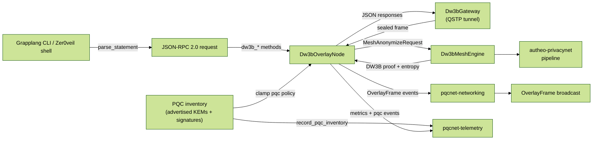

# Autheo DW3B Overlay

`autheo-dw3b-overlay` exposes the Dark Web Privacy Network (DW3B) facade that
wraps the `autheo-dw3b-mesh` engine with transports, JSON-RPC 2.0 endpoints, and
Zer0veil/Grapplang bindings. The overlay mirrors the methods described in the
PrivacyNet + DW3B Mesh primer (`dw3b_anonymizeQuery`, `dw3b_obfuscateRoute`,
`dw3b_policyConfigure`, `dw3b_entropyRequest`, `dw3b_qtaidProve`, `dw3b_syncState`)
so control planes can interact with the privacy stack using the exact API
surface documented in the spec.

## Features

- **Mesh orchestration** – embeds `Dw3bMeshEngine`, converts RPC payloads into
  anonymization requests, and publishes overlay frames (vertex created, proof
  generated, entropy beacon, policy changes) through `pqcnet-networking`.
- **QSTP sealing** – `transport::QstpGateway` encapsulates JSON-RPC frames inside
  AES-GCM envelopes derived from QSTP tunnels, mirroring the production
  loopback/harness strategy.
- **DW3B RPC schema** – `rpc` module implements the JSON-RPC 2.0 contracts for
  anonymize, obfuscate, policy configure, entropy request, state sync, and QTAID
  proofs. Responses include AnonymityProof objects, Bloom summaries, and mesh
  telemetry to keep sentries/relayers honest.
- **Grapplang parsing** – `grapplang` translates Zer0veil shell commands into the
  corresponding RPC requests (e.g., `dw3b-anonymize`, `qtaid-prove`,
  `dw3b-policy`).
- **Telemetry + networking** – integrates with `pqcnet-telemetry` for latency/
  counter recording and `pqcnet-networking` for gossiping overlay frames across
  DW3B observers.
- **PQC advertisement telemetry** – the new `pqc` config section lists the ML-KEM
  public keys and signature redundancy policy that the overlay advertises, and the
  node records those disclosures via `pqcnet-telemetry` so operators can prove
  kyber/hqc fallbacks are armed.

## PQC configuration

`Dw3bOverlayConfig` now exposes a `pqc` section so overlays can declare the
KEMs and signature redundancy stack they publish to relayers, regulators, and
dashboards. The block mirrors the layout used across the PQCNet services:

```toml
[pqc]
[[pqc.advertised-kems]]
scheme = "kyber"
public-key-hex = "9fa0c3c7f19d4eb64a88d9dcf45b2e77e6f233..."
key-id = "dw3b-kyber-0001"
backup-only = false

[[pqc.advertised-kems]]
scheme = "hqc"
public-key-hex = "6cbf9cd9bf2d4de1a0aa9b6dd92d8f041b847..."
key-id = "dw3b-hqc-0001"
backup-only = true

[pqc.signature-redundancy]
primary = "dilithium"
backup = "sphincs"
require-dual = true
```

On startup the overlay records every advertised KEM as a telemetry event (marking
backup-only entries as drills) and exposes the signature stack as a synthetic
`signature-stack` record. Dashboards therefore show, in real time, whether Kyber,
HQC, and the Dilithium+SPHINCS tandem are armed before traffic flows through the
overlay.

## Code flow



The overlay accepts either Grapplang statements or JSON-RPC envelopes, clamps
privacy budgets, runs the DW3B mesh engine, and then uses QSTP sealed frames to
return proofs plus telemetry-backed overlay events. The PQC inventory is fed into
telemetry the moment the node boots so observers can see exactly which KEM and
signature stacks are active. Everything is deterministic under
`Dw3bOverlayConfig::demo()`, which keeps docs, examples, and tests aligned.

## Quick start

```rust
use autheo_dw3b_overlay::{
    config::Dw3bOverlayConfig,
    overlay::Dw3bOverlayNode,
    transport::loopback_gateways,
};

let config = Dw3bOverlayConfig::demo();
let (gateway, _) = loopback_gateways(&config.qstp).unwrap();
let mut node = Dw3bOverlayNode::new(config, gateway);
let response = node.handle_jsonrpc(r#"{
    "jsonrpc": "2.0",
    "id": 1,
    "method": "dw3b_anonymizeQuery",
    "params": {
        "did": "did:autheo:demo",
        "attribute": "age > 18",
        "payload": "kyc-record-42",
        "epsilon": 1e-6,
        "delta": 8.7e-13,
        "route_layers": 5
    }
}"#).unwrap();
println!("{response}");
```

## Examples

- **Loopback JSON-RPC** – run `cargo run -p autheo-dw3b-overlay --example loopback_overlay`
  to see the overlay handle a JSON-RPC anonymize request, answer an entropy beacon
  that arrived over the loopback QSTP tunnel, and parse Grapplang commands. The
  example prints the proof id, entropy sample count, and the parsed Grapplang
  options so shell tooling can mirror the same flow.

## Testing

```
cargo test -p autheo-dw3b-overlay
```

The default sweep now skips the heavy DW3B ZK proof paths so `cargo test` stays fast.
Set `RUN_HEAVY_DW3B=1` (or the broader `RUN_HEAVY_ZK=1`) before running the tests,
or build with `--features real_zk`, to opt into the full anonymize/QTAID/entropy
integration cases.

`tests/overlay.rs` now drives anonymize + QTAID flows, verifies Grapplang parsing,
and exercises the QSTP loopback entropy path. The added coverage ensures the
overlay clamps privacy budgets, parses CLI statements, and returns VRB beacons
exactly the way the README diagrams describe once the heavy tests are enabled.
