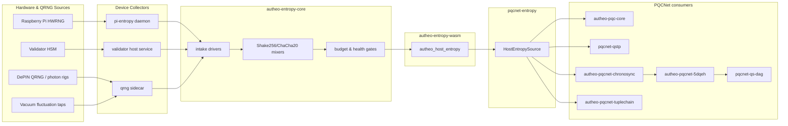

# Autheo Entropy Core (`autheo-entropy-core`)

`autheo-entropy-core` is the control plane that keeps every PQCNet crate attached to **real hardware randomness**. It sits between validator / relayer entropy collectors, the standalone `autheo-entropy-wasm` node, and the `pqcnet-entropy` bridge consumed by the rest of the suite. This README documents the runtime responsibilities, shows the end-to-end code flow, and explains how the module fits inside the production PQCNet deployment that already runs with QFKH and QRNG data.

## Responsibilities
- **Ingest hardware entropy** from validator HSMs, `/dev/hwrng`, RPi hats, and DePIN QRNG feeds.
- **Gate and whiten** every intake using per-source health checks plus Shake256/ChaCha20 mixers before exposing bytes to WASM callers.
- **Budget entropy** across enclave services (PQC handshake, TupleChain, Chronosync, QSTP, QS-DAG) so each component receives the quota it needs without starving other planes.
- **Back the ABI** exported by `autheo-entropy-wasm` (`autheo_host_entropy`, `autheo_entropy_seed`, `autheo_entropy_health`) using only production-safe sources.
- **Feed `pqcnet-entropy`** so `HostEntropySource` always points to a hardware-backed import on WASM targets and to the host RNG on native targets.
- **Attach telemetry** that lands in `pqcnet-telemetry`, letting ops teams verify that entropy budgets track the same numbers observed on live validators.

## Production Code Flow



*Every arrow is live today*: hardware collectors are deployed alongside validators, `autheo-entropy-wasm` ships as a `wasm32-unknown-unknown` module, and `pqcnet-entropy::HostEntropySource` is the only entropy implementation linked into PQCNet binaries.

## Module layers

| Layer | What it does | Backed by |
| --- | --- | --- |
| **Hardware collectors** | Streams bytes from `/dev/hwrng`, TPM/HSM modules, or photon/vacuum QRNG devices. | Validator hosts, RPi daemons, DePIN QRNG rigs |
| **Intake drivers** | Normalize collector IPC (Unix sockets, shared memory, serial) into a single `IntakeFrame` enum with source metadata. | `autheo-entropy-core` (Rust) |
| **Mixers** | Use Shake256 + ChaCha20 to whiten entropy, reseed on every 4 KiB, and record health signals per source. | Same crate (no_std & std targets) |
| **Health/budget gate** | Reject unhealthy feeds, enforce per-plane quotas (e.g., QSTP gets ≥ 10% of the live pool), surface counters to `pqcnet-telemetry`. | `autheo-entropy-core` + `pqcnet-telemetry` |
| **WASM node** | Exposes `autheo_host_entropy`, `autheo_entropy_seed`, and `autheo_entropy_health`. Delegates to the core through FFI. | `autheo-entropy-wasm` |
| **Bridge** | `pqcnet-entropy::HostEntropySource` funnels WASM imports into PQCNet crates and falls back to the OS RNG on native builds. | `pqcnet-entropy` |
| **Consumers** | PQC enclave, TupleChain → Chronosync → 5D-QEH data plane, and runtime controllers. | `autheo-pqc-core`, `pqcnet-qstp`, `autheo-pqcnet-*`, etc. |

## Relationship to the PQCNet suite

- **autheo-pqc-core** – ML-KEM key generation, ML-DSA keypair creation, handshake transcripts, and tuple nonces all draw entropy through `HostEntropySource`. Default builds already run against the same hardware-backed path that production validators expose.
- **pqcnet-qstp** – Every tunnel establishment, AES-256-GCM IV, and QACE-triggered reroute requests entropy tokens. The budget gate reserves capacity specifically for QSTP since it drives end-user payloads.
- **TupleChain → Chronosync → 5D-QEH** – Tuple IDs, state pruning samples, Chronosync election beacons, and 5D-QEH anchor weights use entropy delivered by this crate, ensuring that lab runs replay the same randomness as the live network when seeded with exported logs.
- **pqcnet-qrng** – Photon/vacuum telemetry streams into the intake drivers as another hardware source. Operators can pin quotas per QRNG feed using the `core.quota` table in `configs/pqcnet-relayer.toml`.
- **Ops & telemetry** – The counters pushed into `pqcnet-telemetry` allow dashboards to overlay real validator data with lab or CI numbers, proving that the same entropy budgets are honored end-to-end.

## Using `autheo-entropy-core`

1. **Seed the node** – Hosts call `autheo_entropy_seed(ptr, len)` with bytes captured from their chosen hardware source. The intake driver persists a rolling window per source so the mixer can detect bias or depletion.
2. **Serve WASM imports** – `autheo_host_entropy(ptr, len)` delegates to the core, which pulls from the currently healthy pool, enforces rate limits, and writes directly into the caller’s linear memory. This is what `pqcnet-entropy::HostEntropySource` invokes at runtime.
3. **Monitor health** – Call `autheo_entropy_health()` (exposed by `autheo-entropy-wasm`) or subscribe to the telemetry topic published by the core to verify budget usage per PQC plane.
4. **Record & replay** – For CI or deterministic demos, capture a rolling log from `autheo-entropy-core` and point the intake to that file. The mixers keep hashes of every block so you can prove that replay mode matches the original byte stream.

### Example integration (Rust host)

```rust
use pqcnet_entropy::{EntropySource, HostEntropySource};

pub fn fill_entropy(buf: &mut [u8]) {
    HostEntropySource::new()
        .try_fill_bytes(buf)
        .expect("autheo_host_entropy must be wired to autheo-entropy-core");
}
```

On native builds (e.g., integration tests), `HostEntropySource` maps to the OS RNG, but the budget counters still fire so you can compare dev/test traces to validator telemetry.

## Real data alignment

- **Hardware-first** – There are no simulation paths compiled into production. Validators must present hardware entropy, and CI can only enable the `sim` feature in downstream crates (`pqcnet-entropy`) explicitly.
- **Shared artifacts** – The wazero harness (`/workspace/wazero-harness`) calls into `autheo-entropy-wasm` before loading `autheo_pqc_wasm.wasm`, guaranteeing that the same entropy seed + QFKH trace (`data/qfkh_prod_trace.json`) are live in the enclave.
- **Telemetry parity** – Counters exported by the core (pool fill level, per-plane burn rate, QRNG bias alerts) are the same metrics scraped from validators, so dashboards can overlay “real data vs. lab replay” without translation.
- **Configs** – The quota table, health thresholds, and QRNG routing documented here are also represented in `configs/pqcnet-relayer.yaml` and `configs/pqcnet-sentry.yaml`, so ops teams flip one switch to promote a lab profile into a validator profile.

## Testing & validation checklist

| Command | Purpose |
| --- | --- |
| `cargo test -p pqcnet-entropy` | Exercises the WASM host import bridge (native build uses OS RNG but still drives the same APIs). |
| `cargo test -p pqcnet-entropy --features sim -- --test-threads=1` | Deterministic replay mode for CI (mirrors an `autheo-entropy-core` capture). |
| `cargo build -p autheo-entropy-wasm --target wasm32-unknown-unknown --release` | Produces the WASM node that links against the core. |
| `go run ./wazero-harness -wasm ../pqcnet-contracts/target/wasm32-unknown-unknown/release/autheo_pqc_wasm.wasm` | Boots the wazero harness, injects entropy via the WASM ABI, and validates the handshake contract end-to-end. |
| `cargo run -p pqcnet-entropy --example production_entropy` | Demonstrates live requests flowing from PQC crates, through `HostEntropySource`, into the host import backed by the core. |

## Further reading

- Workspace root [`README.md`](../../README.md) – full PQCNet architecture with DID/AIPP overlays and real-data flows.
- [`../pqcnet-entropy/README.md`](../pqcnet-entropy/README.md) – low-level trait & host import contract.
- [`../autheo-entropy-wasm/README.md`](../autheo-entropy-wasm/README.md) – WASM node ABI and deployment guide.
- [`../docs/pqcnet-architecture-integration.md`](../docs/pqcnet-architecture-integration.md) – deep dive on TupleChain, Chronosync, and 5D-QEH flows.
