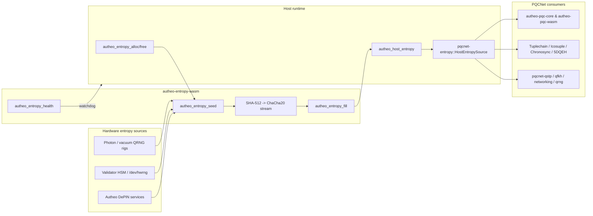

# Autheo Entropy WASM (`autheo-entropy-wasm`)

`autheo-entropy-wasm` is the production entropy node that Autheo validators, relayers, and wazero hosts embed to satisfy the `autheo_host_entropy` import used by every PQCNet crate. It is a `no_std`, allocator-aware WASM module that expands hardware entropy into an infinite ChaCha20 stream and exposes a minimal ABI for seeding, filling, and health probing. There are **zero simulation paths** compiled into this crate—only real hardware entropy is accepted.

## Why this crate exists
- **Bridges hardware RNGs to PQCNet** – provides the concrete implementation behind `pqcnet-entropy::HostEntropySource` for `wasm32-unknown-unknown` builds.
- **Deterministic allocator surface** – ships `autheo_entropy_alloc/free` so hosts can stage seed material without leaking host memory layout details.
- **Hardened RNG core** – derives a ChaCha20 key/nonce pair from each seed via SHA-512, ensuring bias-free material for Kyber, Dilithium, Tuplechain pruning, QSTP tunnels, and Chronosync elections.
- **Health + observability** – exposes `autheo_entropy_health` so relayers and wazero harnesses can fail fast if validators ever lose their hardware entropy feed.

## Production guarantees (no simulations)
- ✅ `#![no_std]` + `wee_alloc` + `spin::Mutex` keep the binary tiny and WASM-safe.
- ✅ Seeds are only accepted from host-supplied hardware entropy; there are no feature flags or fallback PRNGs compiled in.
- ✅ The RNG state lives in a single `Mutex<NodeRng>` guarded by constant-time ChaCha20 cursor math—perfect for deterministic replay in audits.
- ✅ Return codes are explicit: `0` (OK), `-1` (bad pointer/len), `-2` (unseeded). Hosts must propagate these codes back through `autheo_host_entropy`.

## Code flow diagram



## Exported ABI
| Symbol | Purpose | Notes |
| --- | --- | --- |
| `autheo_entropy_alloc(len: u32) -> u32` | Allocate linear-memory scratch space used to pass seed material from the host to the node. | Returns `0` on allocation failure; host must free via `autheo_entropy_free`.
| `autheo_entropy_free(ptr: u32, len: u32)` | Release memory previously obtained from `autheo_entropy_alloc`. | No-op when either argument is zero.
| `autheo_entropy_seed(ptr: u32, len: u32) -> i32` | Hash the provided seed with SHA-512, split into a ChaCha20 key/nonce, and reset the stream cursor. | Returns `0` when seeded, `-1` on invalid pointer/length.
| `autheo_entropy_fill(ptr: u32, len: u32) -> i32` | Fill the destination slice with ChaCha20 output derived from the last seed. | Returns `0` on success, `-1` on bad pointer, `-2` if called before seeding.
| `autheo_entropy_health() -> i32` | Report whether the node is currently seeded. | `0` = healthy, `-2` = unseeded.

`pqcnet-entropy::HostEntropySource` invokes the WASM import `autheo_host_entropy(ptr, len) -> i32`. The host runtime implements that import by delegating to `autheo_entropy_fill` after ensuring the node is seeded.

## Integration with the PQCNet suite
1. **Entropy node boot** – Validators provision hardware entropy (RPi HWRNG, QRNG photon rigs, DePIN feeds) and copy it into the WASM module via `autheo_entropy_alloc` + `autheo_entropy_seed`.
2. **Host import wiring** – wazero/wasmtime hosts expose `autheo_host_entropy` to PQCNet modules (`autheo-pqc-core`, `autheo-pqcnet-qrng`, `pqcnet-qstp`, etc.) and have that import call `autheo_entropy_fill` internally.
3. **PQC module fan-out** – Once seeded, the stream feeds `pqcnet-entropy::HostEntropySource`, which directly powers:
   - Kyber/Dilithium key genesis inside `autheo-pqc-core` and the `autheo-pqc-wasm` ABI.
   - Tuplechain pruning, Chronosync temporal weight sampling, and 5D-QEH anchor randomness.
   - QSTP tunnel nonces, QFKh rotations, QRNG envelope whitening, and networking/telemetry guards.
4. **Health + observability** – Relayers and sentries poll `autheo_entropy_health` to gate PQC workloads and emit telemetry (mirrored in `pqcnet-telemetry`).

See `../pqcnet-entropy/README.md` for the consumer-side contract and the wazero harness under `../../wazero-harness/` for an end-to-end host example.

## Host responsibilities (recap)
1. **Seed on startup** – Call `autheo_entropy_alloc` to reserve space, write hardware entropy into the returned pointer, call `autheo_entropy_seed`, then immediately `autheo_entropy_free`.
2. **Bridge the import** – Implement `autheo_host_entropy(ptr, len)` in the host runtime by copying the caller buffer into the entropy node’s linear memory and invoking `autheo_entropy_fill(ptr, len)`.
3. **Propagate status codes** – Always return the status from `autheo_entropy_fill` so PQC crates can surface `EntropyError::HostRejected` when something goes wrong.
4. **Re-seed periodically** – Feed fresh hardware entropy (e.g., after N megabytes or on operator demand) to reset ChaCha20’s cursor and guarantee forward secrecy.
5. **Watchdog** – Poll `autheo_entropy_health` before serving RPC/QSTP requests; refuse to route PQC payloads until the node reports `STATUS_OK`.

## Build & operations
| Command | Description |
| --- | --- |
| `cargo build -p autheo-entropy-wasm --release --target wasm32-unknown-unknown` | Produces the production WASM artifact used by validator hosts and the wazero harness. |
| `cargo fmt && cargo clippy -p autheo-entropy-wasm` | Ensures deterministic formatting and lints the no_std code before publishing. |
| `wasm-tools validate target/wasm32-unknown-unknown/release/autheo_entropy_wasm.wasm` | Optional sanity check for CI/CD before shipping the artifact. |
| `wazero-harness` (see repo root) | Loads `autheo_entropy_wasm.wasm`, wires it to `autheo_pqc_wasm.wasm`, and exercises the complete PQC handshake flow with real entropy. |

## Example host shim (Rust pseudocode)

```rust
// Pseudocode host import – runs outside the WASM module.
use anyhow::Result;
use entropy_host::AutheoEntropyModule; // e.g., thin wrapper around wasmtime instance

static ENTROPY: once_cell::sync::Lazy<AutheoEntropyModule> = /* ... */;

#[no_mangle]
pub extern "C" fn autheo_host_entropy(ptr: *mut u8, len: usize) -> i32 {
    if ptr.is_null() || len == 0 {
        return -1;
    }

    // Copy the caller buffer into the entropy module’s linear memory, fill it, and copy back.
    match ENTROPY.fill(ptr as u32, len as u32) {
        Ok(()) => 0,
        Err(code) => code, // propagate ERR_BAD_PTR or ERR_UNSEEDED back to PQC modules
    }
}

fn reseed_from_hardware(seed: &[u8]) -> Result<()> {
    let ptr = ENTROPY.alloc(seed.len() as u32)?;
    ENTROPY.write(ptr, seed)?;
    ENTROPY.seed(ptr, seed.len() as u32)?;
    ENTROPY.free(ptr, seed.len() as u32);
    Ok(())
}
```

(See the Go-based wazero harness for a concrete implementation that mirrors this pseudocode.)

## Operations checklist
- [x] Run on real hardware entropy only—no test simulators are part of the binary.
- [x] Always seed before exposing the node to PQC workloads.
- [x] Log and alert on non-zero return codes so PQCNet services can halt deterministically.
- [x] Document the seeding cadence in `configs/` alongside the rest of your PQCNet deployment manifests.

With this README + ABI, `autheo-entropy-wasm` now matches the rest of the PQCNet suite’s production standard and can be published or vendored as a standalone crate. For deeper architectural context, read the workspace root `README.md` and the docs under `../docs/`.
