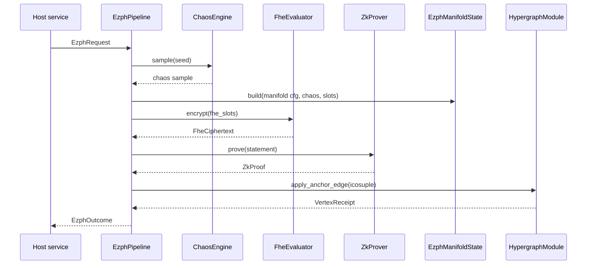

# autheo-pqcnet-5dezph

`autheo-pqcnet-5dezph` layers the **Five-Dimensional Entangled Zero-Knowledge Privacy
Hypergraph (5D-EZPH)** on top of Autheo's `autheo-pqcnet-5dqeh` module. It fuses chaos-driven
manifold synthesis, CKKS-style homomorphic aggregation, and ZK proof metadata so PrivacyNet can
anchor quantum privacy overlays directly inside Chronosync.

## Highlights

- **Manifold synthesis** – builds 5D manifolds where dimensions encode spatial routing, temporal
  noise, quantum entropy pools, chaotic perturbations, and homomorphic layers.
- **Chaos primitives** – deterministic Lorenz + Chua attractors plus a logistic map feed the privacy
  manifold and laser telemetry, matching the AUTHEO PRIMER spec.
- **ZK/FHE bridges** – mock CKKS evaluator and Circom-style prover surfaces let engineers plug
  production CKKS/Halo2 engines without touching the hypergraph glue.
- **Privacy metrics** – computes Rényi divergences, hockey-stick deltas, and privacy amplification
  bounds (< `1e-154`) before accepting a vertex; violations abort the anchor.
- **Projection helpers** – deterministic 5D→3D projections keep Pi-class nodes honest about
  dimensional reduction while exposing axis magnitudes for telemetry.

## How it works

1. **Seed derivation** – `derive_seed` hashes `EzphRequest` metadata (label, Lamport clock, tuple commitment, FHE slots) so chaos, DP, and proof engines stay in sync.
2. **Chaos + manifold build** – `LorenzChuaChaos::sample` produces attractor coordinates that drive `EzphManifoldState::build`, yielding homomorphic amplitude, spatial axes, and temporal noise.
3. **FHE and ZK prep** – `FheEvaluator::encrypt` turns the requested slots into ciphertexts while `ZkProver::prove` emits a proof bound to the same seed and public inputs.
4. **Icosuple construction** – `build_icosuple` encodes CKKS scale, quantum coordinates, PQC layer metadata, and entanglement coefficients into the payload that Chronosync expects.
5. **Anchoring** – `EzphPipeline::entangle_and_anchor` calls `HypergraphModule::apply_anchor_edge`, validates privacy via `evaluate_privacy`, and projects the manifold with `project_dimensions`.
6. **Outcome telemetry** – The returned `EzphOutcome` bundles the vertex receipt, privacy report, ZK digest, ciphertext, and projection data so host services can audit every stage.

## Code flow diagram



## Usage

```bash
# Run the reference walkthrough
cargo run -p autheo-pqcnet-5dezph --example ezph_walkthrough
```

The example instantiates a `HypergraphModule`, drives the EZPH pipeline, prints the anchored vertex
ID, temporal-weight score, privacy bounds, and the projected axes that Pi overlays consume.

## Testing

```bash
# Full crate tests (unit + integration)
cargo test -p autheo-pqcnet-5dezph

# Focus just on the pipeline integration test
cargo test -p autheo-pqcnet-5dezph pipeline
```

The `tests/pipeline.rs` suite stands up a `HypergraphModule`, runs `DefaultEzphPipeline::entangle_and_anchor`
with `EzphRequest::demo`, and asserts that a vertex is anchored only when `EzphOutcome::privacy.satisfied`
remains true. The walkthrough example doubles as a manual test by printing the privacy metrics and
icosuple payloads that Chronosync would ingest.

## Integration points

- **Rust hosts** embed [`EzphPipeline`](src/pipeline.rs) and feed it `EzphRequest` structs sourced
  from TupleChain, AutheoID, or AIPP overlays.
- **Python quantum harness** (`quantum/ezph_pipeline.py`) mirrors the same chaos + QuTiP stack for
  lab validation, taking the JSON emitted by `pqcnet-qs-dag` examples.
- **Telemetry** can record `EzphOutcome::privacy` to prove that every anchored vertex satisfied the
  advertised `ε < 0.01`, `δ ≈ 0` bounds even under Lorenz/Chua chaos injection.

Swap `MockCircomProver` / `MockCkksEvaluator` for production engines by implementing the `ZkProver`
and `FheEvaluator` traits; the pipeline automatically threads the proofs/ciphertexts into the
icosuple payloads and PQC signatures.
