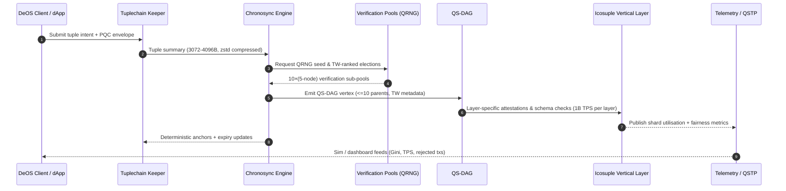

## Chronosync (autheo-pqcnet-chronosync)

`autheo-pqcnet-chronosync` packages the Chronosync consensus primer into a Rust crate so it can
graduate into its own repository later. Chronosync fuses a Quantum-Secure DAG (QS-DAG) with the
Tuplechain / Icosuple stack, applies time-weighted validator profiles, and keeps PQC top-of-mind by
relying on Kyber/Dilithium-era assumptions plus hybrid QRNG entropy. The result targets 50B TPS across
1,000 shards (≈1B TPS per layer) while protecting against Shor-class adversaries and centralisation via
multiplicative longevity weights, Proof-of-Burn throttling, and ZKP propagation incentives.

### Chronosync in one glance

- **QS-DAG Core:** every edge is PQC-signed, referencing up to 10 parents to balance concurrency with
  deterministic replay for tuple summaries.
- **Temporal Weight (TW):** \(TW(n) = \log(\frac{Longevity(n)}{24} + 1) + 0.2\,\text{PoB}(n) + 0.1\,\text{ZKP}(n)\),
  capped at 1.0 and decayed by 5% per suspicious event. Longevity rewards honest uptime, PoB deters
  Sybil attacks, and ZKP validations promote propagation quality.
- **Living Pools:** ten verification pools each contain five QRNG-elected sub-pools, rotating every
  epoch to keep Gini < 0.3 and to map tuple/iocosuple schema ownership to shards.
- **Layered Synergy:** tuple summaries land in Layer 1 (Tuplechain), vertical specialisation happens in
  icosuple tiers, and Chronosync’s QS-DAG cements finality with PBFT-like determinism plus
  probabilistic efficiency.

### Sequence diagram

### Crate layout

- `src/lib.rs` – Chronosync config, Temporal Weight math, validator profiles, verification pool structs,
  and the `EpochReport`/`DagWitness` interfaces exchanged with Tuplechain/Icosuple layers.
- `src/keeper.rs` – `ChronosyncKeeper` + `ChronosyncKeeperReport`, wiring QS-DAG elections into the
  5D-QEH module and implementing the RPCNet `AnchorEdgeEndpoint` so `MsgAnchorEdge` can land over the new router.

### Keeper + RPCNet

- The keeper converts each `DagNode` into a `MsgAnchorEdge`, applies it via `autheo-pqcnet-5dqeh`, and
  maintains a vertex index so QS-DAG snapshots stay in sync with PQC signatures and storage layout.
- It implements `pqcnet-networking::AnchorEdgeEndpoint`, so you can drop the keeper into a
  `RpcNetRouter` and immediately serve `POST /pqcnet/5dqeh/v1/anchor_edge` calls alongside `MsgOpenTunnel`.
- `ChronosyncKeeperReport` exposes applied receipts, missing-parent diagnostics, and the current DAG head,
  making it trivial to stream telemetry or trigger slashing hooks.

### Tests & Keeper hooks

| Command | Description |
| --- | --- |
| `cargo test -p autheo-pqcnet-chronosync` | Executes the Temporal Weight math checks plus keeper integration tests (`keeper_streams_dag_witness_into_hypergraph`, `keeper_handles_anchor_edge_requests_via_rpcnet_trait`). |

Use the README plus the keeper report output to spin Chronosync into a standalone repo when the Autheo
DeOS roadmap calls for it—the API surface is already aligned with tuplechain/icosuple expectations and
the keeper can be dropped directly into RPCNet routers or validators without any simulator glue.
