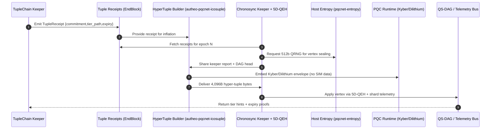

## Autheo PQCNet Hyper-Tuples (`autheo-pqcnet-icosuple`)

`autheo-pqcnet-icosuple` is the production hyper-tuple module: it deterministically expands TupleChain
receipts plus Chronosync/QS-DAG telemetry into the canonical 4,096-byte hyper-tuple consumed by the
`autheo-pqcnet-5dqeh` keeper. No stochastic simulators, no mock entropy—only the five segments defined
in the primer (input hash, prev hash, current hash, layer metadata, PQC envelope) wired to the live
modules that validators run today.

- **Deterministic builder:** `HyperTupleBuilder` consumes a `TupleReceipt`, a Chronosync `EpochReport`,
  and the `ChronosyncKeeperReport`, then emits the encoded 4,096-byte payload ready for 5D-QEH.
- **True QS-DAG integration:** the metadata segment enumerates the first twenty specialisation tiers and
  also appends an unbounded list of layer extensions derived from every vertex the Chronosync keeper
  accepted (complete with TW scores and storage placement).
- **PQC envelope parity:** Kyber + Dilithium layers plus QRNG entropy (default 512 bits) are encoded into
  the final 512-byte slot so the consuming module can verify bindings without any simulation glue.
- **Primer-aligned documentation:** tier catalogue, sequence diagram, and tests all mirror the Autheo-One
  architecture brief so the crate can be lifted into Cosmos SDK or WASM runtimes unchanged.

### Sequence diagram



### Tier specialisations (first 20 layers)

| Layer | Name | Capability snapshot |
| --- | --- | --- |
| 0 | DeOS kernel | Crystalline storage (360TB/mm³), pulsed lasers (1Tbps/channel), RPCNet overlays. |
| 1 | Tuplechain anchor | 3,072-byte tuple summaries with ZK rollups at 10M TPS. |
| 2 | Compute hash | GPU/TPU DePIN workloads (~100M TPS, AI co-processors). |
| 3 | Storage hash | QKD-secured archival tier with ANN lookups + vector DB hooks. |
| 4 | Messaging hash | Sub-ps messaging relays for QS-DAG entanglement. |
| 5 | Identity hash | SSI + AutheoID anchors with ZKPs. |
| 6 | Credential hash | MPC-verifiable credentials (AIP-12). |
| 7 | AI hash | AI-optimised hashing (1B TPS) with qubit simulations. |
| 8 | ML hash | Agent training tier (1B parameters/layer). |
| 9 | Data hash | FHE analytics + ANN queries. |
| 10 | Finance hash | Deterministic DeFi/CBDC settlements. |
| 11 | Health hash | FHIR-compliant EMR pipelines (Aurklei/Aurkei). |
| 12 | IoT hash | Lightweight chains for wearables + DePIN nodes. |
| 13 | Metaverse hash | Entangled digital twins + asset bridges. |
| 14 | Gov hash | Chronosync Temporal Weight governance (AIP-17). |
| 15 | Energy hash | Proof-of-Burn regulated energy meshes. |
| 16 | Privacy hash | Stealth addresses + mixnet overlays. |
| 17 | Bounty hash | Token incentives + verification pools. |
| 18 | Quantum hash | QKD state storage + QRNG orchestration. |
| 19 | Interop hash | IBC bridges + RPCNet adjacency. |

Everything beyond Layer 19 is handled by the `LayerExtension` vector—each Chronosync vertex becomes the
seed for tier `n+1`, `n+2`, … without touching the builder.

### Crate layout

- `src/lib.rs` – `HyperTuple`, `HyperHash`, layer metadata, PQC envelope, and the
  `HyperTupleBuilder::assemble` entry point.
- `tests/icosuple.rs` – production integration tests that wire TupleChain + Chronosync + QEH to prove
  the 4,096-byte envelope, tier catalogue, and extension accounting.

### Usage & Tests

```rust
let receipt = tuplechain_receipt();                // TupleChainKeeper::store_tuple(...)
let epoch_report = chronosync_epoch();             // Chronosync control-plane output
let keeper_report = chronosync_keeper.ingest(&epoch_report)?;

let hyper_tuple = HyperTupleBuilder::default()
    .assemble(&receipt, &epoch_report, &keeper_report);
let encoded_bytes = hyper_tuple.encode(); // [u8; 4096]
```

| Command | Description |
| --- | --- |
| `cargo test -p autheo-pqcnet-icosuple` | Runs integration tests that allocate TupleChain receipts, drive them through Chronosync/5D-QEH with host entropy, and assert byte-perfect hyper-tuples. |

Use this crate/README combo as the jumping-off point for a dedicated `autheo-icosuple-network`
repository—the data model, builder, and tests already align with the architecture brief provided by the
Autheo-One team. All telemetry is deterministic and sourced directly from the production modules—no
simulated dashboards required.
