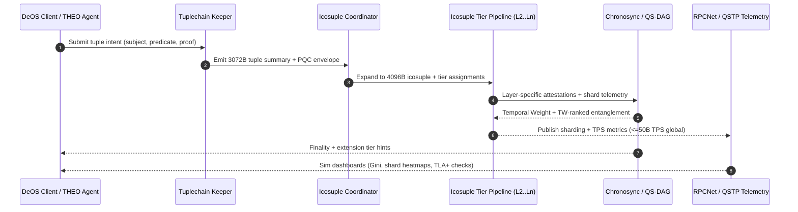

## Icosuple Networks (autheo-pqcnet-icosuple)

`autheo-pqcnet-icosuple` packages the Icosuple Network primer into a Rust crate so the module can
graduate into its own repository like `autheo-pqcnet-tuplechain` and `autheo-pqcnet-chronosync`. It
models the 4096-byte hyper-tuple (input hash, prev hash, current hash, layer metadata, PQC envelope),
tracks the first twenty specialisation tiers, and simulates Chronosync/QS-DAG integration with infinite
layer extensions.

- **Infinite N-tier layering:** starts with Layer 0 (DeOS kernel) and Layer 1 (tuplechain anchor) then
  extends through the first 20 specialised tiers (compute → extension) and dynamically appends tier
  `n+1` overlays.
- **PQC-aligned envelopes:** Kyber/Dilithium signatures plus QRNG entropy are tracked for each
  icosuple with configurable vector embedding sizes.
- **Telemetry for future repos:** `IcosupleNetworkSim` emits tier saturation, shard loads, and QS-DAG
  edge counts so Cosmos SDK or WASM implementations can lift the semantics later.
- **Primer-conformant narrative:** README carries the architectural description, tier summaries, and a
  runnable sim/test story so architecture reviewers can trace the entire stack.

### Sequence diagram

### Tier specialisations (first 20 layers)

| Layer | Name | Capability snapshot |
| --- | --- | --- |
| 0 | DeOS kernel | Crystalline storage (360TB/mm³), pulsed lasers (1Tbps/channel), RPCNet overlays. |
| 1 | Tuplechain anchor | 3072-byte tuple summaries with DPoS + ZK rollups at 10M TPS. |
| 2 | Compute hash | GPU/TPU DePIN workloads (~100M TPS, AI co-processors). |
| 3 | Storage hash | QKD-secured archival tier with ANN lookups + vector DB hooks. |
| 4 | Messaging hash | Sub-ps messaging relays for QS-DAG entanglement. |
| 5 | Identity hash | SSI + AutheoID anchors with ZKPs. |
| 6 | Credential hash | MPC-verifiable credentials (AIP-12). |
| 7 | AI hash | AI-optimised hashing (1B TPS) with qubit simulations. |
| 8 | ML hash | Agent training tier (1B parameters/layer). |
| 9 | Data hash | FHE analytics + ANN queries. |
| 10 | Finance hash | Deterministic DeFi/CBDC settlements. |
| 11 | Health hash | FHIR-compliant EMR pipelines (Aurklei/Aurkei). |
| 12 | IoT hash | Lightweight chains for wearables + DePIN nodes. |
| 13 | Metaverse hash | Entangled digital twins + asset bridges. |
| 14 | Gov hash | Chronosync Temporal Weight governance (AIP-17). |
| 15 | Energy hash | Proof-of-Burn regulated energy meshes. |
| 16 | Privacy hash | Stealth addresses + mixnet overlays. |
| 17 | Bounty hash | Token incentives + verification pools. |
| 18 | Quantum hash | QKD state storage + QRNG orchestration. |
| 19 | Interop hash | IBC bridges + RPCNet adjacency. |
| 20 | Extension hash | Seeds tier n+1 via permissionless overlays. |

Beyond Layer 20 the simulator appends `Dynamic(k)` tiers so governance proposals can materialise new
verticals without recompiling the crate.

### Crate layout

- `src/lib.rs` – Icosuple data model, tier catalogue, sharding helpers, and the `IcosupleNetworkSim`
  harness used by demos/tests.
- `examples/icosuple_sim.rs` – runnable scenario that ingests tuple intents, expands them into
  icosuples, and prints tier saturation plus QS-DAG telemetry.
- `tests/icosuple.rs` – integration tests mirroring the primer (size guarantees, dynamic tiers, etc.).

### Demo / Sim / Tests

| Command | Description |
| --- | --- |
| `cargo run -p autheo-pqcnet-icosuple --example icosuple_sim` | Runs the simulator with seeded QRNG entropy, prints the first 20 tiers’ saturation, shard counts, and QS-DAG edge counts. |
| `cargo test -p autheo-pqcnet-icosuple` | Executes unit + integration tests that check 4096-byte envelopes, tier mapping, and dynamic extension accounting. |
| `cargo test -p autheo-pqcnet-icosuple -- --ignored` | Placeholder for future long-running TLA+/ns-3 backtests once promoted to its own repo. |

Use this crate/README combo as the jumping-off point for a dedicated `autheo-icosuple-network`
repository—the sequence diagram, tier catalogue, demos, and tests already align with the architecture
brief provided by the Autheo-One team.
