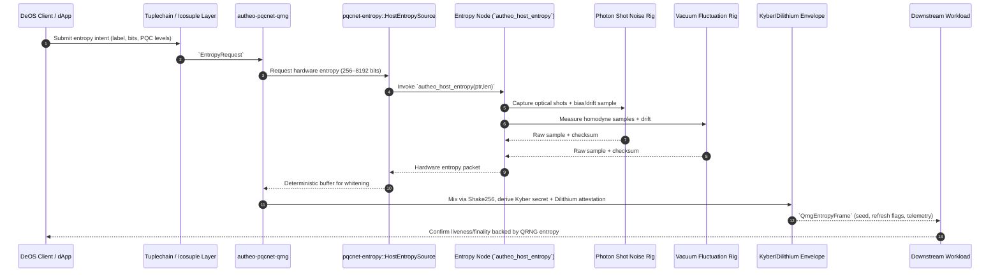

## Autheo PQCNet QRNG (`autheo-pqcnet-qrng`)

`autheo-pqcnet-qrng` is the production quantum entropy bridge for Autheo PQCNet. It packages the QRNG
mixer, telemetry schema, and attested PQC envelope that Tuplechain, Icosuple, Chronosync, and DeOS
workloads consume inside release binaries. The module binds QRNG telemetry (photon shot noise +
vacuum fluctuation sources) delivered via `pqcnet-entropy::HostEntropySource` to Kyber/Dilithium
envelopes so downstream components only ever see hardware-derived randomness.

> Leveraging PQC primitives like CRYSTALS-Kyber and CRYSTALS-Dilithium, alongside QRNGs for
> randomness, icosuple networks mitigate quantum vulnerabilities, ensuring liveness, finality, and
> sovereignty in a post-quantum era.

Every build is wired to the WASM host import exported by `pqcnet-entropy`; there are no inline
simulations or mock entropy paths compiled into production artifacts.

### Why this crate exists

- Provides a hardened QRNG contract so Tuplechain / Icosuple layers can demand 256–8192 bits per
  request while proving PQC hygiene.
- Emits `QrngEntropyFrame` artifacts that already look like future REST/gRPC payloads: PQC envelope,
  Shake256-whitened entropy, refresh flags, and per-source checksums.
- Enforces the `pqcnet-entropy::HostEntropySource` contract so releases inherit the same
  hardware-backed randomness interface used by validator entropy nodes.

### How it works with `pqcnet-entropy`

1. Tuplechain / Chronosync components formulate an `EntropyRequest` with the desired bit budget and
   Kyber/Dilithium security levels.
2. `autheo-pqcnet-qrng` forwards the intent to `pqcnet-entropy::HostEntropySource`, which invokes the
   singleton WASM host import `autheo_host_entropy`.
3. The host import runs inside the dedicated entropy node, fanning out to photon shot noise rigs,
   vacuum fluctuation detectors, and approved fallback ASICs while recording bias/drift telemetry.
4. Raw readings are SHAKE-whitened, checksummed, and wrapped in a Kyber/Dilithium envelope before
   being emitted as `QrngEntropyFrame` objects.
5. Downstream workloads accept the frame, persist telemetry, and refresh Kyber/Dilithium state
   depending on the provided flags.

### Sequence diagram

### Operations & tests

| Command | Description |
| --- | --- |
| `cargo run -p autheo-pqcnet-qrng --example qrng_demo` | Streams production `QrngEntropyFrame` objects through the same mixer logic shipped to validators; point the WASM host import at your entropy node to observe live telemetry. |
| `cargo test -p autheo-pqcnet-qrng` | Executes unit + integration tests covering bit clamping, mixer fallbacks, telemetry counters, and Kyber/Dilithium refresh guarantees. |
| `cargo test -p autheo-pqcnet-qrng -- --nocapture` | Optional verbose mode if you need to inspect emitted frames or debug entropy host plumbing. |

### Repo migration notes

- `src/lib.rs` keeps the API intentionally narrow (`EntropyRequest`, `QrngSim`, `QrngEntropyFrame`) so
  it can be exported as-is when the module becomes its own repository.
- `examples/qrng_demo.rs` doubles as a CLI harness and a wasm-bindgen entry point (no std::io
  shenanigans), ensuring the same production mixer logic can be embedded in dashboards or QSTP
  visualisers.
- `tests/qrng.rs` guards the behavior expected by Tuplechain/Icosuple/Chronosync teams (refresh
  counters, entropy uniqueness) so regressions are caught immediately after the repo split.
