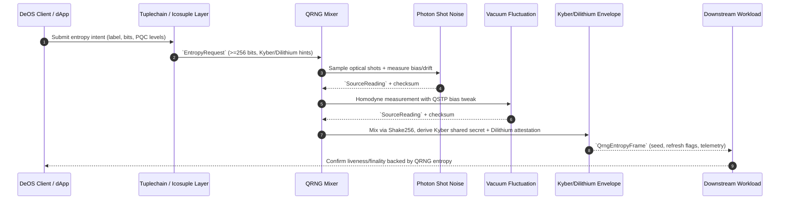

## Autheo PQCNet QRNG (`autheo-pqcnet-qrng`)

`autheo-pqcnet-qrng` packages the quantum random number generator harness that Autheo architects
requested so it can later graduate into its own repository alongside Chronosync, Icosuple, and
Tuplechain crates. The module binds QRNG telemetry (photon shot noise + vacuum fluctuation sources)
to Kyber/Dilithium envelopes and exposes a simulator + demo that downstream PQCNet teams can rely on.

> Leveraging PQC primitives like CRYSTALS-Kyber and CRYSTALS-Dilithium, alongside QRNGs for
> randomness, icosuple networks mitigate quantum vulnerabilities, ensuring liveness, finality, and
> sovereignty in a post-quantum era.

### Why this crate exists

- Models hybrid QRNG sources with bias/drift reporting so Tuplechain / Icosuple layers can demand
  256–8192 bits per request while proving PQC hygiene.
- Emits `QrngEntropyFrame` artifacts that already look like future REST/gRPC payloads: PQC envelope,
  Shake256-whitened entropy, refresh flags, and per-source checksums.
- Ships with a deterministic simulator, WASM/CLI-friendly example, and tests so the module can be
  lifted into a standalone repo without extra scaffolding.

### Sequence diagram

### Demo / Sim / Tests

| Command | Description |
| --- | --- |
| `cargo run -p autheo-pqcnet-qrng --example qrng_demo` | Runs the QRNG simulator with seeded photon/vacuum sources, printing entropy frames, PQC refreshes, and per-source bias/drift stats. |
| `cargo test -p autheo-pqcnet-qrng` | Executes unit + integration tests covering bit clamping, mixer fallbacks, telemetry counters, and seed uniqueness guarantees. |
| `cargo test -p autheo-pqcnet-qrng -- --nocapture` | Optional verbose mode if you add additional debug logging to future tests/demos. |

### Repo migration notes

- `src/lib.rs` keeps the API intentionally narrow (`EntropyRequest`, `QrngSim`, `QrngEntropyFrame`) so
  it can be exported as-is when the module becomes its own repository.
- `examples/qrng_demo.rs` doubles as a CLI harness and a wasm-bindgen entry point (no std::io
  shenanigans), making it trivial to embed in dashboards or QSTP visualisers.
- `tests/qrng.rs` guards the behavior expected by Tuplechain/Icosuple/Chronosync teams (refresh
  counters, entropy uniqueness) so regressions are caught immediately after the repo split.
