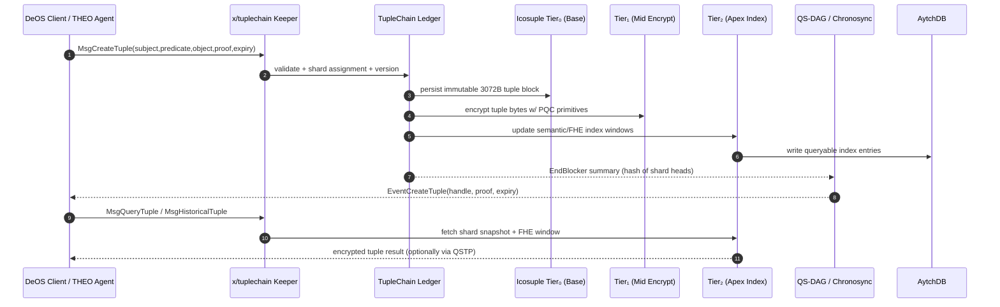

## TupleChain (autheo-pqcnet-tuplechain)

`autheo-pqcnet-tuplechain` implements the TupleChain module described for Autheo-One: a five-element semantic ledger `(subject, predicate, object, proof, expiry)` that evolved from the legacy TernaryChain triple-hash anchor. Where TernaryChain focused on 3072-byte hash tuples for QS-DAG anchoring, TupleChain adds proof and expiry fields, sharded storage, and semantic querying so DeOS agents can execute privacy-preserving workflows with encrypted metadata.

### Conceptual lineage

- **TernaryChain (legacy):** triple-hash `(input_hash, prev_hash, current_hash)` optimized for 10M TPS anchoring in QS-DAG.
- **TupleChain (current):** five-field tuple with FHE-friendly proofs and expiry controls, deployed as a Cosmos SDK module (`x/tuplechain`) that feeds QS-DAG summaries while exposing semantic queries through AytchDB indexes and QSTP tunnels.
- **Objective:** store immutable, queryable tuples that can be pruned or versioned without leaking plaintext, solving state bloat while enabling agentic AI/identity flows inside Autheo DeOS.

### How TupleChain works



### Crate layout

- `src/lib.rs`: TupleChain ledger, keeper façade, simulator (`TupleChainSim`) and helper builders.
- `examples/tuplechain_sim.rs`: runnable scenario showing sharded inserts, expiry pruning, and telemetry.
- `tests/ledger.rs`: integration tests that exercise keeper authorization, historical queries, and pruning.

### Usage

```rust
use autheo_pqcnet_tuplechain::{
    ProofScheme, TupleChainConfig, TupleChainKeeper, TupleChainSim, TupleIntent,
};

let mut keeper =
    TupleChainKeeper::new(TupleChainConfig::default()).allow_creator("did:autheo:l1/kernel");

let intents = vec![
    TupleIntent::identity("did:autheo:alice", "autheoid-passport", 86_400_000),
    TupleIntent::identity("did:autheo:bob", "kyc-proof", 43_200_000),
];

let mut sim = TupleChainSim::new(42);
let report = sim.drive_epoch(&mut keeper, intents, 1_700_000_000_000);
assert!(report.errors.is_empty());
println!("active tuples: {}", report.receipts.len());
for shard in report.shard_utilization.iter().take(3) {
    println!("{} {:?} load={:.02}", shard.shard_id, shard.tier, shard.load_factor);
}
```

### Demo / Sim / Tests

| Command | Description |
| --- | --- |
| `cargo run -p autheo-pqcnet-tuplechain --example tuplechain_sim` | Runs the TupleChain simulator, showing shard utilization, QS-DAG summaries, and expiry pruning over a synthetic DID workload. |
| `cargo test -p autheo-pqcnet-tuplechain` | Executes unit + integration tests covering keeper authZ, version history, and pruning semantics. |
| `cargo test -p autheo-pqcnet-tuplechain -- --include-ignored` | Replays the same suite with ignored cases (useful for long-running state simulations). |

Use the README plus the example output to bootstrap a dedicated repo later—the crate already exposes keeper APIs, telemetry helpers, and a sequence diagram you can drop into Cosmos SDK module docs.
