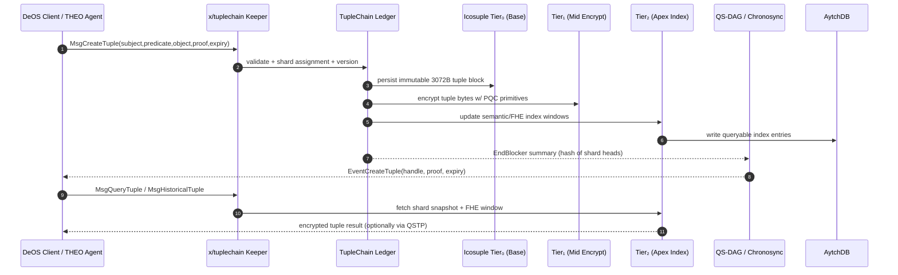

## TupleChain (autheo-pqcnet-tuplechain)

`autheo-pqcnet-tuplechain` implements the TupleChain module described for Autheo-One: a five-element semantic ledger `(subject, predicate, object, proof, expiry)` that evolved from the legacy TernaryChain triple-hash anchor. Where TernaryChain focused on 3072-byte hash tuples for QS-DAG anchoring, TupleChain adds proof and expiry fields, sharded storage, and semantic querying so DeOS agents can execute privacy-preserving workflows with encrypted metadata.

### Conceptual lineage

- **TernaryChain (legacy):** triple-hash `(input_hash, prev_hash, current_hash)` optimized for 10M TPS anchoring in QS-DAG.
- **TupleChain (current):** five-field tuple with FHE-friendly proofs and expiry controls, deployed as a Cosmos SDK module (`x/tuplechain`) that feeds QS-DAG summaries while exposing semantic queries through AytchDB indexes and QSTP tunnels.
- **Objective:** store immutable, queryable tuples that can be pruned or versioned without leaking plaintext, solving state bloat while enabling agentic AI/identity flows inside Autheo DeOS.

### How TupleChain works



### Crate layout

- `src/lib.rs`: TupleChain ledger, keeper façade, builder APIs, and unit tests.
- `tests/ledger.rs`: integration tests that exercise keeper authorization, historical queries, and pruning.

### Usage

```rust
use autheo_pqcnet_tuplechain::{ProofScheme, TupleChainConfig, TupleChainKeeper, TuplePayload};

let mut keeper =
    TupleChainKeeper::new(TupleChainConfig::default()).allow_creator("did:autheo:l1/kernel");

let receipt = keeper
    .store_tuple(
        "did:autheo:l1/kernel",
        TuplePayload::builder("did:autheo:alice", "owns")
            .object_text("autheoid-passport")
            .proof(ProofScheme::Zkp, b"proof", "demo-zkp")
            .expiry(1_700_000_000_000 + 86_400_000)
            .build(),
        1_700_000_000_000,
    )
    .expect("tuple stored");
println!("tuple_id={} shard={} version={}", receipt.tuple_id, receipt.shard_id, receipt.version);
```

### Tests

| Command | Description |
| --- | --- |
| `cargo test -p autheo-pqcnet-tuplechain` | Executes unit + integration tests covering keeper authZ, version history, shard pruning, and shard utilization telemetry. |

Use the README plus the keeper APIs to bootstrap a dedicated repo later—the crate already exposes the ledger, builder, and sequence diagram you can drop into Cosmos SDK module docs.
