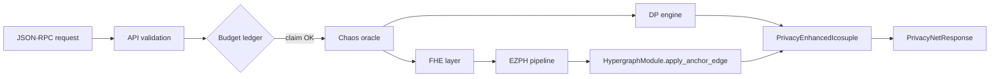

# Autheo PrivacyNet

PrivacyNet is the orchestration layer that braids differential privacy, CKKS/BFV-style FHE jobs, zk proof attestation, and the 5D EZPH manifold anchored inside Chronosync. It exposes a deterministic engine (`PrivacyNetEngine`) plus a JSON-RPC surface so tenants can submit DP queries while inheriting the same telemetry and anchoring guarantees as Autheo PQCNet.

## What it provides

- **DP + budget governance** &mdash; `PrivacyBudgetLedger` tracks per-session eps/delta budgets before a DP query is run.
- **Deterministic chaos** &mdash; `ChaosOracle` injects Lorenz/Chua guidance into DP/FHE noise so repeated runs converge to the same envelope for auditing.
- **Homomorphic compute** &mdash; `FheLayer` now wraps the TFHE-backed evaluator (`TfheCkksEvaluator`) so ciphertexts are actually encrypted before the EZPH manifolds consume them.
- **EZPH anchoring** &mdash; Every request becomes an `EzphRequest` that is anchored via `autheo-pqcnet-5dezph`, yielding Chronosync receipts, Halo2 proof bytes, and privacy metadata. Set `PrivacyNetConfig::ezph.zk_prover` / `fhe_evaluator` to fall back to mocks when running deterministic tests.

## How it works

1. **Ingress** &mdash; RPC payloads are wrapped in `RpcEnvelope` and validated against `ApiConfig` limits.
2. **Budget reservation** &mdash; `PrivacyBudgetLedger::claim` enforces `session_epsilon`, `session_delta`, and query counts before a DP mechanism executes.
3. **Chaos + DP execution** &mdash; `ChaosOracle` samples a deterministic attractor trajectory per request seed and `DifferentialPrivacyEngine` runs the configured mechanism (Gaussian/Laplace, etc.) against the tenant query.
4. **Homomorphic prep** &mdash; Slots from the request go through `FheLayer::execute`, returning a ciphertext ready for manifold projection.
5. **EZPH entanglement** &mdash; `DefaultEzphPipeline::entangle_and_anchor` spins up the Halo2 prover + TFHE evaluator, produces the manifold state, encrypted slots, zk proof, and Chronosync vertex receipt.
6. **Response assembly** &mdash; `PrivacyEnhancedIcosuple::assemble` fuses DP samples, chaos traces, budget claims, and EZPH metadata so tenants can verify that every privacy guardrail was honored.

## Code flow diagram



## Key modules

- `src/pipeline.rs` &mdash; Owns `PrivacyNetEngine`, budget enforcement, and hand-off to the EZPH pipeline.
- `src/dp.rs` &mdash; Defines `DifferentialPrivacyEngine`, supported mechanisms, and seed derivation.
- `src/fhe.rs` &mdash; Lightweight CKKS/BFV mock interface plus `HomomorphicJob` types.
- `src/chaos.rs` &mdash; Lorenz/Chua attractor sampling that keeps DP noise deterministic per request seed.
- `src/api.rs` &mdash; JSON-RPC envelope plus RPC verbs (DP query, chaos perturbation, FHE compute, trait proofs, budget composition).

## Configuration knobs

`PrivacyNetConfig` bundles every subsystem:

- `ezph` &mdash; `EzphConfig` forwarded to `autheo-pqcnet-5dezph` (`privacy.max_entropy_leak_bits`, `manifold.projection_rank`, etc.) plus the `zk_prover` / `fhe_evaluator` switches that flip between Halo2+TFHE (default) and the deterministic mocks for reproducible sims.
- `dp` &mdash; Mechanism selection, sigma/epsilon defaults, and RNG seeds.
- `fhe` &mdash; Slot counts, multiplicative depth, bootstrap period for the circuit runner.
- `budget` &mdash; Session epsilon/delta guardrails *and* tenant-wide rolling ceilings (epsilon/delta/query count) enforced per chain epoch window.
- `chaos` &mdash; Lorenz/Chua parameters controlling deterministic perturbations.
- `api` &mdash; Payload limits and public input ceilings for the RPC surface.

Hardened defaults now live under `config/privacynet.toml` / `config/privacynet.yaml`. The walkthrough example (and binaries embedding this crate) will auto-load whichever file exists or respect the `PRIVACYNET_CONFIG` env var. Halo2 parameters plus proving/verifying keys are cached under `config/crypto/` the first time the prover spins up so auditors can reuse the same artifacts.

## How to test it

```bash
# Run the walkthrough example (auto-detects configs under ./config or ../config)
cargo run -p autheo-privacynet --example privacynet_walkthrough

# Fast test sweep (unit tests + light integrations, heavy ZK skipped)
cargo test -p autheo-privacynet

# Opt into the full Halo2/TFHE path via env flag
RUN_HEAVY_PRIVACYNET=1 cargo test -p autheo-privacynet tests::privacynet

# …or with the explicit `real_zk` feature enabled
cargo test -p autheo-privacynet --features real_zk
```

`tests/privacynet.rs` now detects `RUN_HEAVY_PRIVACYNET` / `RUN_HEAVY_ZK` (or the `real_zk` feature) before spinning up the Halo2 prover. That keeps `cargo test` snappy while still making the full proof/FHE walk available on demand. The walkthrough prints the chaos sample, DP sample, privacy budget claim, and the resulting EZPH receipt so you can verify every stage with the Halo2 + TFHE backends (or override them via config when you need deterministic mocks). The example now walks up to the workspace root when resolving `config/privacynet.{toml,yaml}`, so it works whether you invoke it from `pqcnet-contracts/` or the workspace root; set `PRIVACYNET_CONFIG` to point elsewhere.

## Extending / integrating

- **Bring your own ZK or FHE** by implementing the traits exported from `autheo-pqcnet-5dezph` and wiring them into `PrivacyNetConfig::ezph` (via `zk_prover` / `fhe_evaluator`) and `FheLayerConfig`.
- **Swap DP mechanisms** via `DpQuery`/`DpMechanism`; the engine auto-derives noise from the seeded attractor state.
- **Observe privacy telemetry** by logging the `PrivacyNetResponse.privacy_report` plus the `DpQueryResult.zk_proof_digest` to prove which trait bound was enforced per query.
