# PQCNet Documentation Map & Bundle Guide

This README stitches together the full PQCNet suite so you can answer questions like “what exactly lives inside the PQCNet WASM runtime versus the TupleChain / Chronosync / 5D‑QEH data stack?” Use it as the front-door for the `docs/` folder when you need to point partners, product, or engineering to the right deep dive.

> Quick answer to Lucas’ question: **`autheo-pqc-wasm` (the PQCNet WASM runtime) only covers the Autheo PQC enclave surface.** The TupleChain → Icosuple → Chronosync → 5D‑QEH ledgers plus QS‑DAG anchoring are higher-layer consensus/ledger services that consume the enclave output. They can ship as an optional “PQCNet Consensus Bundle” on top of the core WASM package.

---

## 1. High-Level Orienting Map

The current architecture diagram (see the top-level `README.md`) groups every crate into five verticals:

1. **Shared assets** – `docs/`, `protos/`, `configs/` feed every other layer with reproducible schemas, diagrams, and runtime configuration.
2. **PQC engines & entropy** – `autheo-mlkem-kyber`, `autheo-mldsa-dilithium`, `autheo-mldsa-falcon`, `autheo-entropy-core`, `autheo-entropy-wasm`, `autheo-pqcnet-qrng`, `pqcnet-entropy` supply deterministic or hardware-backed randomness plus the Kyber/Dilithium/Falcon adapters.
3. **Autheo PQC enclave** – `autheo-pqc-core`, `autheo-pqc-wasm`, `pqcnet-qfkh`, `pqcnet-crypto` assemble the engines into the PQC contract logic and expose the WASM ABI (`pqc_handshake`, `pqc_alloc`, `pqc_free`).
4. **PQCNet runtime & ops** – `pqcnet-qstp`, `pqcnet-networking`, `pqcnet-qace`, `pqcnet-relayer`, `pqcnet-telemetry`, `pqcnet-sentry`, `pqcnet-qs-dag` run transport, routing, relays, telemetry, and DAG anchoring.
5. **TupleChain → Chronosync → 5D‑QEH** – `autheo-pqcnet-tuplechain`, `autheo-pqcnet-icosuple`, `autheo-pqcnet-chronosync`, `autheo-pqcnet-5dqeh` implement the production ledger stack that sits *after* the enclave.

The DID / AIPP overlays (wallets, registries, key management, overlays, quantum authn) interact with PQCNet via the runtime services and do not live inside this repo, but they are shown in the diagram for completeness.

---

## 2. What “PQCNet WASM” Really Includes

| Layer | Crates / Assets | Role in WASM package |
| --- | --- | --- |
| Engines & entropy | `autheo-mlkem-kyber`, `autheo-mldsa-dilithium`, `autheo-mldsa-falcon`, `autheo-entropy-core`, `autheo-entropy-wasm`, `autheo-pqcnet-qrng`, `pqcnet-entropy` | Provide deterministic + hardware-backed randomness, ML‑KEM / ML‑DSA adapters, and the QRNG/entropy pipeline compiled into the enclave build.
| Autheo PQC enclave | `autheo-pqc-core`, `pqcnet-qfkh`, `pqcnet-crypto` | Implements key management, signatures, Quantum-Forward Key Hopping, and exposes typed handles to host runtimes.
| WASM ABI | `autheo-pqc-wasm`, `wazero-harness/` | Wraps the enclave in a `cdylib` that exports `pqc_handshake`, allocator helpers, and test harness glue for Go/wazero.

**Anything outside these three rows is *not* inside the PQCNet WASM artifact.** The runtime/consensus crates consume the WASM output but remain separate deployable binaries or libraries.

---

## 3. Consensus & Ledger Stack (Optional Bundle)

The “TupleChain → Chronosync → 5D‑QEH” flow plus QS‑DAG anchoring form the premium ledger/consensus offering:

- `autheo-pqcnet-tuplechain` – produces canonical tuple receipts from QSTP tunnels.
- `autheo-pqcnet-icosuple` – inflates tuples into 4,096‑byte HyperTuples for hypergraph processing.
- `autheo-pqcnet-chronosync` – runs Temporal Weight consensus and preps elections.
- `autheo-pqcnet-5dqeh` – Five-Dimensional QEH state store + RPC-friendly anchor edges.
- `pqcnet-qs-dag` – DAG anchoring façade that records Dilithium signatures + route hashes.

These components rely on PQCNet WASM for cryptographic material but introduce their own compute/storage budgets. Position them as an upsell: **“If you want millions/billions TPS with quantum-native anchoring, you license the PQCNet Consensus Bundle; otherwise stick with Cosmos BFT and bring your own ledger.”**

---

## 4. Runtime & Ops Services (Glue Between WASM and Ledgers)

| Capability | Crates | Notes |
| --- | --- | --- |
| Quantum-Secure Transport | `pqcnet-qstp` | Builds the “quantum tunnel” endpoints, seals payloads, and exposes TupleChain metadata pointers.
| Route intelligence | `pqcnet-qace` | Genetic-algorithm controller that reroutes tunnels without re-running ML‑KEM ceremonies.
| Overlay networking | `pqcnet-networking` | Adapters to Waku/THEO/IPC meshes; hosts QSTP frames and DAG gossip.
| Relay pipeline | `pqcnet-relayer` | Bounded queue for PQC1 envelopes, HyperTuple payloads, and external chain updates.
| Observability | `pqcnet-telemetry` | Counters, histograms, and snapshot exporters used by zer0veil dashboards.
| Watcher quorum | `pqcnet-sentry` | Mirrors production sentries that validate QS‑DAG anchors and signal threat posture.

These binaries plus the consensus stack define the *node runtime*. They can be packaged with the WASM enclave or offered à la carte depending on the customer’s existing stack.

---

## 5. DID & AIPP Overlays (External but Relevant)

While not part of the codebase, the diagram highlights the upstream flows:

- **DID wallets / agents** and **DID core registries** authenticate workloads before they hit PQCNet.
- **AIPP identity, key management, quantum-safe authN, recovery, comms, and overlays** describe how DID policies consume QSTP tunnels and how PQCNet relays feed back into broader identity ecosystems.
- Use `docs/pqcnet-architecture-integration.md` for the full narrative with sequence diagrams and GTM messaging.

---

## 6. Shared Assets & References

- `docs/` (this folder) – Architecture notes, performance data, DepIN overlays, config explanations.
- `protos/` – `qstp.proto`, `pqcnet_5dqeh.proto` for host/client bindings.
- `configs/` – Production-aligned TOML/YAML for relayers, sentries, entropy hosts.
- `wazero-harness/` – Go integration harness that proves the WASM ABI end-to-end.

Every deployment—whether WASM-only or the full bundle—pulls from these artifacts to stay reproducible.

---

## 7. Packaging Guidance

| Package | Includes | When to recommend |
| --- | --- | --- |
| **PQCNet WASM Runtime** | `autheo-pqc-wasm`, `autheo-pqc-core`, `pqcnet-qfkh`, `pqcnet-crypto`, entropy + engine crates, wazero harness | Teams that already have a ledger/consensus layer (e.g., Cosmos BFT) and just need quantum-safe handshakes, tunnels, and key rotation inside their own control plane.
| **PQCNet Consensus Bundle** | Everything above **plus** `pqcnet-qstp`, `pqcnet-networking`, `pqcnet-qace`, `pqcnet-relayer`, `pqcnet-telemetry`, `pqcnet-sentry`, `pqcnet-qs-dag`, TupleChain → 5D‑QEH crates, configs/protos/docs | Customers demanding multi-million TPS, QS‑DAG anchoring, and the hypergraph ledger pipeline out of the box. Market as the premium SKU (“quantum-native security with hypergraph consensus”).

Messaging hook for sales/PM: **“Base tier = PQC handshakes you can bolt onto Cosmos or any BFT ledger. Premium tier = the full hypergraph data plane with QS‑DAG anchoring and GA-routed tunnels.”**

---

## 8. Code-Flow Split Diagram

The diagram below makes the split explicit: everything inside the **PQCNet WASM Runtime** subgraph compiles into `autheo-pqc-wasm.wasm`, while the **Consensus & Ops Bundle** adds the higher-layer controllers, ledgers, and DAG anchoring.

```mermaid
---
config:
  theme: base
---
flowchart LR
    subgraph WASM["PQCNet WASM Runtime"]
        EntropyCore["autheo-entropy-core"]
        EntropyWasm["autheo-entropy-wasm"]
        QRNG["autheo-pqcnet-qrng"]
        EntropyTrait["pqcnet-entropy"]
        Kyber["autheo-mlkem-kyber"]
        Dilithium["autheo-mldsa-dilithium"]
        Falcon["autheo-mldsa-falcon"]
        PqcCore["autheo-pqc-core"]
        PqcWasm["autheo-pqc-wasm"]
        QFkh["pqcnet-qfkh"]
        Crypto["pqcnet-crypto"]
    end

    subgraph Consensus["Consensus & Ops Bundle"]
        Qstp["pqcnet-qstp"]
        Qace["pqcnet-qace"]
        Net["pqcnet-networking"]
        Relayer["pqcnet-relayer"]
        Telemetry["pqcnet-telemetry"]
        Sentry["pqcnet-sentry"]
        QsDag["pqcnet-qs-dag"]
        Tuplechain["autheo-pqcnet-tuplechain"]
        Icosuple["autheo-pqcnet-icosuple"]
        Chronosync["autheo-pqcnet-chronosync"]
        FiveDqeh["autheo-pqcnet-5dqeh"]
    end

    EntropyCore --> EntropyWasm --> EntropyTrait
    QRNG --> EntropyCore
    EntropyTrait --> PqcCore
    Kyber --> PqcCore
    Dilithium --> PqcCore
    Falcon --> PqcCore
    PqcCore --> PqcWasm
    PqcCore --> QFkh
    PqcCore --> Crypto
    QFkh --> Qstp
    Crypto --> Qstp
    PqcWasm --> Qstp
    Qstp --> Net
    Net --> Relayer
    Qstp --> Qace
    Qace --> Qstp
    Relayer --> Tuplechain --> Icosuple --> Chronosync --> FiveDqeh --> QsDag --> Sentry
    Chronosync --> Telemetry
    Qstp --> Telemetry
    Relayer --> Telemetry
```

Use this visual when explaining the SKU split: the left block is the core WASM deliverable, while the right block is the optional premium bundle.

---

## 9. End-to-End Flow (Textual Walkthrough)

1. Hardware and QRNG feeds enter `autheo-entropy-core`, flow through `autheo-entropy-wasm`, and power every PQC engine via `pqcnet-entropy`.
2. `autheo-pqc-core` composes ML‑KEM + ML‑DSA adapters, enforces threshold policies, and emits the `pqc_handshake` ABI through `autheo-pqc-wasm`.
3. `pqcnet-qfkh` keeps ML‑KEM key hops ahead of schedule; `pqcnet-crypto` hands opaque key handles to hosts.
4. `pqcnet-qstp` builds quantum tunnels, `pqcnet-qace` reroutes them, and `pqcnet-networking` / `pqcnet-relayer` move envelopes across meshes.
5. TupleChain receipts, HyperTuples, Chronosync elections, and 5D‑QEH anchors materialize *after* the tunnel emits tuple metadata, proving the consensus layer is an add-on.
6. `pqcnet-qs-dag` records Dilithium signatures + route hashes; `pqcnet-sentry` monitors anchors and feeds threat posture back to the runtime.
7. `pqcnet-telemetry` exports rotation, latency, and throughput metrics that zer0veil dashboards consume.
8. DID / AIPP services ride the QSTP channels and pick the pricing tier (WASM-only vs. full bundle) based on their ledger and throughput needs.

---

## 10. Next Steps & Where to Dive Deeper

- Share this README when questions arise about “what is in PQCNet WASM?”
- Point consensus/ledger discussions to the `### Tuplechain • Chronosync • Hypergraph` section in the top-level `README.md` plus the crate-specific READMEs.
- Use `docs/pqcnet-architecture-integration.md` for GTM-facing storytelling, `docs/qstp.md` + `docs/qstp-performance.md` for tunnel math, and `docs/depinn-overlay.md` for entropy sourcing.
- For demos, pair the wazero harness (`wazero-harness/`) with `cargo test -p autheo-pqcnet-{tuplechain,icosuple,chronosync,5dqeh}` to show exactly where the consensus bundle extends beyond the WASM runtime.

This map should make it clear how to split pricing, packaging, and responsibilities without blurring the line between the core PQC enclave and the optional hypergraph ledger stack.
