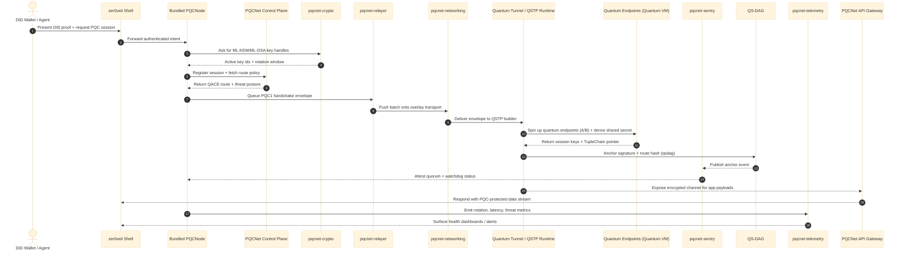

# PQCNet Architecture & Integration Story

This note is meant for the whole team (engineering, product, GTM) so you can walk anyone—from David and Ed to partner solution architects—through how the PQCNet building blocks line up from QS-DAG all the way to API endpoints and zer0veil. Keep this handy when demoing the bundled PQCNode offering or when explaining how DIDs will ride the network once the node is packaged as a sellable unit.

## Executive Highlights

- **Zer0veil shell + PQCNode** act as the secure wrapper where DID wallets or partner APIs land. Everything else fans out from that shell.
- **pqcnet-crypto / networking / telemetry / sentry / relayer** map one-to-one to the code in this repo; they are also the moving parts the story hinges on.
- **PQCNet** provides the QS-DAG trust fabric plus QSTP “quantum tunnels.” Those tunnels spin up quantum endpoints (a quantum VM abstraction) so payloads stay inside PQC-protected lanes even when the physical mesh hops.
- **AWRE + WAVEN runtime** keeps every PQCNode, harness demo, and validator workload on the same wasm-micro-runtime + WAVEN MMU pairing, so entropy proofs and telemetry line up with the deployment/governance blueprint.
- **DID monetization path**: once we bundle the PQCNode, a customer can drop it under zer0veil, register their DID, and immediately sell DID-backed access to the PQC tunnel without touching core crypto code.

## End-to-End Sequence

## High-Level Walkthrough (shareable with non-developers)

1. **Intent & DID proof inside zer0veil shell**  
   - A DID wallet, agent, or partner service initiates a request. Zer0veil verifies the DID proof and makes sure the workload is allowed to touch PQCNet at all.  
   - The shell then hands the request to the bundled PQCNode (a Rust binary built from this repo) so the rest of the flow remains hermetic.

2. **Key orchestration via `pqcnet-crypto`**  
   - The PQCNode delegates every Kyber/ML-KEM and Dilithium/ML-DSA operation to `pqcnet-crypto`.  
   - `pqcnet-crypto` plugs directly into `autheo-pqc-core`’s `KeyManager` and `SignatureManager`, so we inherit rotation policies, threshold splitting, and transcript signatures without re-implementing crypto.  
   - The node only receives opaque key handles plus rotation metadata, keeping secret material scoped to the crypto crate.

3. **Relayer + networking move the handshake toward QS-DAG**  
   - `pqcnet-relayer` batches PQC1 handshake envelopes and any follow-up chunks (tuple metadata, proofs) so the node can absorb bursty traffic.  
   - `pqcnet-networking` is the overlay adapter; it knows how to talk to Waku/THEO meshes or any IPC bus we target.  
   - Together they carry the handshake to the remote PQCNode and into the PQCNet control plane.

4. **Quantum tunnel = quantum VM for endpoints**  
   - Once the envelope lands, the QSTP runtime (implemented inside `pqcnet_qstp`) spins up a “quantum tunnel.” Think of it as a quantum VM: endpoint A lives next to the initiating PQCNode, endpoint B lives near the counterparty validator.  
   - The tunnel hydrates Quantum Endpoint B with the shared secret, enforces TupleChain policies, and gives us per-route AES-256-GCM channels. This all executes inside AWRE (wasm-micro-runtime) with WAVEN’s dual page tables, so the wasm enclave is identical whether you run the wazero demo, a Raspberry Pi node, or a hyperscale validator.  
   - Because the tunnel can reroute via QACE (genetic algorithm controller), the endpoints behave like a live VM that follows the session wherever the network sends it, without re-running the PQC handshake.

5. **QS-DAG anchoring & watcher quorum (`pqcnet-sentry`)**  
   - `pqcnet-qs-dag::QsDagPqc::verify_and_anchor` (invoked by the tunnel) writes the Dilithium signature plus route hash to QS-DAG, giving us the tamper-proof breadcrumb.  
   - `pqcnet-sentry` listens to those anchors, replicates them to a watcher quorum, and feeds “all clear” / “threat detected” signals back to the PQCNode so it can rotate keys or re-home tunnels proactively.

6. **Telemetry closes the loop**  
   - Every stage emits counters and histograms through `pqcnet-telemetry`. Zer0veil ingests those metrics to display SLA dashboards, noisy-neighbor alerts, or capacity planning hints (“DID issuers in APAC are 20% slower—spin up more PQCNodes”).  
   - Because telemetry is just another crate here, product folks can reference specific metric names when they talk to customers.

7. **API + DID packaging**  
   - The quantum tunnel terminates on a PQCNet API gateway (gRPC, HTTP/2, or Waku topic). The response is piped straight back to zer0veil, which hands it to the DID client.  
   - Once we package the PQCNode as a standalone binary or container, customers can drop it next to their DID stack, register it with PQCNet, and start charging for PQC-protected DID verification or signing services. No extra code is required—the sequence above already covers the full story.

## Component Cheat Sheet

- **AWRE (Autheo WASM Runtime Engine) + WAVEN MMU** – The wasm-micro-runtime build plus WAVEN virtualization layer that hosts every PQC crate. Recorder tuples (ABW34) capture `qrng_feed` seeds, dual page-table hashes, and exception-page toggles so DAO voters and auditors can prove a given PQCNode ran the sanctioned runtime stack.
- **PQCNode (bundled binary)** – Hosts `autheo-pqc-core`, exposes the WASM ABI, and drives the rest of the crates. This is what we sell/ship.  
- **`pqcnet-crypto`** – Owns deterministic key generation, rotation, and signing. Maps directly to `KeyManager` + `SignatureManager`.  
- **`pqcnet-relayer`** – A bounded queue for handshake envelopes, QSTP payloads, and TupleChain updates. Lets us absorb bursty API traffic and smooth it onto the mesh.  
- **`pqcnet-networking`** – An overlay/messaging adapter (Waku, THEO, in-memory). It is the code that physically pushes bytes toward other PQCNodes.  
- **`pqcnet-sentry`** – Watcher quorum simulator. Mirrors how production sentries confirm QS-DAG anchors and flag anomalies.  
- **`pqcnet-telemetry`** – Unified metrics sink; exposes counters for key rotations, tunnel latency, threat posture, and relayer backlog.  
- **`PQCNet` (control plane)** – Provides QS-DAG, QACE routing, and policy enforcement. Every PQCNode registers here for route updates.  
- **`Quantum tunnel / Quantum VM`** – The QSTP runtime that instantiates per-session endpoints and keeps payloads inside PQC-protected channels even as routes shift.  
- **`zer0veil shell`** – Secure landing zone for workloads; enforces DID authz before anything reaches the PQC stack.

## Story Beats for David & Ed

- **Dots connected from QS-DAG to APIs** – Use the sequence diagram arrows (“Tunnel → QS-DAG → Sentry → PQCNode → API”) to show the provenance chain.  
- **Quantum tunnel narrative** – Describe it as “a quantum VM that spins up two ephemeral endpoints, one next to each PQCNode, so the DID payload never leaves the PQC envelope.”  
- **Sellable node** – Emphasize that everything above already runs inside a single bundle. Shipping it means partners can rebrand the PQCNode, wire it under their zer0veil tenant, and monetize DID-backed services immediately.  
- **DID onboarding** – Point to Step 1 (intent) and Step 7 (API) in the walkthrough to prove we already support credential presentation, policy enforcement, and receipt delivery.  
- **Observability** – Highlight that telemetry and sentry loops are native crates, so operations teams can rely on familiar Rust binaries rather than bolt-on agents.

## Next Steps / Prompts

- **For engineering** – Consider generating a lightweight `cargo doc` site that links this diagram directly to the crate docs, so devs can jump from the narrative to code.  
- **For solution teams** – Pair this note with a live `cargo run -p pqcnet-relayer --example pipeline` demo so prospects can watch the relayer queue drain while the sequence diagram is on screen.  
- **For product** – Build pricing calculators around “PQCNode + zer0veil tenant” since that’s the SKU customers will actually buy once DID flows are bundled in.
