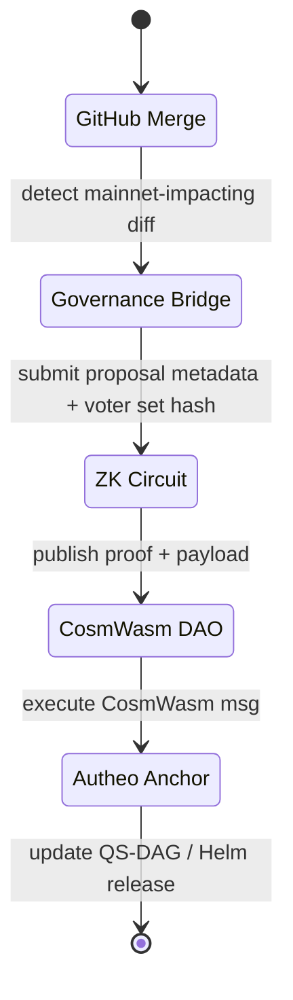

# PQCNet Production Deployment & DAO Governance Blueprint

This blueprint promotes PQCNet from internal prototype to sovereign mainnet under DAO control. It links deployment phases, CI/CD automation, CosmWasm governance, ZK attestations, and Autheo telemetry so upgrades, node ops, and lifecycle actions remain verifiable, reversible, and sovereign.

---

## Objectives & Scope

- Ship PQCNet as a production overlay (alpha → beta → mainnet) with hardware posture, rollout mechanics, and SLAs.
- Enforce decentralized governance via a ZK-SNARK-backed DAO where every network-impacting change is auditable, eligible, and CosmWasm-executed.
- Embed PQ-readiness checks (liboqs, Dilithium/Kyber policies) plus quantum audit artefacts into CI/CD + runtime health.
- Expose RPC endpoints (`/pqc/generateKey`, `/pqc/verifySig`, `/pqc/tunnelStatus`) with Dilithium authentication, rate limits, and Autheo anchoring.
- Capture roadmap, costs, and an operational readiness checklist so productionization is measurable.

---

## Deployment Phases & Runbooks

| Phase | Surface | Goal | Key Owners | Exit Criteria |
| --- | --- | --- | --- | --- |
| Alpha | Raspberry Pi 5 + TPM 2.0 cluster (8–32 nodes) | Prove secure boot, QS-DAG bootstrap, and local observability | Hardware ops + Runtime team | Nodes auto-register into QS-DAG mesh; Prometheus/Loki dashboards green for 7 days |
| Beta | Hybrid cloud (AWS Graviton, GCP Tau, Azure Dpsv5) + edge | Validate multi-region rollouts, Helm packaging, Axelar deprecation path | Platform + SRE | Canary >24h with <1% error, staged-to-mainnet promotion via DAO vote |
| Mainnet | Multi-region sovereign mesh (3 hyperscalers + 2 bare-metal pops) | Full DAO-controlled upgrades, no external wrappers, 99.99% uptime | DAO operators + Validators | Governance pipeline exercised twice, QS-DAG anchors signed by ≥67% voting power |

### Alpha: Raspberry Pi Quantum-Secure Edge

1. **Hardware posture**
   - Raspberry Pi 5 (8 GB) + TPM 2.0 HAT + write-protected SD; secure boot via signed u-boot & PQCNet firmware (`pqcnet-contracts/configs/secure-boot/`).
   - Attach QRNG daughterboard (Ken's design) or USB QRNG; pipe into `autheo-entropy-core` via `HostEntropySource::Qrng`.
2. **Bootstrap**
   - Flash signed image → first boot runs `bootstrap_pi.sh` (Ansible playbook) that:
     - Validates TPM PCR measurements, installs Docker + containerd, and pulls `pqcnode-alpha:<git-sha>`.
     - Registers node on QS-DAG by running `pqcnet-qstp` bootstrap CLI (writes tuple receipt).
     - Labels node via `mesh_manifest.yaml` for GA-based routing inputs.
3. **Observability**
   - Deploy `docker-compose.alpha.yml` with Prometheus, Loki, Tempo, Grafana; auto-scrape `pqcnet-telemetry` exporter at `:9427`.
   - Local alert rules: QSTP tunnel failure, TPM attestation mismatch, QRNG entropy < threshold.
4. **Deliverables**
   - `docs/alpha-rpi-runbook.md` (per-node checklist), Prometheus dashboards, Loki parsing rules.

### Beta: Hybrid Staging + Multi-Region

- **Helm & manifests**
  - Publish `charts/pqcnet-node` with subcharts `pqcnet-relayer`, `pqcnet-telemetry`, `pqcnet-sentry`.
  - Each release pinned to OCI images signed with Sigstore + Dilithium signature stored in QS-DAG.
- **Axelar deprecation**
  - Run bridging controller that redirects cross-chain calls through QS-DAG once Chronosync quorum >80% reliability.
  - Bake phased flag `--qs-dag-native` toggled automatically when DAO vote passes.
- **Scaling pipeline**
  - GitHub Actions job `deploy-beta` → builds ARM64/AMD64 images, runs `cargo test` matrix, executes `terraform plan` for each region, and triggers `helm upgrade --install` in staging clusters.
- **Monitoring**
  - Central Grafana per region; global SLO board calculating <60 ms tunnel latency and throughput overhead ≤20% vs TLS baseline (data from `wazero-harness`).

### Mainnet: Sovereign Mesh & Native QS-DAG

- **Rollout**
  - Multi-region Helmfile orchestrations (AWS, GCP, Azure) with weighted traffic ramp (10% → 25% → 50% → 100%).
  - Bare-metal PoPs run the same containers under systemd-nspawn; manifest parity enforced by GitOps (Flux).
- **Governance gating**
  - Every Helmfile `mainnet.yaml` change lands behind DAO proposal (see Governance section). GitOps controller rejects unsigned charts.
- **Lifecycle ops**
  - Canary jobs run `pqcnet-qs-dag state_walkthrough` hourly; failure triggers rollback workflow plus DAO alert stream.
  - `wazero-harness` smoke tests executed post-rollout to compare telemetry vs baseline (<5% drift).

---

## CI/CD & Release Automation

1. **GitHub Actions Workflow (`.github/workflows/pqcnet-deploy.yml`)**
   - **Build**: `cargo test --workspace`, `cargo clippy -D warnings`, `cargo fmt --check`.
   - **Security**: run `liboqs` Known Answer Tests, `cargo audit`, `npm audit` (docs assets), SBOM via Syft.
   - **Package**: build OCI images for `pqcnode`, `relayer`, `sentry`, `telemetry`, `wazero-harness`; sign with cosign + Dilithium hardware key.
   - **Tests**: `wazero-harness` integration, `pqcnet-qstp` targeted tests, Helm chart template validation, Terraform unit tests (`terratest`).
   - **Staging Deploy**: push to staging cluster via GitHub OIDC → cloud IAM; run smoke tests (QSTP handshake, QS-DAG anchor, DAO contract ping).
   - **Governance Bridge**: if PR touches `mainnet/` directories, post artifact hash to DAO proposal queue (via `gh workflow run governance-bridge`).
   - **Promotion**: after DAO vote success, job `promote_mainnet` re-tags images, runs Helmfile apply, waits for canary health, flips traffic weights, and records QS-DAG event.

2. **Canary & Rollback**
   - Each region maintains `pqcnet-canary` deployment (5% traffic). Health checks: `/pqc/tunnelStatus`, `/pqc/verifySig`, DAO contract RPC. Failure auto-rolls back Helm release & posts alert to DAO watchers.
   - Rollback plan stored in `docs/runbooks/rollback.md`, referencing `fluxctl` commands + QS-DAG revert steps.

3. **Artifact Provenance**
   - Build metadata hashed (BLAKE3) and included in DAO proposal payload; QS-DAG anchor stores `{git_sha, image_digest, wasm_hash}` for auditors.

---

## DAO Governance & ZK Flow

### Roles & Permissions

| Role | Capabilities | Tooling |
| --- | --- | --- |
| Operator | Propose network-impacting changes (deployments, parameter updates) | DAO UI + CLI (`daoctl propose`) with hardware Dilithium key |
| Validator | Vote on proposals, run nodes, attest telemetry | CosmWasm wallet + ZK key, QSTP-connected node |
| Observer | Audit proposals, verify ZK proofs, access dashboards | ZK explorer, read-only Autheo API |

### Proposal Lifecycle (ZK-Verified)

1. **Bridge trigger** – GitHub Action inspects merged PRs touching `mainnet/`, `charts/`, or `contracts/`. It bundles artifact hashes + manifest diffs.
2. **ZK proof** – Circom/Halo2 circuit verifies voter eligibility (stake > threshold, operator role) without exposing identity; proof + public inputs stored IPFS/S3.
3. **CosmWasm execution** – DAO contract validates proof, ensures quorum, and encodes operations: `UpgradeQSdagVersion`, `DeployHelmRelease`, `RotateValidatorKey`, etc. Execution transactions reference QS-DAG edge IDs.
4. **Observability** – Observers pull proofs via ZK explorer; Autheo governance layer ingests the same payload to refresh dashboards and anchor hashes into TupleChain receipts.

### DAO ↔ CI/CD Integration

- `governance-bridge` action opens proposal automatically for mainnet-affecting merges; attaches SBOM hash and Helm diffs.
- DAO contract emits events consumed by GitHub Actions via webhook; on approval, pipeline continues (traffic shift). On rejection, GitHub reverts autop-run branch and opens incident issue.
- Emergency halt: `daoctl propose emergency_halt` flips CI/CD to block merges until vote clears; watchers enforce via branch protection statuses.

---

## Upgrade Pipeline & Lifecycle Automation

- **Merged PR → Proposal**: enumerated above; includes PQ readiness attestations (liboqs version, Dilithium parameters) plus telemetry baseline.
- **Proposal Execution → Node Rollout**: CosmWasm contract posts message to `upgrade-orchestrator` (Rust service) which:
  1. Validates Helmfile version and QS-DAG seq no.
  2. Calls ArgoCD/Flux API to sync clusters.
  3. Emits QS-DAG anchor containing upgrade ID + metrics snapshot ID.
- **Lifecycle hooks**: Node additions, mesh policy updates, parameter toggles all share same pattern; watchers ensure each edge case has revert plan.

---

## Security & PQ Compliance

1. **Quantum audits**
   - Nightly GitHub Action `quantum-audit.yml` runs NIST PQC KAT suites against ML-KEM/ML-DSA implementations (via `autheo-mlkem-kyber`, `autheo-mldsa-dilithium`, Falcon placeholder). Results hashed and published to DAO (observer-readable).
   - External security reports uploaded, hashed (BLAKE3), inserted into DAO proposal metadata.
2. **Runtime PQ readiness**
   - Deployment scripts execute `pqcnet-contracts/scripts/verify_pq_runtime.sh`:
     - Confirms `liboqs` version ≥ pinned baseline.
     - Runs Dilithium self-tests on boot; fails readiness probe if mismatch.
     - Checks `pqcnet-crypto` threshold policy and Shamir config.
3. **Alerting**
   - `pqcnet-sentry` watchers monitor QS-DAG edges; outdated PQ primitives trigger PagerDuty + DAO observer feed.
   - Grafana alerts for KAT failure, entropy shortfall, TPM attestation drift.

---

## Performance, Monitoring & SLAs

- **Uptime**: composite >99.99% via redundant QSTP gateways, Chronosync keepers, DAO contract proxies. Synthetic monitors run from three regions; downtime triggers DAO-mandated incident review.
- **Health checks**
  - `/pqc/tunnelStatus` ensures QSTP tunnels alive (latency <60 ms average, <20% overhead vs TLS baseline, data from `wazero-harness`).
  - `qsdag_health` verifies consensus liveness and anchor propagation (<250 ms edge confirmation).
  - `dao_contract_ping` ensures CosmWasm governance contract responds within 2 blocks.
- **Telemetry**
  - `pqcnet-telemetry` exports counters for tunnels, key rotations, DAO vote latency; scraped by Prometheus + forwarded to Loki/Tempo for traces.
  - Chainstack-style proxy layer replicates metrics to redundant collectors.
- **DAO latency**: vote → apply target <5 minutes; measured via governance bridge metrics (proposal submission timestamp vs Helm sync completion).

---

## Integration Surfaces & Autheo Anchoring

1. **RPC Endpoints**
   - `/pqc/generateKey` – issues ML-KEM handles. Auth: Dilithium mutual auth, optional OAuth2 token introspection. Rate limiting via `pqcnet-sentry` sentry nodes.
   - `/pqc/verifySig` – verifies ML-DSA proofs; outputs QS-DAG edge evidence.
   - `/pqc/tunnelStatus` – returns QSTP tunnel metrics, route hashes, GA convergence info.
2. **Authentication & fencing**
   - Sentry nodes terminate Dilithium-authenticated TLS; rotate certs via DAO-managed secrets (vault sealed with PQC keys).
3. **Autheo integration**
   - DAO registry + node metadata mirrored into Autheo governance APIs; watchers expose upgrade proofs + metrics (QRNG stats, QSTP liveness). Autheo dashboards query Chronosync/5D-QEH receipts for transparency.

---

## Roadmap, Costs & Deliverables

| Phase | Deliverables | Est. Cost (Quarterly) |
| --- | --- | --- |
| Alpha | Secure-boot image, bootstrap scripts, local dashboards, QS-DAG auto-registration | $18k (RPi kits, TPMs, QRNG modules, lab ops) |
| Beta | Helm charts, Terraform stacks, cross-cloud staging, Axelar deprecation playbooks | $65k (cloud credits, CI minutes, SRE time) |
| Mainnet | DAO bridge live, CosmWasm contract audits, multi-region GitOps, observer explorer | $140k (audits, infra, 24/7 SRE, DAO ops) |

Key deliverable docs: `docs/alpha-rpi-runbook.md`, `docs/beta-hybrid-guide.md`, `docs/mainnet-governance.md`, Helm chart repo, DAO contract spec, Autheo dashboard configs, audit hashes stored on-chain.

---

## Operational Readiness Checklist

- [ ] GitHub Actions pipelines green, SBOM + cosign attestations uploaded.
- [ ] DAO bridge functional in staging; sample proposal executed end-to-end.
- [ ] Helm charts + Terraform plans approved by operators & validators.
- [ ] Prometheus/Loki dashboards populated; alert rules tested (fire + auto-resolve).
- [ ] Quantum audit job reports PASS with artifact hash anchored in DAO.
- [ ] Secure boot attestations verified for all Raspberry Pi nodes; TPM measurements archived.
- [ ] QSTP tunnel latency + DAO vote latency meet targets (<60 ms, <5 min).
- [ ] Autheo governance layer receiving live node registry + upgrade proofs.
- [ ] Rollback drills completed (documented in DAO minutes).
- [ ] Documentation packaged for partner consumption (roadmap, checklist, API references).

---

## Dependencies & Interfaces

- **PQCNet Nodes & Mesh** – Underpin QSTP tunnels, QS-DAG anchoring, GA routing. Requires healthy `pqcnet-qstp`, `pqcnet-qace`, `pqcnet-qs-dag`, Chronosync/5D-QEH stack.
- **QSTP Tunnels** – Provide encrypted transport; health gating on `/pqc/tunnelStatus` ensures SLO adherence.
- **Autheo Governance Layer** – Anchors DAO state, exports telemetry to partner dashboards, cross-links upgrade proofs.
- **ZK-SNARK Framework (Circom/Halo2)** – Builds eligibility proofs for votes; circuits stored in `pqcnet-contracts/zk/` (planned). Requires witness generators in CI.

This blueprint should serve as the source of truth for deployment teams, DAO operators, and auditors validating that PQCNet is production-ready, sovereign, and transparently governed.
