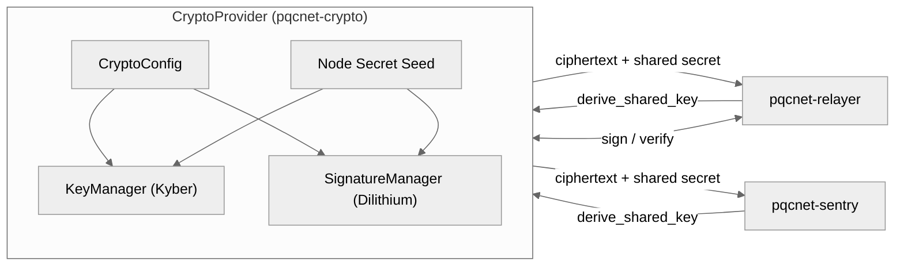

# pqcnet-crypto

`pqcnet-crypto` is the production ML-KEM/ML-DSA glue that every PQCNet
runtime service depends on. It wraps `autheo-pqc-core`’s `KeyManager` (Kyber
rotation + threshold metadata) and `SignatureManager` (Dilithium signing) so we
ship the exact contract flows that go to production—no simulators, no dummy
hashes. The same `CryptoProvider` instance is embedded inside
`pqcnet-relayer`, `pqcnet-sentry`, QSTP tunnels, and watchdog services so every
crate publishes a standalone binary backed by real ciphertexts and signatures.

## What it provides

- **Key rotation that mirrors production** – `CryptoProvider` instantiates
  `KeyManager` with the same rotation interval + threshold policy configured on
  the nodes, so derived sessions stay aligned with relayers, sentries, and
  watch guards.
- **Real ML-KEM encapsulation outputs** – every `derive_shared_key(peer)` call
  encapsulates into the active Kyber key, returns the ciphertext that must be
  forwarded to the peer, and HKDFs the shared secret into deterministic session
  material (seeded by the node’s `secret-seed`).
- **ML-DSA signatures with key provenance** – `sign(payload)` produces a Dilithium
  signature plus the `KeyId` of the registered public key, and `verify` routes
  through `SignatureManager` for identical behavior to the WASM enclave.
- **Standalone crate boundary** – the module lives in its own package so it can
  be published independently or vendored into other repos without dragging the
  rest of the workspace.

## Example / demo

```
cargo run -p pqcnet-crypto --example key_rotation
```

The example wires up a sample config, rotates shared keys for two peers, prints
ciphertexts + expiry timestamps, signs a payload, and verifies the signature via
`SignatureManager`.

## Config schema

The crypto section used by relayers and sentries accepts the following keys:

```toml
[crypto]
node-id = "sentry-a"                    # node label used in signatures / derivations
secret-seed = "1111..."                 # 32-byte hex seed that domain-separates HKDF output
key-ttl-secs = 3600                      # rotation interval (mirrors KeyManager)
threshold-min-shares = 3                 # Shamir t parameter (enforced off-chain)
threshold-total-shares = 5               # Shamir n parameter
```

All fields default to production-safe values so existing configs keep working;
only set them when overriding rotation cadence or share counts for tests.

## Runtime alignment

`CryptoProvider` is instantiated once per node and handed to every daemon that
needs PQC material. The diagram below mirrors the production wiring that runs on
relayers and sentries today.



Relayers and sentries call the exact same APIs that production nodes exercise:

- `derive_shared_key(peer)` encapsulates into the current Kyber key, HKDFs the
  shared secret with the node’s `secret-seed`, and returns both the ciphertext
  (sent to the peer) and the derived session bytes.
- `sign(payload)` / `verify(payload, signature)` go through `SignatureManager`
  so `KeyId` provenance matches what QS-DAG anchors expect.
- No mocks or simulators sit in between; config files point to the same
  `[crypto]` block that the other crates parse.

## API highlights

- `CryptoProvider::derive_shared_key(peer_id) -> Result<DerivedKey, CryptoError>`
  returns session material, ML-KEM ciphertext, expiry timestamp, and the backing
  key id.
- `CryptoProvider::sign(payload)` and `verify(payload, signature)` delegate to
  `SignatureManager`, surfacing `Result` to bubble up PQC errors instead of
  panicking.
- `CryptoConfig::sample(node_id)` still powers doctests/examples, but now also
  seeds the threshold policy so integration tests match production defaults.

## Tests

- Unit + doc tests: `cargo test -p pqcnet-crypto`
- Run only the quickstart doctest: `cargo test -p pqcnet-crypto --doc`

These tests exercise the `KeyManager` glue, HKDF derivations, and signature
flows so `cargo test --doc` continues to have real coverage.
