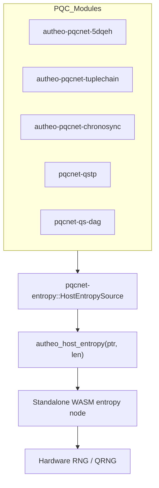

## pqcnet-entropy

pqcnet-entropy is the shared entropy bridge that every Autheo PQC module depends on when compiling to `wasm32-unknown-unknown`. The crate exposes a minimal `EntropySource` trait plus the production-ready `HostEntropySource`, which is the only entropy backend linked into protocol binaries. All entropy requests are funneled through a single WASM host import: `autheo_host_entropy(ptr, len)`.

### Production data flow

- Every PQC pipeline (5DQEH, TupleChain, Chronosync, QSTP, QS-DAG) depends on `HostEntropySource`.
- The source delegates each request to the `autheo_host_entropy` host import.
- The import is implemented once in the standalone WASM entropy node that can run on RPi hardware, validator infra, or any DePIN-attached service.
- Hardware RNG / QRNG devices feed the node; no simulated entropy is compiled into production artifacts.



### Dev-only simulations

Simulations live behind the `sim` cargo feature (`SimEntropySource`). They are intended for local testing only and are excluded from production builds, ensuring the chain surface only observes the WASM import + entropy node.

### Usage

```rust
use pqcnet_entropy::{EntropySource, HostEntropySource};

let mut rng = HostEntropySource::new();
let mut secret = [0u8; 32];
rng.fill_bytes(&mut secret);
```

### Testing

Run the deterministic simulation suite (dev only):

```
cargo test -p pqcnet-entropy --features sim
```

Run the native host entropy smoke test (uses `getrandom` on non-WASM targets):

```
cargo test -p pqcnet-entropy
```
