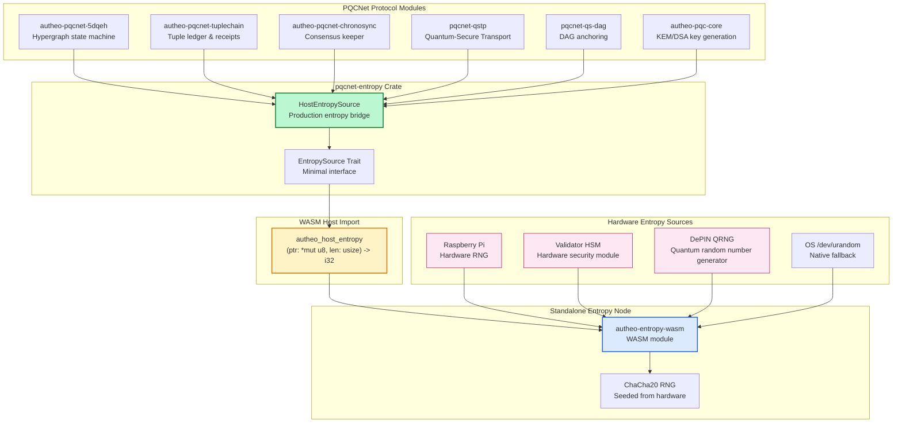

## pqcnet-entropy

**Production-ready entropy bridge for Autheo PQCNet modules**

`pqcnet-entropy` is the shared entropy bridge that every Autheo PQC module depends on when compiling to `wasm32-unknown-unknown`. The crate exposes a minimal `EntropySource` trait plus the production-ready `HostEntropySource`, which is the **only entropy backend linked into protocol binaries**. All entropy requests are funneled through a single WASM host import: `autheo_host_entropy(ptr, len)`.

### Production Architecture

**Key Design Principles:**
- ✅ **NO SIMULATIONS IN PRODUCTION** - The default feature set excludes all simulation code
- ✅ **Single WASM Import** - All entropy flows through `autheo_host_entropy(ptr, len)`
- ✅ **Hardware-Backed** - Production deployments use real hardware RNG/QRNG devices
- ✅ **Zero-Allocation** - Designed for `no_std` WASM environments
- ✅ **Type-Safe** - Strong error handling with `EntropyError` types

### Production Data Flow

The production entropy pipeline follows this architecture:

1. **PQC Modules Request Entropy** - Every PQC pipeline (5DQEH, TupleChain, Chronosync, QSTP, QS-DAG) instantiates `HostEntropySource`
2. **HostEntropySource Delegates** - Each `fill_bytes()` call invokes the WASM host import
3. **WASM Host Import** - The `autheo_host_entropy(ptr, len)` function is implemented by the host runtime
4. **Entropy Node** - The standalone `autheo-entropy-wasm` module provides the implementation
5. **Hardware Sources** - Real hardware RNG/QRNG devices feed the entropy node (RPi, validator HSMs, DePIN services)



### Integration with PQCNet Modules

`pqcnet-entropy` is a foundational dependency for all PQCNet modules. Here's how each module uses it:

#### 1. **autheo-pqc-core** - Key Generation
- ML-KEM keypair generation requires entropy for secret keys
- ML-DSA signing key generation needs randomness
- Session key derivation uses `HostEntropySource` for nonces

#### 2. **autheo-pqcnet-5dqeh** - Hypergraph State
- Vertex ID generation requires entropy
- Edge selection and pruning use randomness
- Coherence checks sample from entropy source

#### 3. **autheo-pqcnet-tuplechain** - Tuple Ledger
- Tuple ID generation
- Receipt nonce generation
- Pruning decisions

#### 4. **autheo-pqcnet-chronosync** - Consensus
- Temporal weight calculations
- Election randomness
- Consensus nonces

#### 5. **pqcnet-qstp** - Transport Protocol
- Tunnel establishment nonces
- Session key derivation
- Frame encryption IVs

#### 6. **pqcnet-qs-dag** - DAG Anchoring
- Edge ID generation
- Anchor nonce generation
- Verification randomness

### Production Usage

**In WASM targets (`wasm32-unknown-unknown`):**

```rust
use pqcnet_entropy::{EntropySource, HostEntropySource};

// Create the production entropy source
let mut rng = HostEntropySource::new();

// Generate a 32-byte secret key
let mut secret_key = [0u8; 32];
rng.fill_bytes(&mut secret_key);

// Generate a nonce for encryption
let mut nonce = [0u8; 12];
rng.fill_bytes(&mut nonce);

// Error handling for production code
let mut buffer = [0u8; 64];
match rng.try_fill_bytes(&mut buffer) {
    Ok(()) => {
        // Entropy successfully filled
        println!("Entropy generated successfully");
    }
    Err(pqcnet_entropy::EntropyError::HostRejected(code)) => {
        // Host import rejected the request
        eprintln!("Host rejected entropy request with code: {}", code);
    }
    Err(pqcnet_entropy::EntropyError::Platform(msg)) => {
        // Platform RNG unavailable (native builds only)
        eprintln!("Platform RNG error: {}", msg);
    }
}
```

**The host runtime must implement `autheo_host_entropy`:**

```rust
// Host runtime implementation (example)
#[no_mangle]
pub extern "C" fn autheo_host_entropy(ptr: *mut u8, len: usize) -> i32 {
    // 1. Validate pointer and length
    if ptr.is_null() || len == 0 {
        return -1; // Invalid parameters
    }
    
    // 2. Get entropy from hardware source
    let entropy = get_hardware_entropy(len)?;
    
    // 3. Copy into WASM linear memory
    unsafe {
        std::ptr::copy_nonoverlapping(
            entropy.as_ptr(),
            ptr,
            len.min(entropy.len())
        );
    }
    
    0 // Success
}
```

### Dev-Only Simulations

⚠️ **Simulations are EXCLUDED from production builds by default**

Simulations live behind the `sim` cargo feature (`SimEntropySource`). They are intended for:
- Local testing and development
- Deterministic test suites
- CI/CD pipelines that need reproducible results

**Simulations are NEVER compiled into production WASM artifacts** - the default feature set ensures only `HostEntropySource` is available, which always delegates to the real hardware-backed `autheo_host_entropy` import.

### Testing

**Production tests (no simulations):**

```bash
# Test HostEntropySource on native targets (uses OS RNG)
cargo test -p pqcnet-entropy

# Test on WASM target (requires host import implementation)
cargo test -p pqcnet-entropy --target wasm32-unknown-unknown
```

**Development tests (with simulations):**

```bash
# Test deterministic simulation suite
cargo test -p pqcnet-entropy --features sim

# Test both production and simulation paths
cargo test -p pqcnet-entropy --features sim -- --test-threads=1
```

### Example: Production Entropy Flow

See `examples/production_entropy.rs` for a complete example demonstrating:
- How to use `HostEntropySource` in production
- Error handling patterns
- Integration with PQC key generation
- WASM host import requirements

Run the example:

```bash
# Native build (uses OS RNG)
cargo run -p pqcnet-entropy --example production_entropy

# WASM build (requires host import)
cargo build -p pqcnet-entropy --example production_entropy --target wasm32-unknown-unknown
```

### Build Configuration

**Production builds (default):**

```toml
[dependencies]
pqcnet-entropy = { path = "../pqcnet-entropy" }
# No features = production mode, no simulations
```

**Development builds (with simulations):**

```toml
[dependencies]
pqcnet-entropy = { path = "../pqcnet-entropy", features = ["sim"] }
```

### Security Considerations

1. **No Fallback to Weak Sources** - Production builds will fail if `autheo_host_entropy` is not properly implemented
2. **Hardware-Backed Only** - All entropy must come from approved hardware sources
3. **Zero Simulation Leakage** - Simulation code is completely excluded from production artifacts
4. **Type-Safe Errors** - All error conditions are strongly typed and cannot be silently ignored

### WASM Host Import Contract

The `autheo_host_entropy` function must follow this contract:

**Signature:**
```rust
fn autheo_host_entropy(ptr: *mut u8, len: usize) -> i32
```

**Return Values:**
- `0` - Success, entropy written to `ptr[0..len]`
- `-1` - Invalid parameters (null pointer or zero length)
- `-2` - Entropy source unavailable (hardware failure)
- `-3` - Insufficient entropy available
- Other negative values - Implementation-specific errors

**Requirements:**
- Must be thread-safe if the host runtime supports threading
- Must provide cryptographically secure random bytes
- Must not block indefinitely (should timeout on hardware failures)
- Must validate pointer and length before writing

### Integration with autheo-entropy-wasm

The `autheo-entropy-wasm` module provides a reference implementation of the entropy node:

1. **Seeding** - Host runtime calls `autheo_entropy_seed(ptr, len)` with hardware entropy
2. **Generation** - PQC modules call `autheo_host_entropy(ptr, len)` which delegates to `autheo_entropy_fill`
3. **Health Checks** - Host can call `autheo_entropy_health()` to verify the node is seeded

See `autheo-entropy-wasm/README.md` for complete integration instructions.
