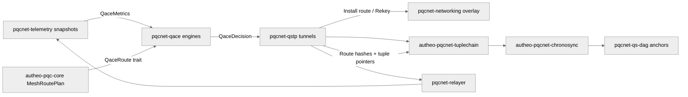

## QACE (Quantum Adaptive Chaos Engine)

`pqcnet-qace` packages the adaptive routing logic that powers PQCNet tunnels into a
standalone, production-aligned crate. The same engines that guard `pqcnet-qstp`
in production are compiled here—no mesh simulators or placeholder controllers.

- `SimpleQace`: deterministic heuristics that run inside `no_std` / WASM runtimes.
- `GaQace`: a genetic-algorithm controller that continuously mutates route orderings.
- `QaceRoute`: trait that keeps QACE decoupled from transport details (`MeshRoutePlan`
  from `autheo-pqc-core`/`pqcnet-qstp` implements it directly).

### Production topology



QACE sits between real telemetry feeds and QSTP tunnels:

1. `pqcnet-telemetry` snapshots are converted into `QaceMetrics`.
2. `autheo-pqc-core` exposes `MeshRoutePlan`, which implements `QaceRoute`.
3. `pqcnet-qstp` invokes `QstpTunnel::apply_qace`, installs the new route,
   and rotates nonce material when `QaceDecision::Rekey` fires.
4. Updated TupleChain pointers and Chronosync/QS-DAG anchors keep the rest of
   PQCNet in sync without any simulator in the loop.

### Integration with PQCNet runtime

`MeshRoutePlan` implements `QaceRoute`, so every tunnel exchanges the exact data
QACE needs without translation glue:

```82:127:pqcnet-contracts/pqcnet-qstp/src/lib.rs
#[derive(Clone, Debug, PartialEq, Eq)]
pub struct MeshRoutePlan {
    pub topic: String,
    pub hops: Vec<MeshPeerId>,
    pub qos: MeshQosClass,
    pub epoch: u64,
}

impl QaceRoute for MeshRoutePlan {
    fn hop_count(&self) -> u32 {
        self.hops.len() as u32
    }

    fn qos_bias(&self) -> i64 {
        match self.qos {
            MeshQosClass::LowLatency => 5,
            MeshQosClass::Control => 3,
            MeshQosClass::Gossip => 1,
        }
    }

    fn freshness(&self) -> i64 {
        self.epoch as i64
    }

    fn is_viable(&self) -> bool {
        !self.topic.is_empty()
    }
}
```

Every tunnel wires its alternates into QACE and applies the returned decision in
place—no simulations, no mocks:

```345:375:pqcnet-contracts/pqcnet-qstp/src/lib.rs
pub fn apply_qace<E>(
    &mut self,
    metrics: QaceMetrics,
    engine: &mut E,
) -> PqcResult<QaceDecision<MeshRoutePlan>>
where
    E: QaceEngine<MeshRoutePlan>,
{
    let path_set = PathSet::new(self.route.clone(), self.alternates.clone());
    let request = QaceRequest {
        telemetry_epoch: self.route.epoch,
        metrics,
        path_set,
    };
    let decision = engine.evaluate(request).map_err(PqcError::from)?;
    let route_changed = self.route != decision.path_set.primary;
    if route_changed {
        self.install_route(decision.path_set.primary.clone());
    }
    self.alternates = decision.path_set.alternates.clone();
    match &decision.action {
        QaceAction::Maintain => {}
        QaceAction::Rekey => self.rotate_route_material(),
        QaceAction::Reroute(_) => {
            if !route_changed {
                self.install_route(decision.path_set.primary.clone());
            }
        }
    }
    self.last_decision = Some(decision.clone());
    Ok(decision)
}
```

### Implementing `QaceRoute`

Bring your own route type for bespoke overlays:

```rust
use pqcnet_qace::QaceRoute;

#[derive(Clone, Debug, PartialEq, Eq)]
struct MyRoute;

impl QaceRoute for MyRoute {
    fn hop_count(&self) -> u32 { /* ... */ }
    fn qos_bias(&self) -> i64 { /* prefer low latency, control, etc. */ }
    fn freshness(&self) -> i64 { /* epoch or timestamp */ }
    fn is_viable(&self) -> bool { /* filters placeholder routes */ }
}
```

Once implemented, feed `MyRoute` into `PathSet<MyRoute>` and run either engine.

### Deterministic runbooks (no simulators)

Examples under `examples/` feed deterministic telemetry captures so you can trace
production behavior without spinning up a mesh emulator:

| Runbook | What it exercises | Command |
| --- | --- | --- |
| `ga_failover` | Drives `GaQace` through steady, congested, and hostile epochs, showing primary promotion plus GA convergence. | `cargo run -p pqcnet-qace --example ga_failover` |
| `deterministic_guard` | Uses `SimpleQace` to demonstrate threat-triggered reroutes versus loss-triggered rekeys. | `cargo run -p pqcnet-qace --example deterministic_guard` |

- Both runbooks emit the exact `QaceDecision` payloads QSTP consumes—copy/paste
  into integration harnesses as needed.
- There is no synthetic mesh simulator; metrics are curated snapshots.

### Validation & observability

- `cargo test -p pqcnet-qace` — unit tests for heuristics, GA controller, and
  convergence accounting.
- `cargo test -p pqcnet-qstp qace_rekey_rotates_nonce_material` —
  end-to-end proof that tunnels rotate nonce material whenever QACE issues a
  rekey decision.
- `cargo run -p pqcnet-qace --example deterministic_guard` /
  `--example ga_failover` — exercise deterministic runbooks without simulators.
- `cd wazero-harness && go run . -wasm ../pqcnet-contracts/target/wasm32-unknown-unknown/release/autheo_pqc_wasm.wasm` —
  drive the WASM build, tunnel handshake, TupleChain storage, and QACE decisions
  from a host runtime.
- Architecture references: `docs/qstp.md` and
  `docs/pqcnet-architecture-integration.md` document how telemetry, TupleChain,
  Chronosync, and QS-DAG stay aligned when QACE reroutes traffic.

Because QACE ships as a standalone crate with full metadata (license, docs,
keywords), it can be lifted into its own repository without modifying any other
PQCNet components.
