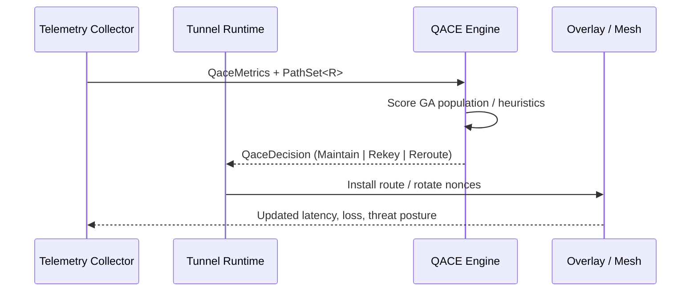

## QACE (Quantum Adaptive Chaos Engine)

`pqcnet-qace` packages the adaptive routing logic that powers PQCNet tunnels into a
standalone crate. It provides:

- `SimpleQace`: deterministic heuristics that run inside `no_std` / WASM runtimes.
- `GaQace`: a genetic-algorithm controller that continuously mutates route orderings.
- `QaceRoute` trait: plug your own route representation into the engines without
  depending on the rest of the PQCNet stack.

### How QACE works



1. A tunnel (or operator) gathers latency/loss/threat measurements along with an
   ordered set of candidate routes (`PathSet<R>`).
2. QACE evaluates the snapshot and returns a `QaceDecision<R>` with an action
   (`Maintain`, `Rekey`, or `Reroute(new_primary)`), the ordered path set, and GA convergence
   scores (when available).
3. The caller applies the decision: install a new primary path, rotate symmetric keys,
   or keep the current route. The tunnel continues to feed telemetry to QACE.

### Implementing `QaceRoute`

Your route type must implement the trait:

```rust
use pqcnet_qace::QaceRoute;

#[derive(Clone, Debug, PartialEq, Eq)]
struct MyRoute;

impl QaceRoute for MyRoute {
    fn hop_count(&self) -> u32 { /* ... */ }
    fn qos_bias(&self) -> i64 { /* prioritize low-latency vs gossip */ }
    fn freshness(&self) -> i64 { /* epoch or timestamp */ }
    fn is_viable(&self) -> bool { /* filters placeholder routes */ }
}
```

Once implemented, you can feed `MyRoute` instances into `PathSet<MyRoute>` and run either engine.

### Examples

Two runnable examples live under `examples/`:

| Example | Description | Command |
| --- | --- | --- |
| `ga_failover` | Runs `GaQace` across steady, congested, and hostile scenarios, showing how primaries swap and confidence evolves. | `cargo run -p pqcnet-qace --example ga_failover` |
| `deterministic_guard` | Exercises `SimpleQace` to show threat-triggered reroutes vs. loss-triggered rekeys. | `cargo run -p pqcnet-qace --example deterministic_guard` |

Both examples define a lightweight `DemoRoute` struct that implements `QaceRoute`, making
them easy to adapt for your own transport layer.

### Integrating with PQCNet

In `autheo-pqc-core`, `MeshRoutePlan` implements `QaceRoute`, and
`QstpTunnel::apply_qace` consumes any `QaceEngine<MeshRoutePlan>`.

- To use the deterministic fallback from WASM:

  ```rust
  use pqcnet_qace::{PathSet, QaceMetrics, QaceRequest, SimpleQace};
  let mut engine = SimpleQace::default();
  let decision = engine.evaluate(QaceRequest { telemetry_epoch, metrics, path_set })?;
  ```

- To enable the GA optimizer on native builds:

  ```rust
  use pqcnet_qace::{GaQace, QaceGaConfig, QaceWeights};
  let mut engine = GaQace::new(QaceGaConfig::default(), QaceWeights::default());
  ```

Because QACE now ships as a standalone crate, it can evolve independently (or be moved
into its own repository) while PQCNet core crates link it via `pqcnet_qace`.
