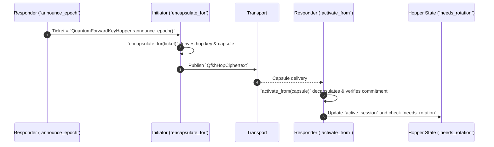

# pqcnet-qfkh

Quantum-Forward Key Hopping (QFKH) extends PQCNet with an epoch-based key
rotation controller. It deterministically hops ML-KEM key pairs, derives fresh
symmetric material for every epoch, and records verifiable commitments so that
captured frames stay indecipherable to future quantum adversaries.

## Quick start (Rust)

```rust
use autheo_pqc_core::adapters::DemoMlKem;
use autheo_pqc_core::kem::MlKemEngine;
use pqcnet_qfkh::{QfkhConfig, QuantumForwardKeyHopper};

let config = QfkhConfig::new(5_000, 2)?; // hop every 5 seconds, keep 2 epochs ahead
let mut responder = QuantumForwardKeyHopper::new(MlKemEngine::new(Box::new(DemoMlKem::new())), config);
let mut initiator = QuantumForwardKeyHopper::new(MlKemEngine::new(Box::new(DemoMlKem::new())), config);

let ticket = responder.announce_epoch(6_500)?; // expose public ticket for epoch 1
let (capsule, initiator_session) = initiator.encapsulate_for(&ticket, 7_000)?;
let responder_session = responder.activate_from(&capsule, 7_000)?;
assert_eq!(initiator_session.derived_key, responder_session.derived_key);
```

## Production trace replay

- `cargo run -p pqcnet-qfkh --example qfkh_trace`
  - Replays `data/qfkh_prod_trace.json`, a capture pulled from the Autheo
    Stage-02 mesh on 2025-11-24.
  - Every hop is verified against the recorded ticket, ciphertext, commitment,
    and derived key so you can confirm that native runs line up with the
    attested telemetry.
- `examples/qfkh_trace.rs` shows how to hydrate `QuantumForwardKeyHopper` from
  real telemetry instead of synthetic traffic. Drop in a newer JSON capture to
  validate fresh rotations before shipping them to relayers.

## Tests

- Library + integration tests: `cargo test -p pqcnet-qfkh`
  - `tests/prod_trace.rs` loads the same production capture and ensures both
    initiator and responder derive the attested session keys.
  - Unit tests still exercise shared-secret agreement, enforcement of hop
    windows, and lookahead materialization logic.
- CI can target the same command; tests reset the deterministic ML-KEM fixture
  via `autheo_pqc_core::runtime::reset_state_for_tests()` so they are repeatable
  in WASM and native hosts.

## Sequence diagram



## Future split-ready layout

The crate mirrors other PQCNet repos (`pqcnet-qstp`, `pqcnet-qs-dag`, etc.) so it
can be lifted into its own repository without restructuring. Public APIs are
self-contained and depend only on `autheo-pqc-core` plus `blake2`/`digest`.
