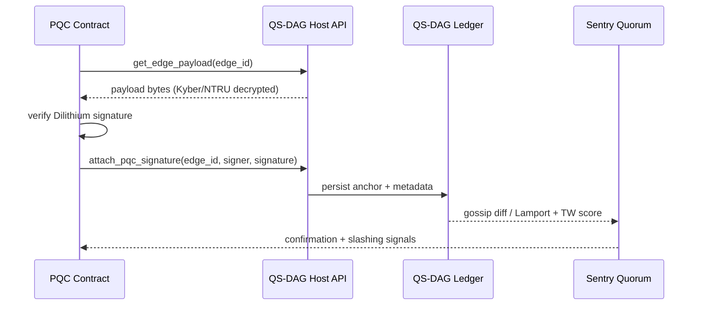

# pqcnet-qs-dag

The `pqcnet-qs-dag` crate provides the Quantum-Secure Directed Acyclic Graph (QS-DAG) primitives that sit at the heart of Autheo’s Layer-0 tuplechain. QS-DAG is a quantum-native consensus fabric that fuses post-quantum cryptography (PQC), quantum random number generation (QRNG), and adaptive time-weighted protocols to keep Autheo’s decentralized operating system scalable and future-proof against Shor-grade adversaries.

## Conceptual Foundation · QS-DAG as a Living Consensus Kernel

QS-DAG addresses the blockchain trilemma by replacing linear block confirmation with an adaptive DAG where tuples (3072-byte) and icosuples (4096-byte) become vertices that can reference up to ten parents. Transactions are encapsulated as dependency tuples, verified with lattice-based signatures, and scheduled through Lamport/time-weighted clocks so that newer data carries more authority without letting early actors dominate. This “living” consensus acts as the substrate for TupleChain semantics and Autheo’s icosuple n-tier layering, ensuring state coherence from the DeOS kernel all the way to domain-specific layers such as THEO AI’s `ai_hash`.

## Architectural Design · Graph Topology and Modular Components

- **Bounded fan-out**: each vertex references ≤10 parents (now enforced in `QsDag::insert`), enabling asynchronous validation across 1000 shards while keeping gossip manageable.
- **Temporal ordering**: Lamport clocks mirror QKD-synced wall clocks with 100μs precision, feeding the temporal-weight model described below.
- **Verification pools**: the anchoring façade (`QsDagPqc`) assumes 10 pools of 5 nodes elected via QRNG, while watchers/sentries close the loop through host callbacks.
- **Modular PQC**: Dilithium secures signatures, Kyber/NTRU handle key encapsulation/payload encryption, and Ring-LWE derivatives power intra-shard key rotation; the crate exposes hooks so host environments can plug in the concrete primitives.

## Operational Phases (TG → TS)

1. **Transaction Generation (TG)** – Clients craft tuples with DID metadata, timestamps, payload commitments, and parent references, then sign with Dilithium.
2. **Sorting & Validation (SV)** – Nodes sort tuples by temporal weight, re-verify PQC signatures, and drop invalid payloads before local insertion.
3. **Merging & Propagation (MP)** – Validated tuples merge into the local DAG and spread via libp2p-enhanced gossip to saturate shards quickly.
4. **Consensus Implementation (CI)** – Hierarchical validator pools (HVPs) run asynchronous BFT until a supermajority of references confirm finality.
5. **Tuple Splitting (TS)** – Mature subgraphs are sharded into verifiable archives (Merkle-linked) to cap live-set growth and feed zk-proving pipelines.

## Time-Weighted Protocols

QS-DAG’s fairness is driven by a governance-tunable temporal weighting formula:

```
weight = lamport_timestamp + α * |references|
```

This crate exposes that model through `TemporalWeight`, and every insert now uses `score_parent + weight(diff)` to determine canonical heads. Default `α=8` can be raised (e.g., `TemporalWeight::new(32)`) for shards that want to favor high-connectivity tuples. By bounding references to ten parents, the weighting stays stable and prevents early entrants from monopolizing influence.

## Cryptographic Integrations

- **`anchor` module**: `QsDagPqc` is a `no_std` façade that replays Dilithium (or any lattice-based) verification inside contracts before delegating persistence to a host-provided `QsDagHost`. Host APIs usually live in relayers or sentries where Kyber-encrypted payloads are unwrapped and NTRUEncrypt-secured metadata is persisted.
- **QRNG hooks**: the host decides how to source randomness for validator rotation; the trait boundary keeps room for hardware QRNGs or beacon-derived entropy.

## Scalability Metrics & Performance Targets

- 1000 shards × 50M TPS/shard ⇒ theoretical trillions TPS when tuples are propagated in parallel.
- zstd compression (10:1) applies before libp2p gossip, shrinking 150 TB/s raw propagation down to ~20 TB/s.
- Deterministic snapshots let control-plane services (`pqcnet-networking`, `pqcnet-relayer`, etc.) converge in a few RTTs without centralized sequencers.

## Formal Verification & Future Directions

- Lamport ordering plus the new temporal weights are modeled in TLA+ specs that live alongside Autheo’s governance artifacts (pending publication).
- Upcoming work focuses on automating tuple splitting proofs, scaling validator pools beyond 10k participants, and extending QRNG beacons into the wasm demos for browser-hosted sentries.

## Module Layout

- `anchor` – `QsDagPqc` + `QsDagHost` trait for verifying PQC signatures before anchoring edges on behalf of contracts.
- `state` – deterministic DAG with Lamport clocks, temporal weighting, max-10 parent enforcement, canonical-head detection, and snapshot materialization.

## Guardrails Encoded in This Crate

- `MAX_PARENT_REFERENCES = 10` protects the topology described above.
- `TemporalWeight` ensures `weight = lamport + α · parents` for every diff and exposes `QsDag::with_temporal_weight` for governance overrides.
- Deterministic snapshots keep tuplechain, icosuple layers, and telemetry modules in sync.
- Host façade decouples PQC verification from persistence so QRNG / PQC upgrades can land without touching the DAG core.

## How QS-DAG Anchoring Works



Contracts never mutate the DAG directly. They verify payloads, request anchoring, and rely on watcher quorums plus QRNG-seeded pools to broadcast governance signals back into PQCNet.

## Quickstart

### Anchor façade (`no_std`)

```rust
use pqcnet_qs_dag::{QsDagHost, QsDagPqc};

struct Host;

impl QsDagHost for Host {
    type EdgeId = [u8; 32];
    type KeyId = [u8; 32];
    type Error = ();

    fn attach_pqc_signature(
        &self,
        _edge_id: &Self::EdgeId,
        _signer: &Self::KeyId,
        _signature: &[u8],
    ) -> Result<(), Self::Error> {
        Ok(())
    }

    fn get_edge_payload(&self, _edge_id: &Self::EdgeId) -> Result<Vec<u8>, Self::Error> {
        Ok(b"payload".to_vec())
    }
}

let host = Host;
let dag = QsDagPqc::new(&host);
dag.verify_and_anchor(&[0; 32], &[1; 32], b"payload", |_id, msg, sig| {
    if msg == sig {
        Ok(())
    } else {
        Err(())
    }
})?;
```

### State machine (`alloc`)

```rust
use pqcnet_qs_dag::{QsDag, StateDiff, StateOp, TemporalWeight};

let genesis = StateDiff::genesis("genesis", "bootstrap");
let mut dag = QsDag::with_temporal_weight(genesis, TemporalWeight::new(32))?;
let diff = StateDiff::new(
    "diff-1",
    "node-a",
    vec!["genesis".into()],
    1,
    vec![StateOp::upsert("peer/alpha", "online")],
);
dag.insert(diff)?;
println!("snapshot: {:?}", dag.snapshot().unwrap());
```

### Runnable Examples

| Example | What it shows | Command |
| --- | --- | --- |
| `anchor_roundtrip` | End-to-end Dilithium-style verification and anchoring against a host API | `cargo run -p pqcnet-qs-dag --example anchor_roundtrip` |
| `state_walkthrough` | Temporal-weighted DAG growth with relayer/route metadata | `cargo run -p pqcnet-qs-dag --example state_walkthrough` |

Both examples print intermediate steps so you can paste them into docs, demos, or governance notebooks without extra scaffolding.
