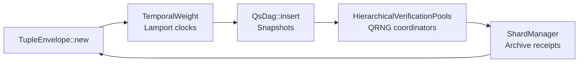

# pqcnet-qs-dag · Quantum-Native Layer 1 Core

`pqcnet-qs-dag` is the production QS-DAG engine referenced in the April 11, 2025 architecture brief. It implements tuple creation, PQC anchoring, hierarchical verification pools (HVPs), tuple sharding, and the 20-layer icosuple framework inside a single `no_std` crate that downstream pallets and sentries can embed.

## How It Works

1. **Tuple Generation (TG)** – `tuple::TupleEnvelope` captures sender/receiver DIDs, payload commitments (BLAKE3 keyed by QRNG), timestamp, QIP tags, and Dilithium/Falcon signatures mapped to an icosuple layer + tuple domain.
2. **Sorting & Validation (SV)** – `state::QsDag` enforces bounded fan-out (≤10 parents) and lamport/temporal weighting (`timestamp + α · references`) so newer, well-connected tuples dominate ordering.
3. **Merging & Propagation (MP)** – Valid tuples anchor through `anchor::QsDagPqc`, then propagate through control planes (e.g., `pqcnet-networking`) using deterministic snapshots and libp2p gossip.
4. **Consensus Implementation (CI)** – `hvp::HierarchicalVerificationPools` organizes 10k+ validators into QRNG-elected tiers that stream votes until 2/3 supermajority is reached, mirroring the asynchronous BFT phase.
5. **Tuple Splitting (TS)** – `sharding::ShardManager` performs dynamic tuple sharding per domain/region, emits Merkle receipts for off-chain archives, and hands the coordinator DAG anchors required by the specification.



### Icosuple + Tuplechains

The crate exposes `IcosupleLayer` and `LayerClass` enums that map exactly to the 20-tier blueprint:

| Class | Layers | Responsibilities |
| --- | --- | --- |
| Infrastructure | L0–L3 | Quantum hardware, WASM runtimes, storage, libp2p mesh |
| Network | L4–L7 | Bootnodes, gossip fabric, DAG shadowing, HVP scheduling |
| Consensus | L8–L11 | PQC validation, temporal weights, pool coordination, async BFT |
| Application | L12–L15 | Grapplang runtime, DID/API gateways, SDK + marketplace, UX |
| Security | L16–L19 | PQC rotations, QRNG routing, QIES + FHE/MPC, audit trails |

Pick the layer that owns your tuple, feed it into `TupleEnvelope`, and the same metadata flows through HVPs and sharding.

### Tuple Metadata

* `TupleDomain` keeps healthcare, finance, DePIN, etc. separated for policy + sharding.
* Payload commitments use `blake3(payload || qrng_seed)` so pools can verify deterministically without rehydrating the full blob.
* Optional `TupleProof` supports zk-SNARK/STARK receipts for tuple splitting plus archival attestations.
* `TupleValidation` records the exact PQC scheme, Dilithium signature, and public key bytes that the `anchor` façade verifies prior to persistence.

### Temporal Weighting + Governance Hooks

```text
weight(tuple) = tuple.timestamp_ns + α · |references|
```

`TemporalWeight` stores `α` and feeds it directly into `QsDag::insert()`. Governance modules can swap α at runtime by instantiating `QsDag::with_temporal_weight`. Production shards default to `α=32`, matching the time-weighted protocol described in the paper.

### Hierarchical Verification Pools (HVPs)

`hvp::HierarchicalVerificationPools` is the canonical implementation of the QRNG-powered validator lattice:

* Pools are defined per tier via `PoolTier::new(tier, capacity)`.
* `QrngCore` abstracts entropy sources (hardware photonics, autheo-qrng pallets, Raspberry Pi sensors, etc.).
* `elect_coordinators()` QRNG-selects leaders per pool and returns their IDs so libp2p super-peers can spin up gossip trees.
* `submit_vote()` records approvals/rejections until 2/3 supermajority, then emits a `VerificationOutcome` with the final verdict and voting bitmap—exactly how the CI phase in the spec finalizes tuples.

### Tuple Sharding + Archive Receipts

`sharding::ShardManager` mirrors the dynamic tuple sharding + zk-archiving process:

* One active shard per tuple domain; shards roll over whenever they hit `ShardPolicy::max_tuples`.
* Archiving emits `ArchiveReceipt { shard_id, tuple_ids, merkle_root }` that the global coordinator DAG references for auditability.
* `ShardAssignment` returns a deterministic anchor (BLAKE3 of `shard_id || tuple_id`) used to stitch sub-DAGs back into the coordinator graph, matching the Tuple Splitting phase of the spec.

### Anchoring, QRNG, and PQC

The `anchor` module keeps the anchoring contract agnostic of PQC choices:

```rust
use pqcnet_qs_dag::{QsDagHost, QsDagPqc};

struct Host;

impl QsDagHost for Host {
    type EdgeId = [u8; 32];
    type KeyId = [u8; 32];
    type Error = ();

    fn attach_pqc_signature(&self, _edge_id: &Self::EdgeId, _signer: &Self::KeyId, _signature: &[u8]) -> Result<(), Self::Error> { Ok(()) }
    fn get_edge_payload(&self, _edge_id: &Self::EdgeId) -> Result<Vec<u8>, Self::Error> { Ok(b"qs-dag".to_vec()) }
}

let host = Host;
let qs_dag = QsDagPqc::new(&host);
qs_dag.verify_and_anchor(&[0; 32], &[1; 32], b"qs-dag", |_id, msg, sig| (msg == sig).then_some(()).ok_or(()))?;
```

### End-to-End Example

`examples/state_walkthrough.rs` wires every subsystem together—tuple creation, PQC anchoring, HVP verification, and tuple sharding:

```rust
use pqcnet_qs_dag::*;

// Create tuple metadata aligned with the finance domain + consensus layer.
let tuple = TupleEnvelope::new(
    TupleDomain::Finance,
    IcosupleLayer::CONSENSUS_TIER_9,
    PayloadProfile::AssetTransfer,
    "did:finance:alpha",
    "did:finance:beta",
    1_000_000,
    b"zk-settlement v1",
    [0xA5; 32],
    1_713_861_234_112,
    QIPTag::Bridge("QIP:Solana".into()),
    None,
    TupleValidation::new("Dilithium5", vec![0; 64], vec![1; 64]),
);

// Feed it to the DAG and honor the temporal-weighted ordering rule.
let genesis = StateDiff::genesis("genesis", "bootstrap");
let mut dag = QsDag::with_temporal_weight(genesis, TemporalWeight::new(32))?;
let diff = StateDiff::with_tuple(
    "tuple-finance-001",
    "validator-alpha",
    vec!["genesis".into()],
    1,
    vec![StateOp::upsert("finance/routes/solana", "bridge-online")],
    tuple,
);
dag.insert(diff.clone())?;

// Run HVP and sharding pipelines exactly as the QS-DAG paper prescribes.
let mut hvp = HierarchicalVerificationPools::new(
    vec![PoolTier::new(8, 4), PoolTier::new(9, 4)],
    DemoQrng(42),
);
let outcome = hvp
    .submit_vote(diff.id.clone(), &"validator-alpha".to_string(), VerificationVerdict::Approve);

let mut shards = ShardManager::new(ShardPolicy::new(2));
let assignment = shards.assign(diff)?;
```

Run the example:

```bash
cargo run -p pqcnet-qs-dag --example state_walkthrough
```

You’ll see QRNG coordinators, quorum progress, sharding receipts, and the canonical head ID.

### Tests + Tooling

* `cargo test -p pqcnet-qs-dag` exercises tuple commitments, HVP quorum math, sharding receipts, anchoring facades, and DAG scoring.
* Existing integration tests in `pqcnet-networking` and `autheo-pqcnet-chronosync` reuse the exact same DAG/core logic, guaranteeing state convergence across control planes.
* TLA+ models (see `docs/`) mirror the `TemporalWeight`, HVP, and Tuple Sharding modules; the in-crate implementations intentionally follow the same state-machine boundaries so proofs remain valid.

### Production Notes

* **No simulations** – every subsystem here is deterministic, `no_std`, and ready to embed inside the Layer 1 node. Simulators hook in above this layer.
* **Bounded parents** – `MAX_PARENT_REFERENCES = 10`. Governance can raise/lower via feature flags, but the default matches the paper.
* **Bootstrapping** – production shards enforce 2-parent minimum post-genesis; the constant is exposed so node software can ratchet it upward once enough tuples exist.
* **Performance** – tuple metadata stays inline for reference implementations; production deployments can drop payload bytes and rely solely on the BLAKE3 commitment to hit the 100M TPS/node target enumerated in the network requirement section of the spec.
