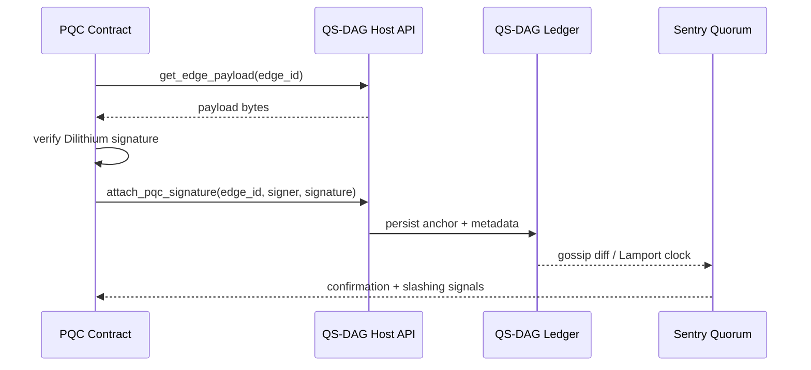

# pqcnet-qs-dag

QS-DAG primitives shared across PQCNet:

- `anchor` – a `no_std` façade (`QsDagPqc`) that replays Dilithium verification before anchoring signatures onto the DAG through a host-implemented `QsDagHost`.
- `state` – a deterministic, append-only DAG state machine with Lamport clocks, scoring, and snapshot materialization for control-plane synchronization.

## How QS-DAG Anchoring Works



The contract runtime never mutates the DAG directly. It only verifies payloads and asks the host to persist anchors. Watchers and sentries subscribe to those diffs to close the loop and feed governance or telemetry signals back into PQCNet.

## Quickstart

### Anchor façade (`no_std`)

```rust
use pqcnet_qs_dag::{QsDagHost, QsDagPqc};

struct Host;

impl QsDagHost for Host {
    type EdgeId = [u8; 32];
    type KeyId = [u8; 32];
    type Error = ();

    fn attach_pqc_signature(
        &self,
        _edge_id: &Self::EdgeId,
        _signer: &Self::KeyId,
        _signature: &[u8],
    ) -> Result<(), Self::Error> {
        Ok(())
    }

    fn get_edge_payload(&self, _edge_id: &Self::EdgeId) -> Result<Vec<u8>, Self::Error> {
        Ok(b"payload".to_vec())
    }
}

let host = Host;
let dag = QsDagPqc::new(&host);
dag.verify_and_anchor(&[0; 32], &[1; 32], b"payload", |_id, msg, sig| {
    if msg == sig {
        Ok(())
    } else {
        Err(())
    }
})?;
```

Contracts embed the façade (often via `autheo-pqc-core`) while the host environment implements the storage hooks.

### State machine (`alloc`)

```rust
use pqcnet_qs_dag::{QsDag, StateDiff, StateOp};

let mut dag = QsDag::new(StateDiff::genesis("genesis", "bootstrap"))?;
let diff = StateDiff::new(
    "diff-1",
    "node-a",
    vec!["genesis".into()],
    1,
    vec![StateOp::upsert("peer/alpha", "online")],
);
dag.insert(diff)?;
println!("snapshot: {:?}", dag.snapshot().unwrap());
```

The deterministic ordering plus Lamport clocks make it suitable for control-plane convergence (e.g., the simulated mesh network in `pqcnet-networking`).

## Runnable Examples

| Example | What it shows | Command |
| --- | --- | --- |
| `anchor_roundtrip` | End-to-end signature verification + anchoring with an in-memory host | `cargo run -p pqcnet-qs-dag --example anchor_roundtrip` |
| `state_walkthrough` | Building and snapshotting a DAG with relayer and route metadata | `cargo run -p pqcnet-qs-dag --example state_walkthrough` |

Both examples print intermediate steps so you can drop them into docs or demos without additional scaffolding.
