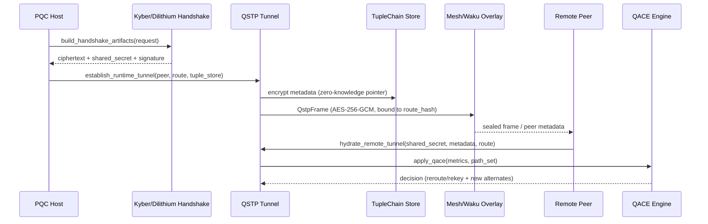

## QSTP (Quantum-Secure Transport Protocol)

`pqcnet-qstp` packages the tunnel runtime used across PQCNet into a standalone crate designed for establishing secure, ephemeral channels that facilitate data transmission with zero-knowledge assurances. It binds Kyber + Dilithium handshakes to AES-256-GCM payloads, encrypts TupleChain descriptors before they ever leave the host, and leverages QACE to keep routes fresh without repeating the PQC ceremony.

### Highlights

- `establish_runtime_tunnel` turns PQC handshake envelopes into ready-to-use tunnels plus protobuf-friendly metadata blobs (`QstpPeerMetadata`) that remote peers can hydrate with a single call to `hydrate_remote_tunnel`.
- `QstpTunnel::seal/open` authenticate every frame against the active `MeshRoutePlan`, binding `TunnelId`, route hash, and application AAD into the AES-GCM transcript.
- `TupleChainStore` provides an integration point for storing encrypted metadata off-chain so operators can prove tunnel provenance without exposing plaintext—perfect for zero-knowledge attestations.
- `MeshTransport` documents the contract for wiring real Waku/THEO overlays; bring your own transport implementation when integrating this crate.
- QACE interoperability via `register_alternate_routes` and `apply_qace` keeps channels adaptive: reroutes trigger nonce rotation, while rekeys keep tuple material in lock-step.

### How it works



Every payload follows the same lifecycle: PQC handshake output → tunnel finalization → encrypted TupleChain metadata → sealed frames on the mesh. Observers never see tuple details in plaintext, yet auditors can later prove session lineage using the stored pointer and `QstpTunnel::fetch_tuple_metadata`.

### Usage

```rust
use pqcnet_qstp::{
    establish_runtime_tunnel, hydrate_remote_tunnel, InMemoryTupleChain, MeshPeerId,
    MeshQosClass, MeshRoutePlan, TunnelRole,
};

let mut tuple_store = InMemoryTupleChain::new();
let initiator_peer = MeshPeerId::derive("initiator");
let responder_peer = MeshPeerId::derive("responder");
let route = MeshRoutePlan {
    topic: "waku/alpha".into(),
    hops: vec![MeshPeerId::derive("hop-a")],
    qos: MeshQosClass::LowLatency,
    epoch: 1,
};

let mut initiator = establish_runtime_tunnel(
    b"client=demo&ts=1700",
    initiator_peer,
    route.clone(),
    &mut tuple_store,
)?;

let mut responder = hydrate_remote_tunnel(
    initiator.session_secret.clone(),
    responder_peer,
    route,
    initiator.peer_metadata.clone(),
    TunnelRole::Responder,
)?;

let frame = initiator.tunnel.seal(b"hello-qstp", b"app")?;
let clear = responder.open(&frame, b"app")?;
assert_eq!(clear, b"hello-qstp");
```

### Demos & Tests

| Command | Description |
| --- | --- |
| `cargo test -p pqcnet-qstp` | Runs the in-crate suite that exercises handshakes, tuple proofs, and QACE-backed reroutes. |
| `cargo test -p pqcnet-qstp qace_rekey_rotates_nonce_material` | Focused test that proves QACE rekey actions rotate nonce material while keeping the active route stable. |
| `cd wazero-harness && go run . -wasm ../pqcnet-contracts/target/wasm32-unknown-unknown/release/autheo_pqc_wasm.wasm` | Optional host-level harness that loads the compiled WASM, drives the same handshake artifacts, and validates TupleChain persistence without any in-crate simulators. |

Use these artifacts to prove the zero-knowledge and adaptive-routing guarantees end-to-end before wiring QSTP into external repos—no bundled simulators are required.
