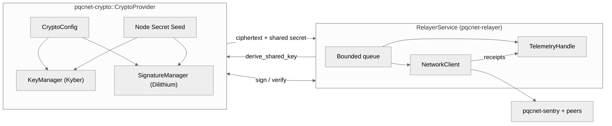

# pqcnet-relayer

Reference relayer daemon that batches PQC messages, broadcasts them to peers,
and records telemetry suitable for demos/tests. The crate now exposes a library
surface so doctests and examples can drive the queue logic without the CLI. It
links directly against `pqcnet-crypto`, `pqcnet-networking`, and
`pqcnet-telemetry`, so the binary you run here is the exact same stack we ship
to production nodes—no mock ciphertexts or simulated signatures.

## Production alignment

- **Real ML-KEM / ML-DSA artifacts** – `RelayerService::fill_queue` calls
  `CryptoProvider::derive_shared_key` and `CryptoProvider::sign` for every batch.
  The queue stores the ciphertext plus Dilithium signature exactly as downstream
  sentries expect.
- **Network parity** – `NetworkClient` (from `pqcnet-networking`) reads the same
  `[networking]` section as the sentry, so broadcast receipts mirror production
  overlay behavior.
- **Telemetry hooks** – Counters and histograms are emitted through
  `pqcnet-telemetry`, letting zer0veil or any OTLP collector visualize backlog,
  retries, and latency in real time.

## Flow

1. Load `Config` (`configs/pqcnet-relayer.{toml,yaml}`) and instantiate
   `CryptoProvider`, `NetworkClient`, and `TelemetryHandle`.
2. `fill_queue()` derives a fresh shared key for each pending message, signs the
   transcript, and pushes the payload plus ciphertext into a bounded queue.
3. `relay_once()` drains up to `batch_size` entries, broadcasting through
   `NetworkClient::broadcast`. Receipts feed telemetry counters/latencies, and
   bidirectional mode requeues messages to simulate full-mesh chatter.



Relayers and sentries consume the same ciphertext + shared-secret tuples, which
keeps watcher quorums aligned with the relayer backlog.

## Examples / Demos

```
cargo run -p pqcnet-relayer --example pipeline
```

The pipeline example fills the queue, performs a bidirectional batch, and dumps
the telemetry snapshot so you can demonstrate delivery counts and buffered
messages.

Run the CLI with a real config:

```
cargo run -p pqcnet-relayer -- --config configs/pqcnet-relayer.toml --iterations 5
```

Override the relayer mode or batch size on the command line to show hot
reconfiguration.

## Config schema

```toml
[relayer]
batch-size = 8
max-queue-depth = 2048
retry-backoff-ms = 500
mode = "bidirectional" # ingest | egress | bidirectional

[crypto]
node-id = "relayer-a"
secret-seed = "bbbbbbbbbbbbbbbbbbbbbbbbbbbbbbbbbbbbbbbbbbbbbbbbbbbbbbbbbbbbbbbb"
key-ttl-secs = 3600
threshold-min-shares = 3
threshold-total-shares = 5

[networking]
listen = "0.0.0.0:7200"
max-inflight = 128

[[networking.peers]]
id = "sentry-a"
address = "127.0.0.1:7101"

[telemetry]
endpoint = "http://localhost:4318"
```

- `batch-size` controls how many messages are drained per iteration.
- `max-queue-depth` caps memory usage and safeguards backpressure.
- `mode` toggles ingest-only, egress-only, or bidirectional loops.
- `[crypto]` is parsed directly by `pqcnet-crypto`, so relayers and sentries can
  share the same rotation window and threshold policy without diverging.
- `[networking]` and `[telemetry]` sections are identical to the configs in the
  sibling crates, which keeps multi-node demos reproducible.

See `configs/pqcnet-relayer.toml` (and `.yaml`) for a complete config.

## Tests

```
cargo test -p pqcnet-relayer
```

Tests cover config validation, service telemetry, queue behavior, and the new
doctest embedded in `service.rs`, so `cargo test --doc` reports active cases.
