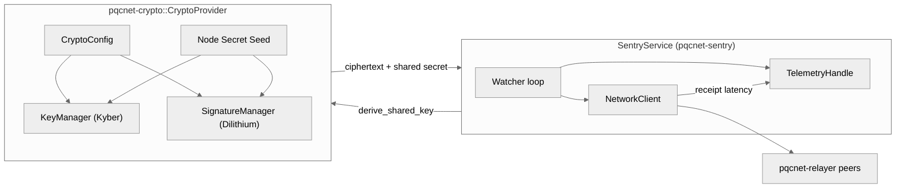

# pqcnet-sentry

Reference sentry daemon that polls configured relayers/watchers, derives
per-watcher challenges, and ships synthetic telemetry. The crate now exposes a
library interface so doctests and examples can exercise the service logic
without going through the CLI binary. Like the relayer, it embeds the real
`pqcnet-crypto` provider plus the production networking/telemetry clients, so
every run exercises the exact ciphertext/signature flow used on mainnet sentries
instead of a mock simulator.

## Production alignment

- **Watcher challenges backed by ML-KEM** – `SentryService::run_iteration`
  invokes `CryptoProvider::derive_shared_key` for every watcher, handing the
  ciphertext to each peer so they decapsulate the real Kyber payload.
- **Networking symmetry** – `NetworkClient::publish` reads the same
  `[networking]` section that relayers use, so jitter, retries, and peer
  identities match the PQCNet overlay.
- **Telemetry parity** – Successful watcher responses increment the exact
  `sentry.success` counter that zer0veil dashboards scrape, and dry-run flagging
  toggles OTLP output without touching the service loop.

## Flow

1. Parse `Config` (`configs/pqcnet-sentry.{toml,yaml}`) to hydrate crypto,
   networking, and telemetry handles.
2. For each watcher, call `derive_shared_key` to generate a PQC challenge,
   encode it with the ciphertext, and either publish it or mark a dry-run ping.
3. Record watcher latency + counters and report quorum status for the caller.



Sentries therefore consume and attest the same ciphertext + quorum metadata that
relayers ship, keeping PQC proofs and telemetry synchronized.

## Examples / Demos

Watch a single iteration with the new example:

```
cargo run -p pqcnet-sentry --example quorum_demo
```

Or drive the real CLI with a config file:

```
cargo run -p pqcnet-sentry -- --config configs/pqcnet-sentry.toml --iterations 3
```

Both flows print processed watchers, quorum thresholds, and telemetry counters so
your PM can see the sentry making progress.

## Config schema

```toml
[sentry]
watchers = ["peer-a", "peer-b"]
poll-interval-ms = 2000
quorum-threshold = 2

[crypto]
node-id = "sentry-a"
secret-seed = "aaaaaaaaaaaaaaaaaaaaaaaaaaaaaaaaaaaaaaaaaaaaaaaaaaaaaaaaaaaaaaaa"
key-ttl-secs = 3600
threshold-min-shares = 3
threshold-total-shares = 5

[networking]
listen = "0.0.0.0:7100"
max-inflight = 64
jitter-ms = 50

[[networking.peers]]
id = "relayer-a"
address = "127.0.0.1:7201"

[telemetry]
endpoint = "http://localhost:4318"
flush-interval-ms = 1000
```

- `watchers` is the peer list the sentry challenges every iteration.
- `poll-interval-ms` controls how frequently the CLI loops (examples override the
  loop length by running a single iteration).
- `quorum-threshold` determines how many successful watcher responses are
  required before the sentry reports success.
- `[crypto]` feeds directly into `pqcnet-crypto`, so sentries share the same key
  rotation cadence and threshold policy as relayers.
- `[networking]` / `[telemetry]` settings match the other crates to keep
  multi-process demos reproducible.

See `configs/pqcnet-sentry.toml` (and `.yaml`) for a complete config including
the shared `[crypto]`, `[networking]`, and `[telemetry]` sections.

## Tests

```
cargo test -p pqcnet-sentry
```

The suite covers config validation, TOML/YAML decoding, service telemetry, and
now the doctest embedded in `service.rs`, ensuring `cargo test --doc` reports
non-zero coverage.
